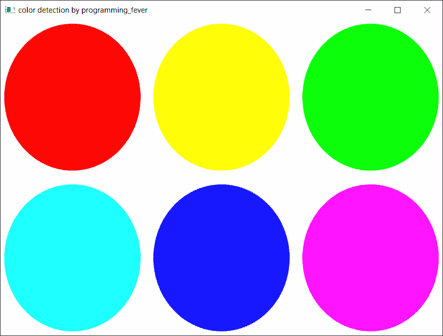
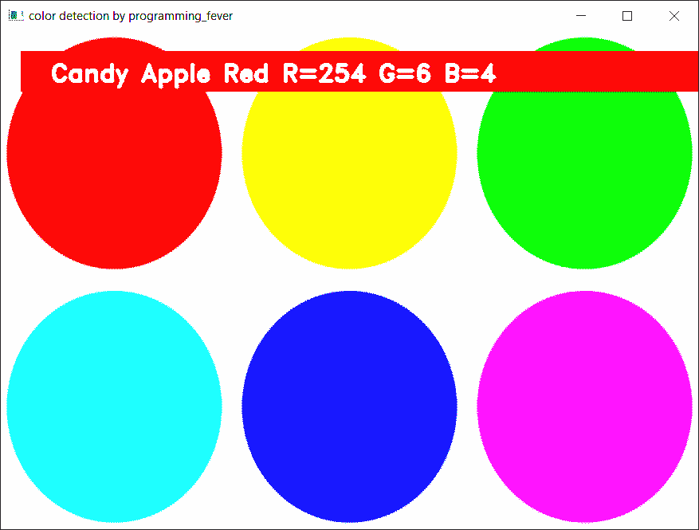
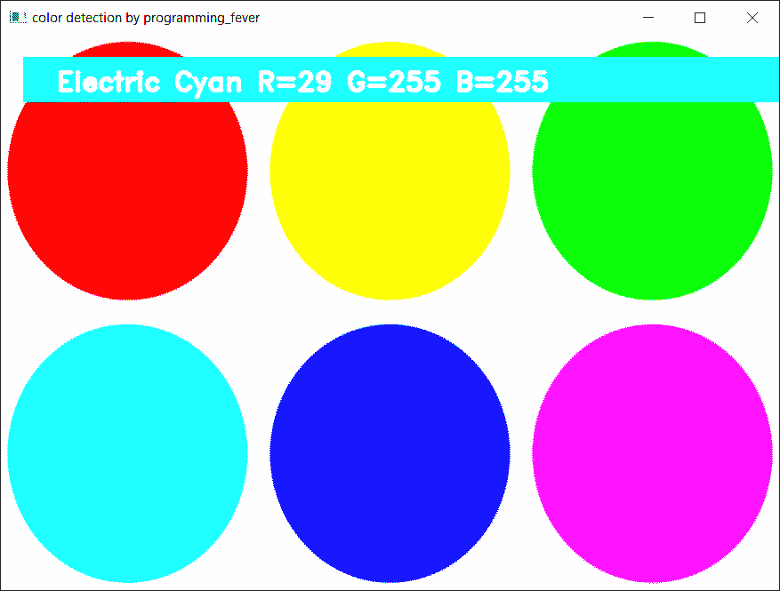
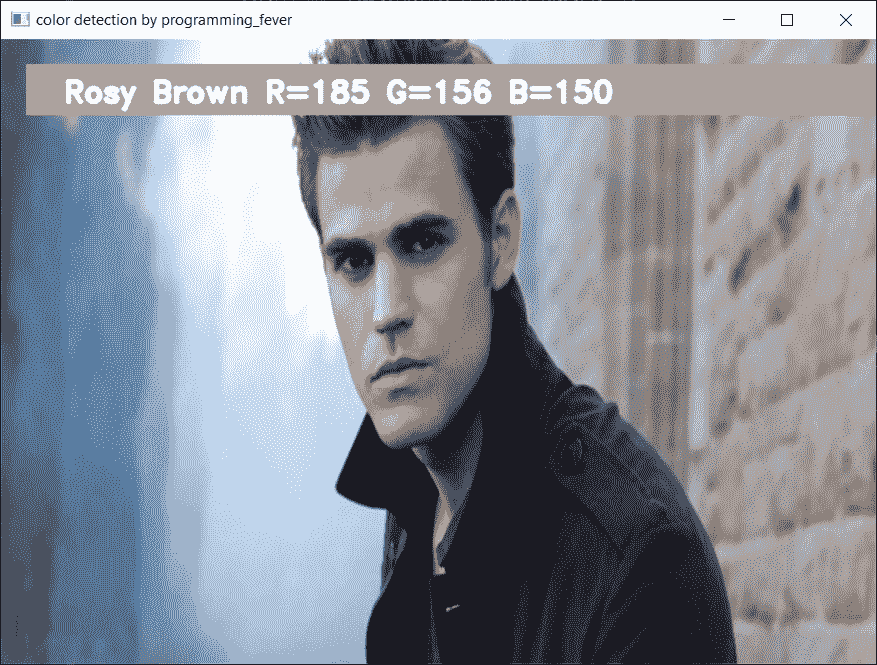

# 使用 Python 进行颜色检测——初学者参考

> 原文：<https://www.askpython.com/python/examples/color-detection>

你好，程序员朋友们！今天在本教程中，我们将学习如何在 Python 中的 OpenCV 库的帮助下检测图像中的各种颜色。

## 颜色检测简介

检测图像中任何颜色名称的过程称为**颜色检测**。对人类来说，这是一项极其简单的任务，但对计算机来说却不那么简单。人类的眼睛和大脑协同工作，将光转化为颜色。信号通过我们眼睛里的光感受器传递到大脑。这种颜色被我们的大脑识别出来。

在这个 Python 颜色检测教程中，我们将创建一个应用程序，让您只需点击它就可以获得颜色的名称。因此，我们需要一个包含颜色名称和值的数据文件。然后我们将计算每种颜色之间的距离，并选择距离最小的颜色。

## 用于颜色检测的数据集

红、绿、蓝是构成任何可用颜色的三原色。计算机中的每个颜色值都被定义为 0 到 255 之间的一个数字。一种颜色可以有大约 1650 万种不同的表现方式。我们需要使用数据集将每种颜色的值转换成它们的名称。我们将使用包含 RGB 值及其名称的数据集。

## 导入 OpenCV

第一步是导入所有需要的模块和 OpenCV，然后加载图像，但是要确保图像和代码文件在同一个文件夹中。

```py
import cv2
import numpy as np
import pandas as pd

img = cv2.imread("sample.jpg")

```

## 加载“colors.csv”文件

我们利用`pandas`库对 CSV 这样的数据文件进行操作。而`pd.read_csv()`函数用于加载和读取 CSV 文件。我们还在索引列表中为每一列指定了一个名称，以便于访问。

```py
index = ["color", "color_name", "hex", "R", "G", "B"]
data = pd.read_csv("colors.csv", names=index, header=None)

```

## 创建一个窗口和一个回调函数

首先，我们必须创建一个显示输入图像的新窗口。然后，我们提供了一个回调函数，只有当鼠标事件在图像上发生时，该函数才会被激活。

```py
cv2.namedWindow("Color Detection Window")
cv2.setMouseCallback("Color Detection Window",call_back_function)

```

但是现在我们要创建一个`call_back_function`这个名字提到的回调函数。

## 创建回调函数

让我们来理解这个回调函数将做什么:它将计算我们双击的像素的 **rgb** 值，并保存鼠标位置的(x，y)坐标。

```py
def call_back_function (event, x,y,flags,param):
  if event == cv2.EVENT_LBUTTONDBLCLK:
        global b,g,r,xpos,ypos, clicked
        clicked = True
        xpos = x
        ypos = y
        b,g,r = img[y,x]
        b = int(b)
        g = int(g)
        r = int(r)

```

## 从 rgb 值中提取颜色名称

既然我们已经从图像中提取了 rgb 值，现在我们需要将 rgb 值更改为颜色名称。下面的函数也是如此。

```py
def get_Color_Name(R,G,B):
    minimum = 10000
    for i in range(len(csv)):
        d = abs(R- int(csv.loc[i,"R"])) + abs(G-           int(csv.loc[i,"G"]))+ abs(B- int(csv.loc[i,"B"]))
        if(d<=minimum):
            minimum = d
            cname = csv.loc[i,"color_name"]
    return cname

```

为了得到颜色名称，我们计算一个距离(d ),它告诉我们离一个特定的颜色有多近，然后选择一个距离最小的颜色。使用以下公式计算距离:

*d = abs(红-红颜色)+(绿-绿颜色)+(蓝-绿颜色)*

## 在窗口上显示结果

我们利用`cv2.imshow()`函数在我们之前创建的窗口上绘制图像。当用户双击窗口时，在图像上绘制一个矩形，分别使用`cv2.rectangle`和`cv2.putText()`函数获得窗口的颜色名称。

```py
while(1):
  cv2.imshow("Color Detection Window",img)
  if (clicked):
    cv2.rectangle(img,(20,20), (750,60), (b,g,r), -1)
    text = getColorName(r,g,b)+'R='+str(r)+'G='+ str(g)+'B='+ str(b)
    cv2.putText(img, text,(50,50),2,0.8, (255,255,255),2,cv2.LINE_AA)
    if(r+g+b>=600):
       cv2.putText(img, text,(50,50),2,0.8,(0,0,0),2,cv2.LINE_AA)
    clicked=False
    if cv2.waitKey(20) & 0xFF ==27:
      break
cv2.destroyAllWindows()

```

## 样本输出



Color Detection Window Opencv



Detected Red Color Detection



Detected Cyan Color Detection

## 在另一个图像上输出



Skin Color Detection Image2

## 结论

今天我们学习了如何使用 Python 编程语言中的 OpenCV 来检测颜色。希望你学到了一些东西！

感谢您的阅读！