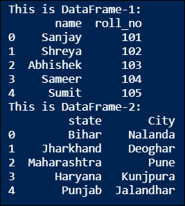
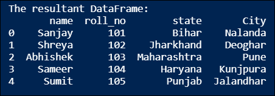
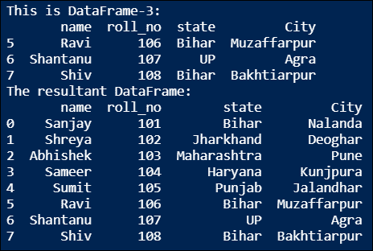
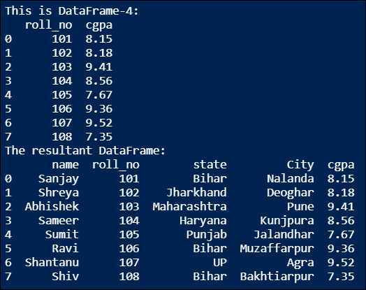
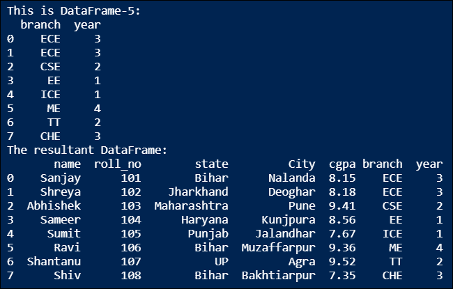

# Python 中如何组合数据帧？

> 原文：<https://www.askpython.com/python-modules/pandas/combine-dataframes-in-python>

读者你好！在本教程中，我们将学习在 Python 中组合数据帧的不同方法。

* * *

## Python 中的数据帧是什么？

在 Python 中，[数据帧](https://www.askpython.com/python-modules/pandas/dataframes-in-python)是结构化的二维 Python 对象，用于以表格格式存储数据，即使用行和列。为了处理数据帧，我们需要`pandas` Python 模块。我们可以从各种 Python 对象创建 Pandas 数据帧，例如 list、dictionary、NumPy ndarray、另一个数据帧等。使用`pandas.DataFrame()`功能。下面是安装`pandas` Python 模块的命令:

```py
C:\Users\Guest> pip install pandas

```

让我们创建两个`pandas`数据帧，我们将在以后的讨论中使用它们。创建熊猫数据帧的 Python 代码。

```py
# Import pandas Python module
import pandas as pd 

# Create two datasets using dictionary of list
data1 = {"name": ['Sanjay Kumar', 'Shreya Mohan', 'Abhishek Kumar', 'Sameer Singh', 'Sumit Kumar'],
        "roll_no": [101, 102, 103, 104, 105]}

data2 = {"state": ['Bihar', 'Jharkhand', 'Maharashtra', 'Haryana', 'Punjab'],
        "City": ['Nalanda', 'Deoghar', 'Pune', 'Kunjpura', 'Jalandhar']}

# Create DataFrame-1
df1 = pd.DataFrame(data1)
print("This is DataFrame-1:")
print(df1)

# Create DataFrame-2
df2 = pd.DataFrame(data2)
print("This is DataFrame-2:")
print(df2)

```

**输出:**



## Python 中组合数据帧的方法

沿任一轴组合两个或多个数据帧的过程是在**数据分析**中使用的核心数据预处理技术之一。数据科学家或数据分析师必须经常使用不同的方法组合以熊猫数据帧形式呈现的数据。当从多个来源收集不同格式的数据时，在数据分析过程中执行这一步骤变得非常关键。我们已经创建了两只熊猫的数据帧，让我们开始讨论用 Python 逐个组合数据帧的不同方法。

### 方法 1:使用 concat()函数

在 Python 中，`concat()`函数在 [pandas 模块](https://www.askpython.com/python-modules/pandas/python-pandas-module-tutorial)中定义，用于沿指定轴组合两个或多个 pandas 数据帧。轴= 0 表示*垂直轴*，轴= 1 表示*水平轴*。

通过连接它们，函数返回一个新的 DataFrame 对象。它可用于将一个数据帧的行或列组合到另一个数据帧中。让我们编写 Python 代码来实现熊猫数据帧上的`concat()`功能。

```py
# Combine the DataFrame-1 & DataFrame-2
# along horizontal axis using concat() function
df = pd.concat([df1, df2], axis = 1)
print("The resultant DataFrame:")
print(df)

```

**输出:**



### 方法 2:使用 append()函数

在 Python 中，`append()`函数也用于通过沿任一轴(水平轴或垂直轴)追加两个或更多熊猫数据帧来组合它们。让我们通过 Python 代码在熊猫数据帧上实现`append()`功能。

```py
# Create a new DataFrame-3
df3 = pd.DataFrame({"name": ['Ravi', 'Shantanu', 'Shiv'],
                    "roll_no": [106, 107, 108],
                    "state": ['Bihar', 'UP', 'Bihar'],
                    "City": ['Muzaffarpur', 'Agra', 'Bakhtiarpur']},
                    index = [5, 6, 7])
print("This is DataFrame-3:")
print(df3)

# Combine this newly created DataFrame-3
# to the existing DataFrame along vertical axis
# using append() function
df = df.append(df3)
print("The resultant DataFrame:")
print(df)

```

**输出:**



### 方法 3:使用 merge()函数

在 Python 中，pandas 模块提供了`merge()`函数来组合 Python 中的数据帧，方法是使用数据库风格的连接来合并它们。默认情况下，它使用一个"*"操作来合并熊猫数据帧。*

*它可用于根据列名或索引组合数据帧，但传递的列名或索引级别必须同时出现在两个数据帧中。让我们来理解在 pandas 数据帧上实现`merge()`功能的 Python 代码。*

```py
*# Create a new DataFrame-4
df4 = pd.DataFrame({"roll_no": [101, 102, 103, 104, 105, 106, 107, 108],
                    "cgpa": [8.15, 8.18, 9.41, 8.56, 7.67, 9.36, 9.52, 7.35]})
print("This is DataFrame-4:")
print(df4)

# Combine this newly created DataFrame-3
# to the existing DataFrame along horizontal axis
# using merge() function
df = pd.merge(df, df4, on = "roll_no")
print("The resultant DataFrame:")
print(df)* 
```

***输出:***

**

### *方法 4:使用 join()函数*

*在 Python 中，pandas 模块提供了`join()`函数，它可以通过在指定的列或索引级别上连接两个或多个 pandas 数据帧来有效地组合它们。默认情况下，它通过索引级别连接 pandas Dataframe 对象。让我们看看在 pandas 数据帧上实现`join()`功能的 Python 代码。*

```py
*# Create a new DataFrame-5
df5 = pd.DataFrame({"branch": ['ECE', 'ECE', 'CSE', 'EE', 'ICE', 'ME', 'TT', 'CHE'],
                    "year": [3, 3, 2, 1, 1, 4, 2, 3]})
print("This is DataFrame-5:")
print(df5)

# Combine this newly created DataFrame-3
# to the existing DataFrame along horizontal axis
# using join() function
df = df.join(df5)
print("The resultant DataFrame:")
print(df)* 
```

***输出**:*

**

## *结论*

*在本教程中，我们学习了以下内容:*

*   *Python 中的 DataFrame 对象是什么*
*   *结合熊猫数据帧的重要性*
*   *组合熊猫数据帧的不同方法*