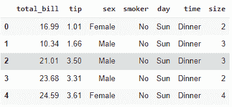
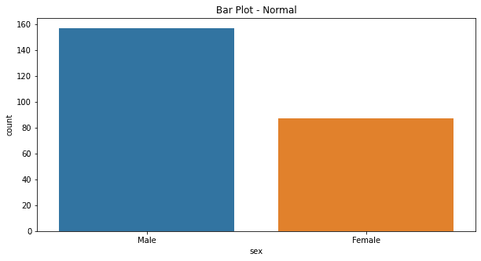
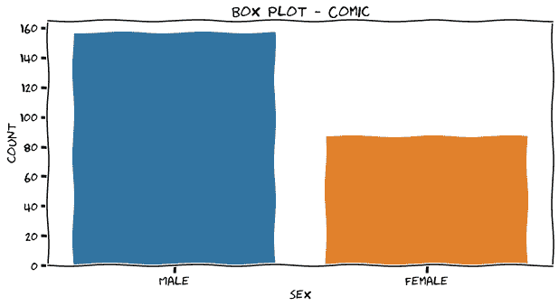
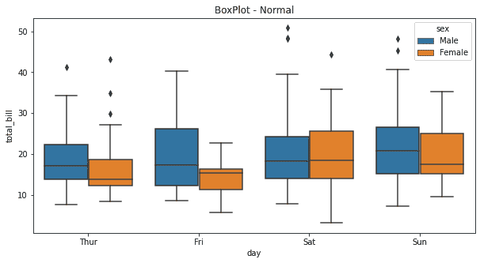
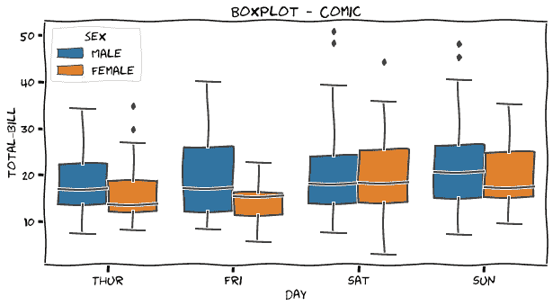
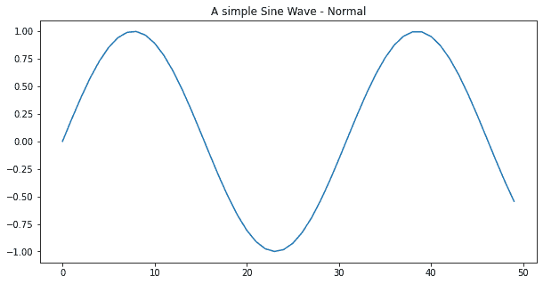
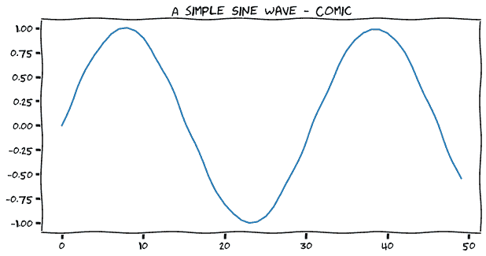
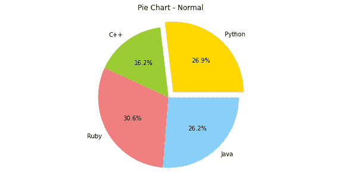
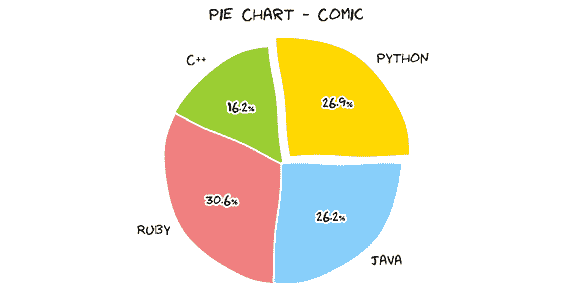

# 实现漫画可视化 Python

> 原文：<https://www.askpython.com/python-modules/comic-visualization-python>

我们都知道，普通人对视觉信息的反应远远好于单纯的文字。通常情况下，Matplotlib 生成的图形非常完美，但是很无聊。观察这些图表并不有趣。

在本教程中，我们将以 XKCD 为例，努力使常规图像更具娱乐性和幽默性。

网络漫画 xkcd 由美国作家兰道尔·门罗于 2005 年创立。xkcd 是每周更新的网络连环画。它是最受欢迎的漫画书之一。我们将在这里尝试用 xkcd 漫画的风格来描绘我们的剧情！

* * *

## 加载库和数据

我们将从导入必要的库开始，然后将数据导入到程序中。在这里，我们加载 tips 数据集并输出其最初的五行。

```py
import numpy as np
import pandas as pd
import matplotlib.pyplot as plt
import seaborn as sns
from seaborn import load_dataset

tips = load_dataset("tips")
tips.head()

```



Tips Dataset

## 示例 1–条形图

条形图是数据的图形表示，其中的类别可以用特定的形式突出显示，如矩形。条形图中条形的长度和高度显示了数据集中数据的分布。

***也读作: [Python 条形图——可视化 Python 中的分类数据](https://www.askpython.com/python/python-bar-plot)***

使用 sns.countplot 函数，我们可以生成一个基本的条形图。

```py
plt.figure(facecolor="W",figsize=(10,5))
plt.title("Bar Plot - Normal")
sns.countplot(tips['sex'])
plt.show()

```



BarPlot Normal

为了让剧情具有喜剧效果，我们需要在整个代码之前添加 plt.xkcd 方法。



BarPlot Comic

## 示例 2:箱线图

箱线图是对数据集数据分布的度量。它将数据集分成四分位数。此图描述了数据集的最小值、最大值、中值、第一个四分位数和第三个四分位数。

***也读: [Boxplots:你需要知道的一切](https://www.askpython.com/python/examples/boxplots)***

使用下面的代码，我们可以使用 sns.boxplot 函数生成一个箱线图。

```py
plt.figure(facecolor="W",figsize=(10,5))
plt.title("BoxPlot - Normal")
sns.boxplot(x = "day", y = "total_bill", hue = "sex", data = tips);
plt.show()

```



BoxPlot Normal

要制作一个剧情漫画，我们需要在整个代码之前添加 plt.xkcd 方法。

```py
plt.xkcd()
plt.figure(facecolor="W",figsize=(10,5))
plt.title("BoxPlot - Comic")
sns.boxplot(x = "day", y = "total_bill", hue = "sex", data = tips);
plt.show()

```



BoxPlot Comic

## 示例 3–正弦波

在本例中，我们将利用 linspace 和 sin 函数生成正弦波图的值，如下面的代码所示。

```py
plt.figure(facecolor="W",figsize=(10,5))
plt.plot(np.sin(np.linspace(0, 10)))
plt.title('A simple Sine Wave - Normal')
plt.show()

```



Sine Wave Normal

要制作一个剧情漫画，我们需要在整个代码之前添加 plt.xkcd 方法。

```py
plt.xkcd()
plt.figure(facecolor="W",figsize=(10,5))
plt.plot(np.sin(np.linspace(0, 10)))
plt.title('A simple Sine Wave - Comic')
plt.show()

```



Sine Wave Comic

## 示例 4–饼图

Matplotlib 的 pie()函数支持饼状图。plt.pie()方法可用于生成绘图。以下代码生成一个饼图:

```py
labels = 'Python', 'C++', 'Ruby', 'Java'
sizes = [215, 130, 245, 210]
colors = ['gold', 'yellowgreen', 'lightcoral', 'lightskyblue']
explode = (0.1, 0, 0, 0)
plt.figure(facecolor="W",figsize=(10,5))
plt.pie(sizes, explode=explode, labels=labels, colors=colors,autopct='%1.1f%%')
plt.axis('equal')
plt.title("Pie Chart - Normal")
plt.show()

```



PieChart Normal

为了让剧情漫画化，我们需要在整个代码之前添加 plt.xkcd 方法。

```py
labels = 'Python', 'C++', 'Ruby', 'Java'
sizes = [215, 130, 245, 210]
colors = ['gold', 'yellowgreen', 'lightcoral', 'lightskyblue']
explode = (0.1, 0, 0, 0)
plt.xkcd()
plt.figure(facecolor="W",figsize=(10,5))
plt.pie(sizes, explode=explode, labels=labels, colors=colors,autopct='%1.1f%%')
plt.axis('equal')
plt.title("Pie Chart - Comic")
plt.show()

```



PieChart Comic

* * *

## 结论

我希望你喜欢这个教程，在 xkcd 的帮助下，从枯燥的标准可视化到有趣的漫画。我还会向您推荐以下教程:

1.  [使用 Python 散景进行数据可视化](https://www.askpython.com/python-modules/data-visualization-using-python-bokeh)
2.  [用 Python 制作数据动画——简单指南](https://www.askpython.com/python/examples/animating-data-in-python)
3.  [Python 编程语言中的 ASCII 艺术](https://www.askpython.com/python-modules/ascii-art)

感谢您的阅读！快乐学习！😃