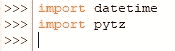
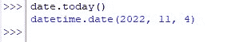
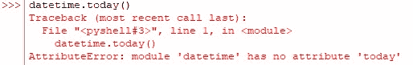
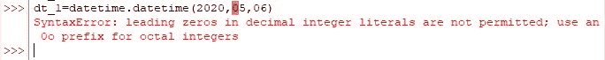
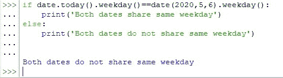
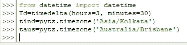
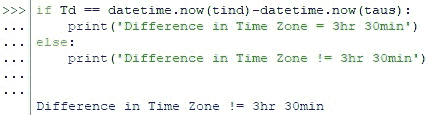

# 在 Python 中比较日期和时间[简单的一步一步]

> 原文：<https://www.askpython.com/python/examples/comparing-date-time-in-python>

当一个人必须分析数据时，没有例外。为分析而部署的工具必须能够兼容处理各种类型的数据。数据可以是文本、分数、日期、整数、时间等形式。Python 是最受欢迎的数据分析工具之一，它有自己的一套模块来处理这种数据多样性。

本文将重点展示如何使用 python 来比较不同的日期和时间。通过不同的日期和时间，推断是针对不同时区的日期和时间。

表面上看，时间可能是一样的，但如果把时区因素考虑在内，情况就完全不同了。我们将通过导入 python 中的一些库——pytz &[datetime](https://www.askpython.com/python-modules/python-datetime-module)来探索这一点。

这可以通过键入以下代码来完成。

```py
import datetime
import pytz

```



Datetime Time Zone Libraries Imported

* * *

## **用 Python 比较日期**

[**模块*日期时间***](https://www.askpython.com/python-modules/python-datetime-module) 包含了两个日期&时间，所以本节我们只选择日期进行比较。这可以通过使用下面的代码从上面的模块中只提取日期来完成。

```py
from datetime import date

```

现在让我们尝试比较两个日期，以确定它们是否属于一周中的同一天。我们将首先使用下面的代码调用今天的日期。

```py
date.today()

```



Calling Todays Date

如果选择使用 *datetime.today()* 而不是 *date.today()* 会怎么样？这将导致以下结果，因为我们已经选择只使用来自*日期时间*模块的*日期*。



Datetime Error

现在让我们继续输入另一个日期，以便与当前日期进行比较。但是在输入月份或日期时要小心，因为 Python 不喜欢在这些地方使用前导零。否则将出现以下错误。



Leading Zero Error

所以如果没有前导零，代码就变成了，

```py
dt_1=datetime.datetime(2020,5,6)

```

既然我们知道了如何构造一个日期，现在让我们使用 *weekday()* 来比较这两个日期，看看它们是否共享同一个工作日。

```py
if date.today().weekday()==date(2020,5,6).weekday():
    print('Both dates share same weekday')
else:
    print('Both dates do not share same weekday')

```

执行上面的代码会得到下面的输出。



Weekdays Of Two Dates Compared

* * *

## **在 Python 中比较不同时区**

在本节中，我们将尝试比较两个时区之间的差异&验证它们是否相同。为此，我们将使用 Python 中的一个专有命令，称为 *timedelta()。*下面是它的语法，

```py
timedelta(days=0, seconds=0, microseconds=0, milliseconds=0, minutes=0, hours=0, weeks=0)

```

该命令不能立即使用，而是从 *datetime* 库中导入，

```py
from datetime import timedelta

```

使用的任何两个日期或时间之间的时间差就是 *[**时间增量**](https://www.askpython.com/python-modules/python-timedelta)* 有助于指示的。让我们将它设置为 3 小时 30 分钟，并将其赋给一个变量*‘Td’*，以验证任意两个选定时区之间的时差是否与之匹配。

```py
Td=timedelta(hours=3, minutes=30)

```

现在我们将使用下面的代码包括时间和日期，因为我们只限于上一节中的日期。

```py
from datetime import datetime

```

一旦完成，印度时区和澳大利亚时区的当前时间被分别分配给变量*‘tind’*和*‘taus’*。

```py
tind=pytz.timezone('Asia/Kolkata')
taus=pytz.timezone('Australia/Brisbane')

```



Assigning Timedelta Time Zones

然后使用 *if* 逻辑进行如下比较。

```py
if Td == datetime.now(tind)-datetime.now(taus):
    print('Difference in Time Zone = 3hr 30min')
else:
    print('Difference in Time Zone != 3hr 30min')

```

下面是代码执行后的输出。



Different Time Zones Compared

* * *

## **结论**

既然我们已经到了本文的结尾，希望它已经详细阐述了如何使用 Python 中的 datetime & pytz 库来比较不同时区的日期和时间。这里有另一篇文章详细介绍了如何在 Pandas 中使用 isin()命令。在 [AskPython](https://www.askpython.com/) 中还有许多其他有趣的&文章，这些文章可能对那些想提高 Python 水平的人有很大帮助。*欢呼*！