# 熊猫:有条件分组值

> 原文：<https://www.askpython.com/python-modules/pandas/conditionally-grouping-values>

在本文中，我们将有条件地对熊猫的值进行分组。我们已经通过详细介绍了 [Python 熊猫群。因此，如果您不确定该函数是如何工作的，可以浏览一下这篇文章。](https://www.askpython.com/python-modules/pandas/pandas-groupby-function)

## 什么是分组？

对数据库/数据框进行分组是日常数据分析和数据清理中的常见做法。分组是指将相同的数据(或具有相同属性的数据)组合成不同的组。

**例如**:想象一个学校数据库，里面有所有班级的学生。现在，如果校长希望比较班级之间的成绩/出勤情况，他需要比较每个班级的平均数据。但是他怎么能这样做呢？他根据学生所属的班级(同一个班级的学生进入同一个组)对学生数据进行分组，然后对组中每个学生的数据进行平均。

我们的例子涵盖了一个非常理想的情况，但它是分组的最基本的应用。分组可以基于多个属性。这有时称为分层分组，根据数据的其他属性将一个组进一步细分为更小的组。这使得我们的查询可以根据我们的需要而变得复杂。

还有一个非常基本的问题，我们在例子中忽略了，数据库中的所有数据不需要平均。例如，如果我们只需要比较每个班级的平均出勤率和百分比，我们可以忽略其他值，如手机号码或点名号码，它们的平均值实际上没有意义。在本文中，我们将学习如何在 pandas 中制作如此复杂的分组命令。

## 用 df.groupby()对熊猫进行分组

Pandas `*d*f.groupby()`提供了一个函数来分割数据帧，应用一个函数如`mean()`和`sum()`来形成分组数据集。对于数据帧来说，这似乎是一个可怕的操作，所以让我们首先将工作分成两组:拆分数据和应用并组合数据。对于这个例子，我们使用来自 Kaggle 的超市数据集。

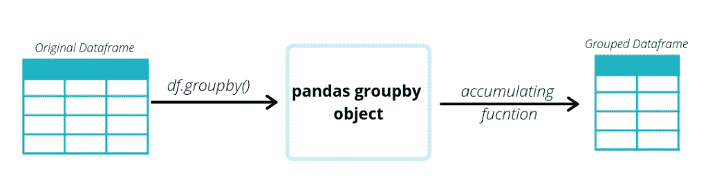

An overview of pandas Groupby method

```py
# Importing the data
import pandas as pd

# Our dataframe. The csv file can be downloaded fro above hyperlink.
df = pd.read_csv('supermarket_sales - Sheet1.csv')

# We drop some redundant columns
df.drop(['Date', 'Invoice ID', 'Tax 5%'], axis=1, inplace=True)
# Display the dataset
df.head()

```

**输出:**

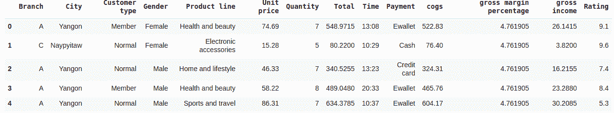

`df.groupby()`函数将接受标签或标签列表。这里我们想根据列分支进行分组，所以我们在函数定义中只指定了' Branch'。我们还需要指定沿着哪个轴进行分组。 `axis=1` 代表‘列’，`axis=0` 表示‘索引’。

```py
# We split the dataset by column 'Branch'.
# Rows having the same Branch will be in the same group.
groupby = df.groupby('Branch', axis=0)

# We apply the accumulator function that we want. Here we use the mean function here but we can also other functions. 
groupby.mean()

```

**输出:**

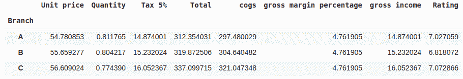

现在我们已经学习了如何创建分组数据帧，我们将研究如何对数据应用分组条件。

## 离散和连续数据

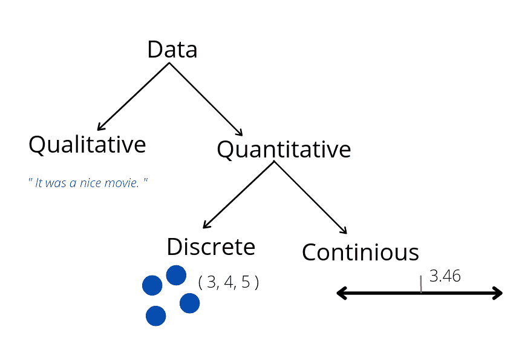

A hierarchical map showing the difference between discrete and continuous data. Discrete data are counted whereas continuous data are measured.

使用离散(表格)数据进行分组是一种常见的做法。连续数据不适合分组。但这不会限制我们的数据分析能力吗？是的，很明显。所以我们需要一个变通方法。我们将对连续数据进行宁滨，以将数据制成表格。

例如:百分比是一个连续的数据，为了将它转换成带标签的数据，我们采用四个预定义的组-优秀(75-100)、良好(50-75)、差(25-50)、非常差(0-25)。每个数据无论如何变化，都将归入这 4 组。

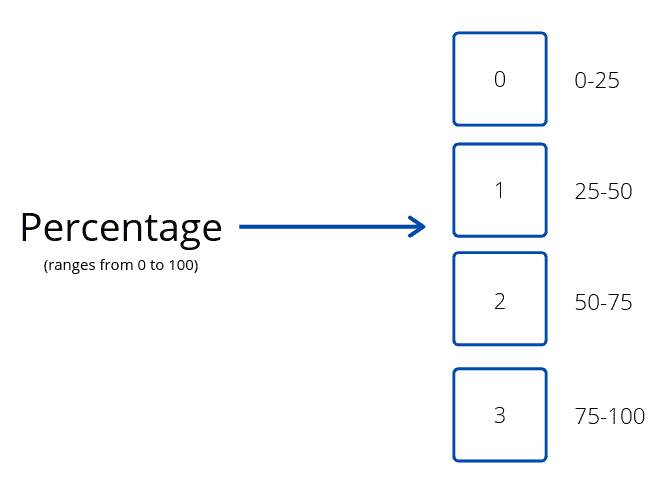

Conversion of data from continuous to discrete from.

另一种方法是对不同的值使用 true 和 false。

例如，**超市经理想知道有多少顾客一次购买了超过 3 件商品**。一种方法是，如果文章数量大于或等于 3，则用 1/True 替换文章数量，否则用 0/False 替换。

```py
# Binning of the data based on a condition
df.loc[df.Quantity < 3, 'Quantity'] = 0
df.loc[df.Quantity >= 3, 'Quantity'] = 1

# Grouping and couting
df.groupby('Quantity').count()

```

**输出:**

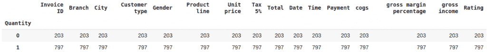

### 基于其他列对值进行有条件分组

对于我们的最终查询，我们需要根据是否售出了 3 件以上的商品将数据帧分组。我们需要找到一次性购买超过 3 件商品的平均单价。

1.  我们需要过滤掉我们感兴趣的列。
2.  如果对连续数据进行分组，我们需要将连续数据转换成表格数据。
3.  使用`df.groupby()` 分割数据。
4.  应用聚合函数。

```py
# Filter out columns of our interest
df_1 = df.loc[:, ["Quantity", "Unit price"]]

# We have already binned the quantity data into 0 and 1's for counting.
# So we don't need any pre-processing

# Group the data
groupby = df_1.groupby("Quantity", axis=0)

# Apply the function(here mean)
groupby.mean()

```

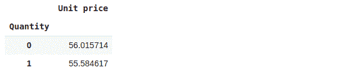

从上图可以看出，一次购买 3 件以上的物品的单价是 55.5846。

Pandas 内置了`df.filter()`和`df.query()`等功能，使得查询变得更加容易。这允许用户对数据库进行更高级和复杂的查询。这些是我们在前面的例子中看到的 df.loc 的高级抽象

### df.filter()方法

Pandas filter 方法允许你过滤数据帧的标签。它不作用于数据帧的内容。这是一个过滤掉数据集中的城市和性别标签的例子。

```py
df = pd.read_csv('supermarket_sales - Sheet1.csv')

# We need to mention the labels to be filterd in items
df.filter(items=["City","Gender"]).head()

```

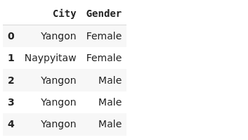

我们也可以使用正则表达式过滤掉标签。我们尝试过滤以字母 c 开头的标签。

```py
# We can specify the regex literal under regex in the function
df.filter(regex="^C").head()

```

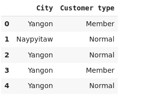

### df.query()方法

查询方法允许查询任意复杂程度的数据帧列的内容。这里有一个例子来找出顾客一次购买超过 3 件商品的情况。

```py
df.query('Quantity > 3').head()

```

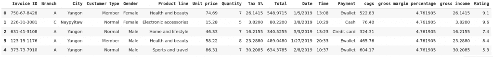

我们还可以使用' & '和' | '将许多条件组合在一起。例如，我们想找出顾客一次购买超过 3 件商品并使用现金付款的情况。

```py
df.query('Quantity > 3 & Payment=="Cash"').head()

```

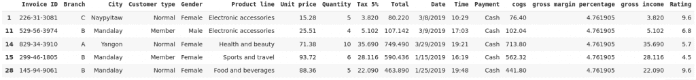

### 组合 df.query()和 df.filter()以及 df.groupby()

我们想解决根据是否有超过 3 件商品售出来将数据帧分组的问题。我们需要找到每个城市一次性购买超过 3 件商品的平均单价。

我们分三步进行:

1.  使用`df.query()`筛选出超过 3 条的数据。
2.  使用`df.filter()`仅保留感兴趣的标签(此处为城市和单价)
3.  使用`df.groupby()`对数据进行分组

```py
# Query the database for Quantity greater than 3
df_g = df.query('Quantity > 3')

# Filter out labels of interest
df_g = df_g.filter(['City', 'Unit price'])

# Group the value according to a condition
df_g.groupby('City').mean()

```

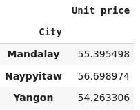

### 参考

*   [了解熊猫 groupby()函数](https://www.askpython.com/python-modules/pandas/pandas-groupby-function)
*   pandas group by function–journal dev