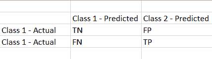

# 理解 Python 中的混淆矩阵

> 原文：<https://www.askpython.com/python/examples/confusion-matrix>

嘿，伙计们！今天，我们将了解数据科学中最重要的概念之一—**混淆矩阵及其在 Python** 中的实现。

数据科学是一个巨大的领域，我们在其中研究数据，清理数据，并使用各种机器学习算法进行预测。在使用任何算法之后，检查算法对期望输出的贡献的准确性和效果是非常重要的。

评估模型性能的一个这样的误差度量是混淆矩阵。

* * *

## 混淆矩阵是什么？

有时，我们会遇到这样的情况，我们需要应用特定的 ML 算法来预测`classification problem`的结果，即结果/目标/响应变量是**分类数据**的业务问题。示例:检测电子邮件是否为垃圾邮件。

因此，在上面的场景中，我们需要一个特殊的误差度量来判断最佳模型的准确性和正确性。

混淆矩阵是一个**误差度量**，用于判断分类机器学习算法的性能。它为我们提供了关于模型的准确度、精确度和误差百分比的详细信息。

通过使用混淆矩阵，我们可以区分分类响应变量的实际正确结果和预测结果。

因此，在理解了混淆矩阵的需要之后，现在让我们将注意力集中在各种组件上，通过这些组件，我们可以判断和预测任何模型的正确拟合算法。

* * *

## 混淆矩阵的组成部分

看看下面混乱矩阵的结构！



**Confusion Matrix**

它表示由分类模型执行的预测的汇总。

*   **真负值(TN)** :实际为负值，也预测为负值的值。
*   **假阴性(FN)** :实际为阳性但预测为阴性的值。
*   **假阳性(FP)** :实际为阴性但预测为阳性的值。
*   **真正(TP)** :实际为正且预测为正的值。

那么，现在让我们看看混淆矩阵提供的关于模型的其他信息-

1.  **准确度** —它被定义为显示从提供的输入中成功预测的百分比的值。

**精度= TP + TN / (TP + TN + FP + FN)**

2.—它是定义被正确预测为真并且在实际集合中也恰好为真的一组值的值。

就精度而言，我们的意思是理解正值确实被预测为正值。

**精度= TP / (TP + FP)**

3.—它是代表一组实际上为真并且也被正确预测为真的值的值，

通过回忆，我们的意思是理解特定类别的样本被正确预测。

**召回= TP / (TP +FN)**

4. **F1 比分**

当数据不平衡时，F1 分数有助于我们评估模型的准确性和效率。它实际上是精确度和回忆分数的调和平均值。

**F1 = 2*(召回率*精度)/(召回率+精度)**

现在让我们通过一个例子来实现混淆矩阵的概念，如下一节所示。

* * *

## 用 Python 实现混淆矩阵

在这个例子中，我们传递了一个预测值和实际值的列表来构建混淆矩阵。为了使用混淆矩阵函数，我们需要导入 sklearn 库。

```py
from sklearn import metrics

pred = ["T", "F", "T", "T", "F"] #predicted set of values

actual = ["F", "F", "F", "T", "T"] #actual set of values
CM = metrics.confusion_matrix(pred, actual, labels=["T", "F"]) #confusion matrix

print(CM)
report = metrics.classification_report(pred, actual, labels=["T", "F"]) #precision, recall, f1-score,etc
print(report) 
```

`classification_matrix() function`代表已经被正确和错误识别的一组值。此外，`classification_report() function`代表每个类别的输入的度量值，即“T”和“F”。

**输出:**

```py
[[1 2]
 [1 1]]
              precision    recall  f1-score   support

           T       0.50      0.33      0.40         3
           F       0.33      0.50      0.40         2

    accuracy                           0.40         5
   macro avg       0.42      0.42      0.40         5
weighted avg       0.43      0.40      0.40         5 
```

* * *

## 结论

到此，我们就结束了这个话题。如果你遇到任何问题，欢迎在下面评论。

在那之前，学习愉快！