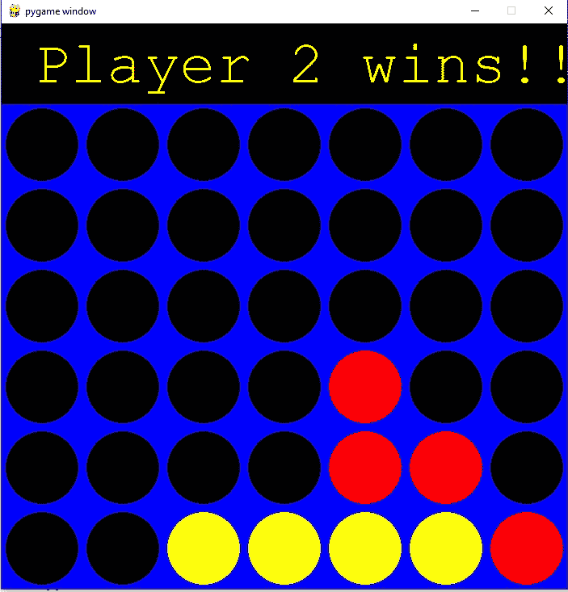

# 用 Python 连接四个游戏

> 原文：<https://www.askpython.com/python/examples/connect-four-game>

在开始之前，让我们先了解一下什么是 connect Four 游戏。

**Connect4 game** 在苏联又被称为**四起、剧情四起、找四起、队长的情妇、一连四起、掉落四起、重力旅行**。

这是一种双人连接棋盘游戏，游戏者选择一种颜色，然后轮流将彩色圆盘投入七列六行垂直悬挂的网格中。

碎片垂直下落，占据塔内最低的可用空间。

游戏的目标是第一个形成自己的四个圆盘的水平线、垂直线或对角线。连接四是一个解决的游戏。

第一个玩家总能通过正确的走法赢得胜利。听起来很有趣，对吧？

让我们了解一下如何用 python 编程语言编写这个游戏的代码。

* * *

## 导入连接四个游戏所需的库

### 1.NumPy 模块

**[NumPy 库](https://www.askpython.com/python-modules/numpy/python-numpy-module) :** NumPy 代表数值 Python。NumPy 是一个 Python 库，用于处理数组。它还具有在线性代数、傅立叶变换和矩阵领域工作的功能。这是一个开源项目，你可以免费使用。NumPy 是一个 Python 库，它提供了一个简单而强大的数据结构:n 维数组。

如果您的系统上没有预装 NumPy，请在窗口的 cmd 中键入以下命令:

```py
C:\Users\Admin> pip install numpy

```

当您将语句 **import numpy 称为 np** 时，您正在将短语“ **numpy** ”缩短为“ **np** ”，以使您的代码更易于阅读。它还有助于避免名称空间问题。

```py
import numpy as np

```

### 2.Pygame 模块

Pygame 是一个免费的开源跨平台库，用于使用 Python 开发视频游戏等多媒体应用。

它使用简单的 DirectMedia 层库和其他几个流行的库来抽象最常见的函数，使编写这些程序成为一项更直观的任务。

如果您的系统上没有预装 Pygame，请在窗口的 cmd 中键入以下命令:

```py
C:\Users\Admin> pip install numpy

```

### 3.Python 系统模块

[**python sys** 模块](https://www.askpython.com/python-modules/python-sys-module)提供了用于操纵 **Python** 运行时环境不同部分的函数和变量。它允许我们访问特定于系统的参数和功能。**导入系统**。首先，在运行任何函数之前，我们必须**导入**程序中的 **sys** 模块。**系统**.模块

### 4.Python 数学模块

一些最流行的数学函数在数学模块中定义。其中包括三角函数、表示函数、对数函数、角度转换函数等。此外，该模块中还定义了两个数学常数。

如果您的系统中没有预装 math，请在窗口的 cmd 中键入以下命令:

```py
C:\Users\Admin> pip install maths

```

* * *

## 用 Python 实现连接四个游戏

### 步骤 01

将 NumPy 包作为 np 导入。然后我们将创建一个名为 **create_board( )** 的 python 函数。

[**np.zeros( )** 函数](https://www.askpython.com/python-modules/numpy/numpy-zeros-method-in-python)用于创建一个充满零的矩阵。在 [TensorFlow](https://www.askpython.com/python-modules/tensorflow-vs-pytorch-vs-jax) 和其他统计任务的第一次迭代中初始化权重时，可以使用 Python 中的这个函数。((6，7))是维数。6 行 7 列。然后我们只需将那块板返回。

我们现在将开始编写主游戏循环。我们将创建一个循环作为**，而不是游戏结束**。while not 循环重复执行循环体，直到满足循环终止的条件。只要 game_over 变量为假，我们的循环就会一直运行。我们将初始化游戏结束为假。只有当某人连续得到 4 个圆圈时，它才会转换为真。

为了增加 1 圈，我们将使用 **turn += 1** 。为了让它在玩家 1 和 2 之间交替切换，我们使用 **turn = turn % 2** 。

```py
import numpy as np

def create_board():
    board = np.zeros((6,7))
    return board

#initialize board
board = create_board()
#We will initialize the game_over as False.
game_over = False
turn = 0

while not game_over:
    #Ask for player 1 input
    if turn == 0:
        selection = int(input("Player 1, Make your Selection(0-6):"))

    #Ask for player 2 input
    else:
        selection = int(input("Player 2, Make your Selection(0-6):"))

    turn += 1
    turn = turn % 2

```

### 步骤 02

在步骤 02 中，我们对前面的代码做了一些修改和更新。

我们希望**选择变量**实际上在棋盘上放下一个棋子。为此，我们要做的第一件事是创建另外三个名为 **def drop_piece()、** **def is_valid_location()、def get_next_open_row()的函数。**

这些函数如何一起工作如下，玩家将做出选择。代码中的 **(0-6)** 表示他们想要放置棋子的列。因此我们将**选择变量**的名称更新为**列变量** **(col)** 。

现在，我们将把这个 **col** 放在我们现有的当前板中，并把它作为参数传递给**板**的所有三个函数。

我们将初始化名为**行计数**和**列计数**的全局变量。在 **Python** 中，在函数之外或者在**全局**范围内声明的**变量**被称为**全局变量**。这意味着全局变量**可以在函数内部或外部访问。**

函数的作用是:沿着指定的轴反转数组元素的顺序，保持数组的形状。

```py
Syntax: np.flip(array, axis)

```

```py
import numpy as np

ROW_COUNT = 6
COLUMN_COUNT = 7

def create_board():
    board = np.zeros((6,7))
    return board

def drop_piece(board,row,col,piece):
    board[row][col]= piece

def is_valid_location(board,col):
    #if this condition is true we will let the use drop piece here.
    #if not true that means the col is not vacant
    return board[5][col]==0

def get_next_open_row(board,col):
    for r in range(ROW_COUNT):
        if board[r][col]==0:
            return r

def print_board(board):
    print(np.flip(board,0))

board = create_board()
print_board(board)
game_over = False
turn = 0

while not game_over:
    #Ask for player 1 input
    if turn == 0:
        col = int(input("Player 1, Make your Selection(0-6):"))
        #Player 1 will drop a piece on the board
        if is_valid_location(board,col):
            row = get_next_open_row(board,col)
            drop_piece(board,row,col,1)

    #Ask for player 2 input
    else:
        col = int(input("Player 2, Make your Selection(0-6):"))
        #Player 2 will drop a piece on the board
        if is_valid_location(board,col):
            row = get_next_open_row(board,col)
            drop_piece(board,row,col,2)

    print_board(board)

    turn += 1
    turn = turn % 2 

```

* * *

### 步骤 03:完成代码演练

在步骤 03 中，我们将创建一个有 GUI 的游戏，而不仅仅是有矩阵的游戏。上面的代码以及我们所做的新的修改将使游戏看起来像一个真正的棋盘游戏。

首先，我们将导入所有必要的库。

接下来，我们将把颜色**蓝、黑、红**和**黄**定义为全局静态变量。这些值将是 **rgb 值。**

我们将初始化名为**行计数**和**列计数**的全局变量。行数为 6，列数为 7。

然后我们创建 5 个函数，分别命名为 **create_board( )** 、 **drop_piece( )** 、 **is_valid_location( )** 、 **get_next_open_row( )** 和 **print_board( )** 。

然后，我们创建一个名为 **winning_move()** 的函数，并检查水平位置获胜，垂直位置获胜，正负斜线获胜。

在**水平和垂直位置中，**我们为行和列创建一个嵌套的 for 循环，并检查 if 条件语句，以查看棋子是否已被放到棋盘上的那个位置。如果**T3 如果条件 T5 满足，则返回**真**。我们将对垂直位置重复同样的过程，也包括正斜率和负斜率的对角线。**

在函数 **def draw_board( )** ， **pygame.draw** 中是一个用于绘制形状的模块。

**pygame.draw.rect** 用于绘制矩形。现在我们将定义三角形。定义高度、宽度和位置。

所以位置是， **c*SQUARESIZE** ，y 轴的位置是， **r*SQUARESIZE+SQUARESIZE** 。

高度和宽度将是另外两个参数，那就是**平方尺寸**，**平方尺寸**。对圆也重复同样的步骤。

```py
import numpy as np
import pygame
import sys
import math

BLUE = (0,0,255)
BLACK = (0,0,0)
RED = (255,0,0)
YELLOW = (255,255,0)

ROW_COUNT = 6
COLUMN_COUNT = 7

def create_board():
	board = np.zeros((ROW_COUNT,COLUMN_COUNT))
	return board

def drop_piece(board, row, col, piece):
	board[row][col] = piece

def is_valid_location(board, col):
	return board[ROW_COUNT-1][col] == 0

def get_next_open_row(board, col):
	for r in range(ROW_COUNT):
		if board[r][col] == 0:
			return r

def print_board(board):
	print(np.flip(board, 0))

def winning_move(board, piece):
	# Check horizontal locations for win
	for c in range(COLUMN_COUNT-3):
		for r in range(ROW_COUNT):
			if board[r][c] == piece and board[r][c+1] == piece and board[r][c+2] == piece and board[r][c+3] == piece:
				return True

	# Check vertical locations for win
	for c in range(COLUMN_COUNT):
		for r in range(ROW_COUNT-3):
			if board[r][c] == piece and board[r+1][c] == piece and board[r+2][c] == piece and board[r+3][c] == piece:
				return True

	# Check positively sloped diaganols
	for c in range(COLUMN_COUNT-3):
		for r in range(ROW_COUNT-3):
			if board[r][c] == piece and board[r+1][c+1] == piece and board[r+2][c+2] == piece and board[r+3][c+3] == piece:
				return True

	# Check negatively sloped diaganols
	for c in range(COLUMN_COUNT-3):
		for r in range(3, ROW_COUNT):
			if board[r][c] == piece and board[r-1][c+1] == piece and board[r-2][c+2] == piece and board[r-3][c+3] == piece:
				return True

def draw_board(board):
	for c in range(COLUMN_COUNT):
		for r in range(ROW_COUNT):
			pygame.draw.rect(screen, BLUE, (c*SQUARESIZE, r*SQUARESIZE+SQUARESIZE, SQUARESIZE, SQUARESIZE))
			pygame.draw.circle(screen, BLACK, (int(c*SQUARESIZE+SQUARESIZE/2), int(r*SQUARESIZE+SQUARESIZE+SQUARESIZE/2)), RADIUS)

	for c in range(COLUMN_COUNT):
		for r in range(ROW_COUNT):		
			if board[r][c] == 1:
				pygame.draw.circle(screen, RED, (int(c*SQUARESIZE+SQUARESIZE/2), height-int(r*SQUARESIZE+SQUARESIZE/2)), RADIUS)
			elif board[r][c] == 2: 
				pygame.draw.circle(screen, YELLOW, (int(c*SQUARESIZE+SQUARESIZE/2), height-int(r*SQUARESIZE+SQUARESIZE/2)), RADIUS)
	pygame.display.update()

board = create_board()
print_board(board)
game_over = False
turn = 0

#initalize pygame
pygame.init()

#define our screen size
SQUARESIZE = 100

#define width and height of board
width = COLUMN_COUNT * SQUARESIZE
height = (ROW_COUNT+1) * SQUARESIZE

size = (width, height)

RADIUS = int(SQUARESIZE/2 - 5)

screen = pygame.display.set_mode(size)
#Calling function draw_board again
draw_board(board)
pygame.display.update()

myfont = pygame.font.SysFont("monospace", 75)

while not game_over:

	for event in pygame.event.get():
		if event.type == pygame.QUIT:
			sys.exit()

		if event.type == pygame.MOUSEMOTION:
			pygame.draw.rect(screen, BLACK, (0,0, width, SQUARESIZE))
			posx = event.pos[0]
			if turn == 0:
				pygame.draw.circle(screen, RED, (posx, int(SQUARESIZE/2)), RADIUS)
			else: 
				pygame.draw.circle(screen, YELLOW, (posx, int(SQUARESIZE/2)), RADIUS)
		pygame.display.update()

		if event.type == pygame.MOUSEBUTTONDOWN:
			pygame.draw.rect(screen, BLACK, (0,0, width, SQUARESIZE))
			#print(event.pos)
			# Ask for Player 1 Input
			if turn == 0:
				posx = event.pos[0]
				col = int(math.floor(posx/SQUARESIZE))

				if is_valid_location(board, col):
					row = get_next_open_row(board, col)
					drop_piece(board, row, col, 1)

					if winning_move(board, 1):
						label = myfont.render("Player 1 wins!!", 1, RED)
						screen.blit(label, (40,10))
						game_over = True

			# # Ask for Player 2 Input
			else:				
				posx = event.pos[0]
				col = int(math.floor(posx/SQUARESIZE))

				if is_valid_location(board, col):
					row = get_next_open_row(board, col)
					drop_piece(board, row, col, 2)

					if winning_move(board, 2):
						label = myfont.render("Player 2 wins!!", 1, YELLOW)
						screen.blit(label, (40,10))
						game_over = True

			print_board(board)
			draw_board(board)

			turn += 1
			turn = turn % 2

			if game_over:
				pygame.time.wait(3000)

```

## **我们完成的 GUI 用 Python 连接了四个游戏**



## 结尾注释…

这是如何用 Python 编写著名的 connect four 游戏的完整解释。Pygame 让用户很容易学习和编写大量的游戏。我希望你一定会尝试编码，并享受你自己创造的游戏。

快乐学习！