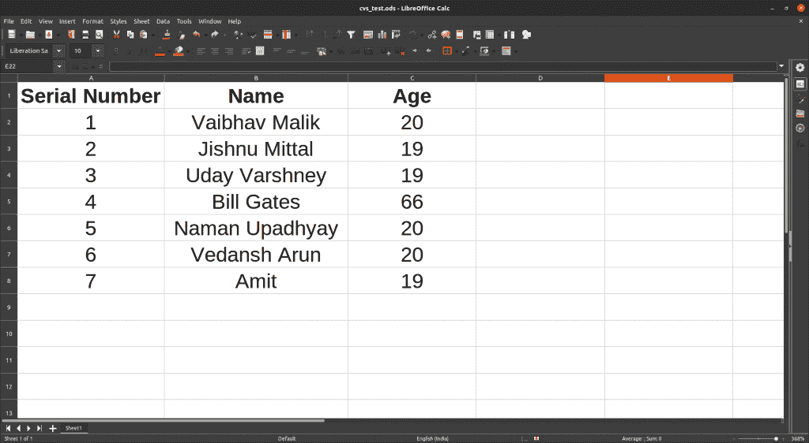
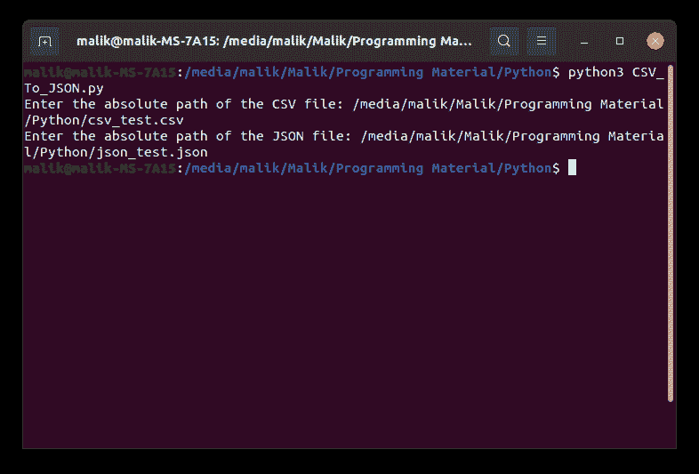
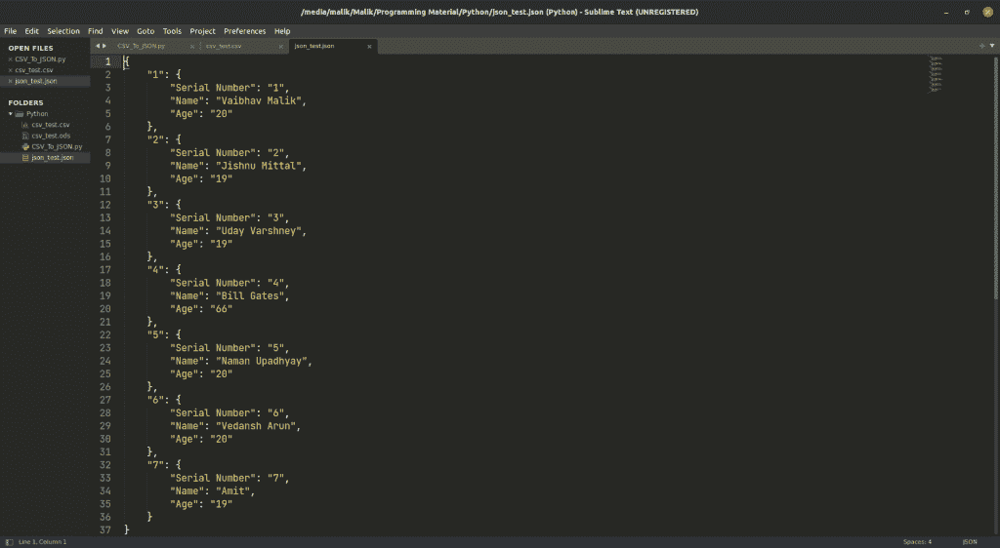

# 使用 Python 将 CSV 转换为 JSON 初学者指南

> 原文：<https://www.askpython.com/python/examples/convert-csv-to-json>

在本文中，我们将使用一个简单的 Python 脚本将 CSV 转换为 JSON。我们将学习如何使用 Python 的 JSON (JavaScript Object Notation)库，并尝试理解这种转换背后的逻辑。

## 为什么要将 CSV 转换成 JSON？

JSON 是一种标准的基于文本的格式，用于表示基于 JavaScript 对象语法的结构化数据。它通常用于在 web 应用程序中传输数据，因此每当需要将一些数据从服务器发送到客户机时，数据首先被转换成 JSON，然后发送到客户机，以便可以在 web 页面上显示，反之亦然。

## 将 CSV 转换为 JSON 的步骤

我们将通过各种小步骤来解决他的问题，这样我们就能彻底而容易地理解这个问题。

**第一步:**输入 CSV 文件和 JSON 文件的路径

这可以在输入功能的帮助下实现。默认情况下，Input 函数接受字符串形式的输入，这正是我们需要的。Input 函数也可以用来在请求输入时显示一些字符串

**步骤 2:** 使用文件处理程序打开 CSV 文件

一个[文件处理程序](https://www.askpython.com/python/built-in-methods/python-open-method)可以很容易地启动，有许多方法可以做到这一点，但我们将坚持最安全的一个，即我们将使用:

```py
with open(csv_file_path, encoding = 'utf-8') as csv_file_handler:

```

这将在读取模式下打开文件，一旦我们离开这个块，它将自动关闭这个文件。使用后关闭文件对于防止文件损坏或数据丢失非常重要。

**步骤 3:** 使用 JSON 文件处理程序打开 JSON 文件

该文件将以写模式打开，因此代码变为:

```py
with open(json_file_path, 'w', encoding = 'utf-8') as json_file_handler:

```

这里'+w '表示文件以写模式打开，即其数据可以更改

**步骤 4:** 使用 JSON 模块的函数将文件解析成 JSON 文件

使用下面这段代码可以轻松完成这项任务:

```py
json_file_handler.write(json.dumps(data_dict, indent = 4))

```

一切都准备好了，现在你只需要运行代码，你的工作就完成了

## 用 Python 将 CSV 转换成 JSON 的完整代码

```py
import csv
import json

def csv_to_json(csv_file_path, json_file_path):
	#create a dictionary
	data_dict = {}

	#Step 2
	#open a csv file handler
	with open(csv_file_path, encoding = 'utf-8') as csv_file_handler:
		csv_reader = csv.DictReader(csv_file_handler)

		#convert each row into a dictionary
		#and add the converted data to the data_variable

		for rows in csv_reader:

			#assuming a column named 'No'
			#to be the primary key
			key = rows['Serial Number']
			data_dict[key] = rows

	#open a json file handler and use json.dumps
	#method to dump the data
	#Step 3
	with open(json_file_path, 'w', encoding = 'utf-8') as json_file_handler:
		#Step 4
		json_file_handler.write(json.dumps(data_dict, indent = 4))

#driver code
#be careful while providing the path of the csv file
#provide the file path relative to your machine

#Step 1
csv_file_path = input('Enter the absolute path of the CSV file: ')
json_file_path = input('Enter the absolute path of the JSON file: ')

csv_to_json(csv_file_path, json_file_path)

```

**运行代码**



Input Csv File

### 运行脚本的命令

```py
$ python3 "python script name without quotes"

```



Running Python Script In Terminal

**输出文件**



Json File Generated As Output

## 结论

在本文中，我们学习了如何实现一个可以创建 CSV 并将其转换为 JSON 的 Python 脚本。我们还学习了 Python 的'**[【JSON】](https://www.askpython.com/python-modules/python-json-module)**'和' **[csv](https://www.askpython.com/python-modules/python-csv-module)** '模块及其常用功能。

## 参考

[https://medium . com/@ Hannah 15198/convert-CSV-to-JSON-with-python-b 8899 c 722 f 6d](https://medium.com/@hannah15198/convert-csv-to-json-with-python-b8899c722f6d)

[https://stack overflow . com/questions/19697846/how-to-convert-CSV-file-to-multiline-JSON](https://stackoverflow.com/questions/19697846/how-to-convert-csv-file-to-multiline-json)