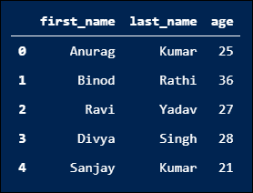
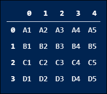
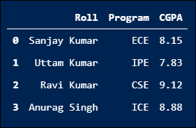
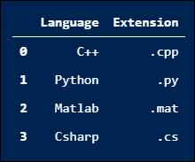

# Python 中如何把列表转换成数据帧？

> 原文：<https://www.askpython.com/python-modules/pandas/convert-lists-to-dataframes>

你好极客们！在本教程中，我们将讨论用 Python 从列表创建数据帧的不同方法。

***也读:*** [***如何在 Python 中组合 DataFrames？***](https://www.askpython.com/python-modules/pandas/combine-dataframes-in-python)

* * *

## Python 中的列表和数据帧是什么？

在 Python 中，**列表**是 Python 的标准数据结构之一，被广泛用作其他 Python 对象的数组。数据帧是由以表格形式存储数据的 [`pandas` Python 模块](https://www.askpython.com/python-modules/pandas/python-pandas-module-tutorial)提供的第三方 Python 对象。Pandas 数据框架可以从不同的 Python 对象创建，如列表、字典、NumPy 数组等。但是这里我们将只讨论从 Python 列表创建 pandas DataFrame 对象。所以让我们安装`pandas` Python 模块并开始我们的讨论。

```py
C:\Users\Guest> pip install pandas

```

在 Python 中，我们有多种方法从列表中创建熊猫数据帧。但这里我们只讨论其中一些常用的。

## 1.从一维列表创建数据帧

这是创建熊猫数据帧对象 Python 列表的最简单的技术之一。在这个方法中，我们将创建一个包含少量元素的一维列表，并将其传递给`DataFrame()`函数。这将返回一个 pandas DataFrame 对象，该对象由传递的一维列表的数据元素组成。

让我们编写 Python 代码来从一维列表创建熊猫数据帧。

```py
# Import pandas module
import pandas as pd 

# Create a Python 1-D list
lst = ['Android', 'Bootstrap', 'Csharp', 'Django']

# Create a DataFrame using 1-D list
df = pd.DataFrame(lst)
print(df)

```

**输出:**


## 2.从二维列表创建数据框架(列表列表)

在这个方法中，我们创建一个包含一些元素的 2-D Python 列表，并将其传递给`DataFrame()`函数。此外，这个`DataFrame()`函数返回一个 pandas DataFrame 对象，该对象由传递的二维列表的数据元素组成。让我们看看从二维列表创建熊猫数据帧的 Python 代码。

```py
# Import pandas module
import pandas as pd 

# Create a Python 2-D list
lst = [['Anurag', 'Kumar', 25], 
       ['Binod', 'Rathi', 36], 
       ['Ravi', 'Yadav', 27], 
       ['Divya', 'Singh', 28], 
       ['Sanjay', 'Kumar', 21]]

# Create a DataFrame using 2-D list
df = pd.DataFrame(lst, columns = ['first_name', 'last_name', 'age'])
print(df)

```

**输出:**



## 3.从元组列表创建数据帧

我们还可以使用元组的 Python 列表来创建 pandas DataFrame 对象。同样，我们有三种方法从元组列表中创建熊猫数据帧。让我们逐一讨论。

### 方法 1:将元组列表传递给 DataFrame()函数

在这个方法中，我们简单地创建一个 Python 列表，其中包含 Python 元组形式的数据。然后我们将它传递给`DataFrame()`函数。然后，`DataFrame()`函数返回一个由元组列表的数据元素组成的 Pandas DataFrame 对象。

让我们通过 Python 代码来实现这一点。

```py
# Import pandas module
import pandas as pd 

# Create a Python list of tuples
list_tp = [('A1', 'A2', 'A3', 'A4', 'A5'),
          ('B1', 'B2', 'B3', 'B4', 'B5'),
          ('C1', 'C2', 'C3', 'C4', 'C5'),
          ('D1', 'D2', 'D3', 'D4', 'D5')]

# Create a DataFrame using list of tuples
df = pd.DataFrame(list_tp)
print(df)

```

**输出:**



### 方法 2:使用 from_records()函数

在这个方法中，我们创建一个包含 Python 元组形式的数据的列表，就像我们在上面的 Python 代码中创建的一样。并将其传递给`from_records()`函数，然后该函数返回一个由元组列表的数据元素组成的 Pandas DataFrame 对象。让我们编写 Python 代码来实现这一点。

```py
# Import pandas module
import pandas as pd 

# Create a Python list of tuples
list_tp = [('Sanjay Kumar', 'ECE', 8.15),
           ('Uttam Kumar', 'IPE', 7.83),
           ('Ravi Kumar', 'CSE', 9.12),
           ('Anurag Singh', 'ICE', 8.88)]

# Create a DataFrame using list of tuples
# and from_records() function
df = pd.DataFrame.from_records(list_tp, columns = ['Roll', 'Program', 'CGPA'])
print(df)

```

**输出:**



### 方法 3:使用 list()和 zip()函数

在这个方法中，我们使用`list()`和`zip()`函数创建一个 Python 元组列表，其中包含 Python 元组形式的数据。

**[`zip()`函数](https://www.askpython.com/python/built-in-methods/python-zip-function)压缩传递给它的两个列表中的数据元素，并创建一个 [Python tuple](https://www.askpython.com/python/tuple/python-tuple) 对象。**

`list()`函数从 Python `zip()`函数返回的[迭代器对象](https://www.askpython.com/python/built-in-methods/python-iterator)中创建一个 Python 元组列表。

然后我们简单地将这个元组列表传递给`DataFrame()`函数，然后该函数返回一个由元组列表的数据元素组成的 Pandas DataFrame 对象。让我们看看实现这一点的 Python 代码。

```py
# Import pandas module
import pandas as pd 

# Create two Python lists
prog_lang = ['C++', 'Python', 'Matlab', 'Csharp']
file_extn = ['.cpp', '.py', '.mat', '.cs']

# Create a Python list of tuples
# using above lists and zip() function
list_tp = list(zip(prog_lang, file_extn))

# Create a DataFrame from lists using dictionary
df = pd.DataFrame(list_tp, columns = ['Language', 'Extension'])
print(df)

```

**输出:**



## 结论

在本教程中，我们学习了以下内容:

*   Python 中的数据框架对象和列表是什么
*   如何从一维创建数据框架
*   如何从列表列表或二维列表创建数据框架
*   从元组列表创建数据帧的不同方法