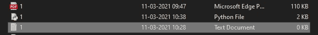
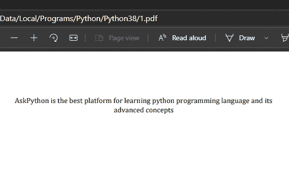
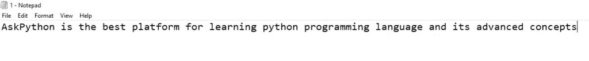

# 使用 Python 将 PDF 转换为 TXT 文件

> 原文：<https://www.askpython.com/python/examples/convert-pdf-to-txt>

在本文中，我们将创建一个简单的 python 脚本来帮助我们将 pdf 转换成 txt 文件。您可以下载各种应用程序，用于将 **pdf 转换为 txt** 文件。有很多在线应用程序也可用于此目的，但如果您可以使用简单的 python 脚本创建自己的 pdf 到 txt 文件转换器，那该有多酷。

我们开始吧！

* * *

## Python 中 PDF 转换为 TXT 的步骤

事不宜迟，让我们开始把 pdf 转换成 txt 的步骤。

### 步骤 01–创建一个 PDF 文件(或找到一个已有的文件)

*   打开新的 Word 文档。
*   在 word 文档中键入您选择的一些内容。
*   现在到文件>打印>保存。
*   请记住将 pdf 文件保存在保存 python 脚本文件的同一位置。
*   现在你的。创建并保存 pdf 文件，稍后您可以将其转换为. txt 文件。

### 步骤 02–安装 PyPDF2

*   首先，我们将安装一个名为 **PyPDF2** 的外部模块。
*   PyPDF2 包是一个**纯 python PDF 库**，您可以使用它来分割、合并、裁剪和转换 pdf。根据 PyPDF2 网站，你也可以使用 PyPDF2 添加数据、查看选项和密码到 PDF。
*   要安装 PyPDF2 包，请打开 windows 命令提示符并使用 [pip 命令](https://www.askpython.com/python-modules/python-pip)来安装 PyPDF2:

```py
C:\Users\Admin>pip install PyPDF2

```

```py
Collecting PyPDF2
  Downloading PyPDF2-1.26.0.tar.gz (77 kB)
     |████████████████████████████████| 77 kB 1.9 MB/s
Using legacy 'setup.py install' for PyPDF2, since package 'wheel' is not installed.
Installing collected packages: PyPDF2
    Running setup.py install for PyPDF2 ... done
Successfully installed PyPDF2-1.26.0

```

这将在您的系统上成功安装您的 PyPDF2 包。一旦它被安装，你就可以开始你的脚本了。

### 步骤 03–为脚本打开一个新的 Python 文件

*   打开你的 python IDLE 并按 ctrl + N 键，这将打开你的文本编辑器。
*   您可以使用您喜欢的任何其他文本编辑器。
*   将文件另存为 *your_pdf_file_name* .py。
*   保存这个。py 文件放在与 pdf 文件相同的位置。

* * *

## 让我们从脚本代码开始

```py
import PyPDF2

#create file object variable
#opening method will be rb
pdffileobj=open('1.pdf','rb')

#create reader variable that will read the pdffileobj
pdfreader=PyPDF2.PdfFileReader(pdffileobj)

#This will store the number of pages of this pdf file
x=pdfreader.numPages

#create a variable that will select the selected number of pages
pageobj=pdfreader.getPage(x+1)

#(x+1) because python indentation starts with 0.
#create text variable which will store all text datafrom pdf file
text=pageobj.extractText()

#save the extracted data from pdf to a txt file
#we will use file handling here
#dont forget to put r before you put the file path
#go to the file location copy the path by right clicking on the file
#click properties and copy the location path and paste it here.
#put "\\your_txtfilename"
file1=open(r"C:\Users\SIDDHI\AppData\Local\Programs\Python\Python38\\1.txt","a")
file1.writelines(text)

```

**下面是代码的快速解释:**

*   我们首先创建一个 [Python 文件对象](https://www.askpython.com/python/built-in-methods/open-files-in-python)，并以“读取二进制(rb)”模式打开 PDF 文件
*   然后，我们创建 PdfFileReader 对象，该对象将读取上一步中打开的文件
*   变量用于存储文件中的页数
*   最后一部分将把 PDF 中识别的行写入您指定的文本文件

**输出:**



**PDF 文件图像:**



**转换后的 Txt 文件图像:**



简单来说，这是关于如何通过编写自己的 python 脚本将 pdf 文件转换为 txt 文件。试试吧！