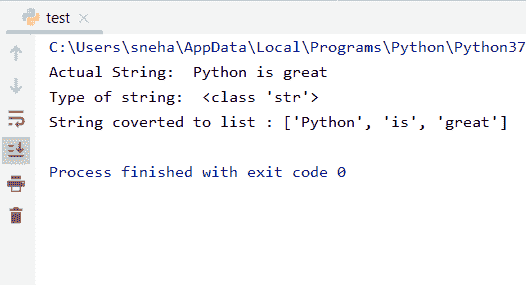
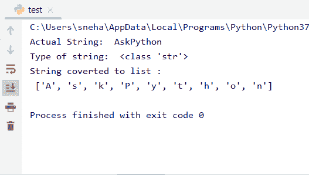
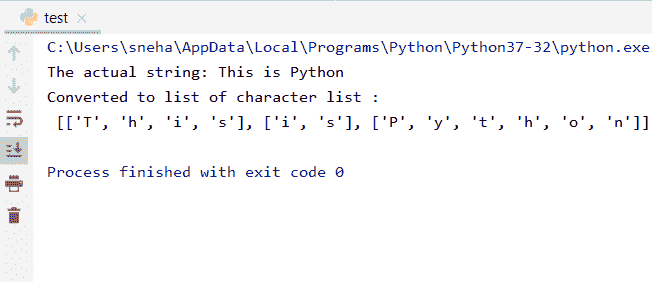
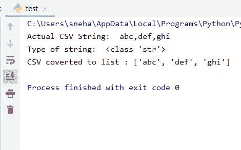
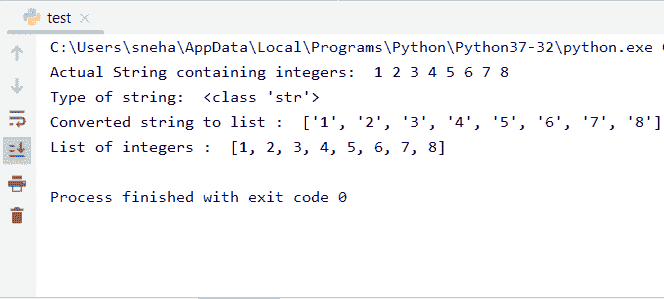

# 在 Python 中将字符串转换为列表

> 原文：<https://www.askpython.com/python/string/convert-string-to-list-in-python>

在编程时，我们可能需要在 Python 中将一个**字符串**转换成一个**列表**。那可能是任何其他原因。但是，这里出现了一个问题，我们如何将一个字符串转换成不同形式的列表？

因此，在本教程中，我们将学习如何在 **Python** 中将字符串转换成列表。

* * *

## Python 中把字符串转换成列表的方法

在 Python 中，将一个[字符串](https://www.askpython.com/python/string)转换成一个列表是一件非常简单的工作。根据我们的要求，可以通过以下不同的方法来实现。

在本教程中，我们将讨论在不同情况下使用 Python 将字符串转换为列表的所有方法。下面我们列出了所有的方法:

*   **字符串列表中的一个字符串**
*   **字符串到字符列表**
*   **字符串列表到列表列表的列表**
*   **CSV 到列表**
*   **一个由整数组成的字符串到一个整数列表**

现在我们将逐一讨论上述每一种技术。

* * *

### 1.字符串到字符串列表

当我们需要将一个字符串转换成 Python 中的一个列表，该列表包含父字符串的组成字符串(之前由一些分隔符分隔，如**、**或空格)，我们使用这个方法来完成任务。

例如，假设我们有一个字符串**“Python 很棒”**，并且我们想要一个只包含之前用空格分隔的给定名称的列表，我们只需根据空格的位置将字符串分成几个部分就可以得到所需的列表。

让我们看一个例子来更好地理解它。

```py
#given string
string1="Python is great"

#printing the string
print("Actual String: ",string1) 

#gives us the type of string1
print("Type of string: ",type(string1))  

print("String converted to list :",string1.split()) 
#prints the list given by split()

```

**输出**:



String To List Of Strings

在上面的代码中:

*   我们考虑一个字符串，`string1="Python is great"`,并尝试转换相同的组成字符串列表
*   type()给出了传递给方法的对象的类型，在我们的例子中是一个字符串
*   split()用于根据给定的分隔符将一个字符串拆分成一个列表。在我们的代码中，单词由空格分隔。默认情况下，如果我们不向 split()方法传递任何东西，它会根据空格的位置拆分字符串
*   因此，尽管我们没有提到 separator 参数，`split()`方法给了我们一个相应字符串的列表

* * *

### 2.字符串到字符列表

如果我们需要一个字符串中的字符列表怎么办？在这种情况下，在 Python 中使用`list()`方法直接将类型从字符串转换为列表就可以了。

当然，如果输入字符串是类似于 **"abcd"** 的东西，那么使用`list()`方法将字符串类型化为一个列表会给我们一个列表，它的元素是单个字符 **'a '，' b '，' c '，' d'** 。看看下面给出的示例代码。

```py
#given string
string1="AskPython"

#printing the string
print("Actual String: ",string1)
#confirming the type()
print("Type of string: ",type(string1))

#type-casting the string into list using list()
print("String converted to list :\n",list(string1))

```

**输出**:



String To List Of Characters

理解代码:

*   首先在这里，我们初始化一个字符串，`string1`为 **"AskPython"** ，并使用`type()`方法打印它的类型
*   正如我们所观察到的，使用`list()`方法对字符串进行类型转换会根据需要为我们提供一个成员字符列表

* * *

### 3.字符串列表到列表列表

在这里，我们将看到如何结合上述两种方法来将一个字符串转换成一个字符列表。

仔细看下面给出的例子，

```py
#Given string
string1="This is Python"

print("The actual string:",string1)

#converting string1 into a list of strings
string1=string1.split()

#applying list method to the individual elements of the list string1
list1=list(map(list,string1))

#printing the resultant list of lists
print("Converted to list of character list :\n",list1)

```

**输出**:



String To List Of Character Lists

理解代码:

*   在这种情况下，在初始化字符串`string1`之后，我们使用第一种方法，将它转换成一个字符串列表
*   也就是说，此时 string1 是由`[ 'This', 'is', 'Python' ]`给出的字符串列表
*   然后我们将`list()`方法应用于列表的所有元素
*   **string1** 。正如我们在前面的例子中看到的，这给了我们一个由字符列表组成的列表。注意，使用[映射()函数](https://www.askpython.com/python/built-in-methods/map-method-in-python)进行批量类型转换

* * *

### 4.CSV 至列表

**CSV(逗号分隔值)**字符串，顾名思义就是由逗号分隔的值或数据组成的字符串。

让我们看看如何在 Python 中将这种类型的字符串转换成列表。

```py
#given string
string1="abc,def,ghi"
print("Actual CSV String: ",string1)
print("Type of string: ",type(string1))

#spliting string1 into list with ',' as the parameter
print("CSV converted to list :",string1.split(','))

```

**输出**:



CSV To List

这里:

*   类似地，我们首先考虑一个字符串 **string1** ，其中包含由逗号(**、**)分隔的各种数据或值
*   在打印完它和它的`type()`之后，我们继续根据参数'，'对它进行分割
*   这使得值“abc”、“def”和“ghi”成为列表的元素。这样，我们能够从给定的 **CSV** 中提取值

* * *

### 5.由整数组成的字符串转换为整数列表

现在我们要转换一个字符串，该字符串只包含由空格、逗号等分隔的整数。，到一个有**个整数**个元素的列表。

例如，看看下面的代码，

```py
#string with integers sepated by spaces
string1="1 2 3 4 5 6 7 8"
print("Actual String containing integers: ",string1)
print("Type of string: ",type(string1))

#converting the string into list of strings
list1=list(string1.split())
print("Converted string to list : ",list1)

#typecasting the individual elements of the string list into integer using the map() method
list2=list(map(int,list1))
print("List of integers : ",list2)

```

**输出**:



String With Integers To List

现在:

*   我们取一个字符串，`string1`作为 **"1 2 3 4 5 6 7 8"** ，并连续打印它和它的 **type()**
*   然后，我们使用`split()`方法将其拆分，并将结果列表存储到一个列表中， **list1** 。在这一点上，list1 持有 **[ '1 '，' 2 '，' 3 '，' 4 '，' 5 '，' 6 '，' 7 '，' 8' ]** 正如我们从输出中所看到的，正如预期的那样
*   现在我们[在整个列表中映射](https://www.askpython.com/python/built-in-methods/map-method-in-python)函数`int()`，将每个元素类型化为整数。此外，我们将类型化的映射列表存储到**列表 2** 中并打印出来
*   结果，我们得到了一个由整数元素组成的列表，现在我们可以对其执行算术运算。

* * *

## 结论

这就是现在，这是关于使用各种方法将字符串转换成不同的列表。尝试使用适合您的代码、解决您的目的以及满足您的要求的方法。欢迎在评论中提问。

* * *

## 参考

*   [https://www.askpython.com/python/string](https://www.askpython.com/python/string)