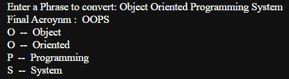

# 将文本转换成 Python 中的首字母缩略词——完整指南

> 原文：<https://www.askpython.com/python/examples/convert-text-to-acronyms>

一个`acronym`是一个长短语的缩短版本，例如，我们有 **NLP 用于自然语言处理**。在本教程中，我将向您展示如何创建一个将文本转换为缩写的 Python 应用程序。

虽然拼出整个单词需要更长的时间，但说出或写出每个单词的首字母或整个单词的缩写形式需要更少的时间。因此，在日常用语中使用首字母缩略词会使交流更容易。

***也读作:[用 Python 加密价格预测](https://www.askpython.com/python/examples/crypto-price-prediction)***

* * *

## 在 Python 中将文本转换成首字母缩略词

为了实现首字母缩略词，我们的目标是从给定的句子中生成单词的简短形式**。同样可以通过**拆分索引**得到第一个单词然后组合。**

看看下面提到的代码，然后我们将一行一行地深入代码内部。

```py
Phrase = input("Enter a Phrase to convert: ")
list_words = Phrase.split()
final_acro = ""
for i in list_words:
    final_acro+=i[0].upper()

print("Final Acroynm : ",final_acro)
for i in range(len(final_acro)):
    print(final_acro[i]," -- ",list_words[i])

```

*   在[输入](https://www.askpython.com/python/built-in-methods/python-input-function)功能的帮助下，`Line 1`获取需要转换成缩略词的短语的输入。
*   `Line 2`会在[拆分](https://www.askpython.com/python/string/python-string-split-function)功能的帮助下将句子转换成单词列表，默认情况下，该功能会根据空格拆分句子。
*   `Line 3`正在用一个空字符串初始化最终的首字母缩写词，该字符串稍后将被更改。
*   从`Line 4`和`Line 5`开始，我们有一个循环，将每个单词的第一个字母作为一个字符添加到最终的缩写词中。
*   首字母缩略词总是包含**大写**字母，因此，在[大写](https://www.askpython.com/python/string/python-string-upper-function)函数的帮助下，每个单词的每个第一个字母都被转换成大写，而不管它们之前的大小写。
*   从`Line 7`到`Line 9`将显示在[循环](https://www.askpython.com/python/python-loops-in-python)和[打印](https://www.askpython.com/python/built-in-methods/python-print-function)语句的帮助下创建的最终缩写。

* * *

## 输出示例

下图显示了执行上一节中提到的代码后的一些示例输出。


Sample Output Acronym



Sample Output2 Acronym

* * *

## 结论

我希望你理解首字母缩写词以及如何用 python 实现它们。你自己试试！

编码快乐！😇

想了解更多？查看下面提到的教程:

1.  [找出没有连续 1 的可能字符串的数量](https://www.askpython.com/python/examples/number-of-possible-strings)
2.  [如何在 Python 中将字典转换成字符串？](https://www.askpython.com/python/string/dictionary-to-a-string)
3.  [在 Python 中把元组转换成字符串【一步一步】](https://www.askpython.com/python/string/convert-tuple-to-a-string)
4.  [Python 中的字符串格式——快速概述](https://www.askpython.com/python/string/string-formatting)

* * *