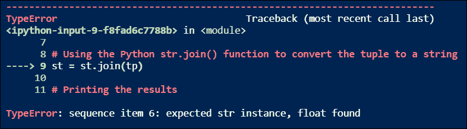

# 在 Python 中将元组转换为字符串[一步一步]

> 原文：<https://www.askpython.com/python/string/convert-tuple-to-a-string>

在本教程中，我们将讨论在 Python 中将元组转换为字符串的不同方法。

* * *

## Python 中的元组是什么？

在 Python 中，**元组**是一种线性数据结构，用于存储有序的数据集合，这些数据可以是相似的类型，也可以是不同的类型。元组的元素被括在括号`()`中。

元组的所有元素都从`0 to N-1`开始索引，其中 N 是元组的长度或大小，我们可以直接访问元组的任何元素。

它还允许存储重复值，这意味着不同的索引元素可以具有相同的值。

一个[元组本质上是不可变的](https://www.askpython.com/python/tuple/python-tuple)，这意味着我们在创建它之后不能改变它的值。

下面是我们如何用 Python 创建一个`tuple`。我们将使用 [type()方法](https://www.askpython.com/python/built-in-methods/python-type-function)来验证一个元组是否已经被创建。

```py
# Defining a Python tuple
tp = ('Ubuntu', 'Kali', 'Debian', 'Fedora', 'Ubuntu')

# Printing the results
print(tp)

# Validating the type of 'tp'
print(type(tp))

```

**输出:**

```py
('Ubuntu', 'Kali', 'Debian', 'Fedora', 'Ubuntu')
<class 'tuple'>

```

## Python 中的字符串是什么？

在 Python 中，**字符串**是最常用的数据类型。任何用单引号、双引号或三引号括起来的值都被视为字符串。三重引号还允许您在字符串变量中输入多行。

一个 Python 字符串可以被认为是一个字符数组，但是请记住我们在 Python 中没有任何字符数据类型，所以即使是单个字符也是一个字符串。

像 Python tuple 一样，一个字符串的所有元素(字符)都从`0 to N-1`开始索引，其中 N 是字符串的长度或大小，我们可以直接访问字符串的任何字符。

Python 字符串是可变的，这意味着我们可以在创建它之后改变它的值。Python 中有一个内置函数`[print()](https://www.askpython.com/python/built-in-methods/python-print-function)`,用于在控制台上打印字符串值。

```py
# Defining Python string
str1 = 'AskPython'
str2 = "LinuxforDevices"
str3 = """AskPython and LinuxforDevices 
are parts of JournalDev 
IT Services Private Limited."""

# Printing the results
print(str1)
print(str2)
print(str3)

# Validating the type of str1, str2, & str3
print(type(str1))
print(type(str2))
print(type(str3))

```

**输出:**

```py
AskPython
LinuxforDevices
AskPython and LinuxforDevices  
are parts of JournalDev  
IT Services Private Limited. 
<class 'str'> 
<class 'str'> 
<class 'str'>

```

## 将元组转换为字符串的 3 种方法

在 Python 中，主要有三种将元组转换为字符串的方法，这三种方法是经常使用的，理解起来也很重要。让我们逐一讨论。

***推荐阅读: [Python astype()方法](https://www.askpython.com/python/built-in-methods/python-astype)***

### 1.使用 for 循环将元组转换为字符串

在这个将 Python `tuple`转换成 Python `string`的方法中，我们将使用简单的 [`for`循环](https://www.askpython.com/python/python-for-loop)来遍历元组元素，并不断将元组的每个元素添加到一个空的 Python 字符串中。让我们通过下面的 Python 代码来理解这一点。

```py
# Defining a Python tuple
tp = ('Linux', 'for', 'Devices')

# Creating an empty Python string
st = ''

# Using the Python for loop to convert the tuple to a string
for item in tp:
    st = st + item

# Printing the results
print("Given Python tuple: ", tp)
print("Generated Python string: ", st)

# Validating the type of 'st'
print(type(st))

```

**输出:**

```py
Given Python tuple:  ('Linux', 'for', 'Devices') 
Generated Python string:  LinuxforDevices 
<class 'str'>

```

### 2.使用 Python join()函数将元组转换为字符串

在这个将 Python `tuple`转换成 Python `string`的方法中，我们将使用`str.join()`函数。这个 Python 函数将 tuple 这样的可迭代 Python 对象作为其参数，并返回使用字符串分隔符**或分隔符**连接的 Python 字符串。这个分隔符或定界符可以是

e 任何字符串，但通常，我们使用空字符串("")、逗号(，)、连字符(-)和单个空格(" ")。让我们通过下面的 Python 代码来理解这一点。

```py
# Defining a Python tuple
tp = ('AskPython', 'is', 'a', 'part', 'of', 'JournalDev.')

# Creating a string separator/delimiter
# Here it's a single space
st = ' '

# Using the Python str.join() function to convert the tuple to a string
st = st.join(tp)

# Printing the results
print("Given Python tuple: ", tp)
print("Generated Python string: ", st)

# Validating the type of 'st'
print(type(st))

```

**输出:**

```py
Given Python tuple:  ('AskPython', 'is', 'a', 'part', 'of', 'JournalDev.') 
Generated Python string:  AskPython is a part of JournalDev. 
<class 'str'>

```

### 3.使用 Python reduce()函数将元组转换为字符串

在这个将 Python `tuple`转换成 Python `string`的方法中，我们将使用`reduce()`函数。在 Python 中，reduce()函数将一个*函数*作为其第一个参数，将一个*的可迭代函数*作为其第二个参数。

然后，它将该函数应用于 iterable 对象的每个元素，并返回该函数执行的操作的最终结果。

这里我们将传递`add`函数和一个元组作为 iterable 对象。这样，`reduce()`函数会将元组的每个元素相加。

我们先来了解一下如何使用这个`reduce()`和`add()`函数，通过 Python 代码将一个元组转换成一个字符串。

**注意:** *要使用`reduce()`和`add`()函数，我们必须导入两个 Python 模块`funtools`和`operator`。由于`reduce()`和`add()`功能分别定义在`funtools`和`operator`模块中。我们不需要安装这些模块，因为它们是 Python 的标准模块，并且与 Python 解释器一起安装在系统上。*

```py
# Importing Python functools module which contains the reduce() function
import functools

# Importing Python operator module which contains the add() function
import operator

# Defining a Python tuple
tp = ('Linux', 'for', 'Devices')

# Using the Python  reduce() function to convert the tuple to a string
st = functools.reduce(operator.add, tp)

# Printing the results
print("Given Python tuple: ", tp)
print("Generated Python string: ", st)

# Validating the type of 'st'
print(type(st))

```

**输出:**

```py
Given Python tuple:  ('Linux', 'for', 'Devices') 
Generated Python string:  LinuxforDevices 
<class 'str'>

```

## 使用 Python join()将元组转换为字符串时出错

如果我们试图使用`join()`函数将一个元组(至少有一个非字符串元素)转换成 Python 中的字符串，那么我们可能会得到一个错误。

这实际上是一个 ****`TypeError`**** ，它的产生是因为`join()`函数不能将一个字符串值与一个非字符串值相连接。

因此，为了克服这个`TypeError`，我们使用了`map()`函数。在 Python 中，map()函数接受两个参数，第一个是一个*函数*，第二个是一个*可迭代 Python 对象*，就像一个`tuple`，然后它将该函数应用于可迭代对象的每个元素。

最后，它返回一个 map 对象，实际上是一个迭代器。这个迭代器属于 iterable，它的元素是应用于作为参数传递的 iterable 对象的每个元素的函数的结果。

让我们通过 Python 代码来理解这个概念。

```py
# Defining a Python tuple with two non-string elements (float)
tp = ('Ubuntu', 'is', 'available', 'in', 'different', 'versions:', 20.04, 18.04, 'etc.')

# Creating a string separator/delimiter
# Here it's a single space
st = ' '

# Using the Python join() function to convert the tuple to a string
st = st.join(tp)

# Printing the results
print("Given Python tuple: ", tp)
print("Generated Python string: ", st)

# Validating the type of 'st'
print(type(st))

```

**输出:**



TypeError With str.join() function

现在让我们使用 map()函数和 join()函数运行上面的 Python 程序，看看这个 TypeError 是否被删除了。

```py
# Defining a Python tuple with two non-string elements (float)
tp = ('Ubuntu', 'is', 'available', 'in', 'different', 'versions:', 20.04, 18.04, 'etc.')

# Creating a string separator/delimiter
# Here it's a single space
st = ' '

# Using the Python map() function with str.join() function to convert the tuple to a string
# Here the first argument is str() function & the second argument is a tuple
st = st.join(map(str, tp))

# Printing the results
print("Given Python tuple: ", tp)
print("Generated Python string: ", st)

# Validating the type of 'st'
print(type(st))

```

**输出:**

```py
Given Python tuple:  ('Ubuntu', 'is', 'available', 'in', 'different', 'versions:', 20.04, 18.04, 'etc.') 
Generated Python string:  Ubuntu is available in different versions: 20.04 18.04 etc. 
<class 'str'>

```

## 总结

在本教程中，我们学习了 Python 中三种不同的将元组转换为字符串的方法。我们还学习了 Python 中的`join()`函数、`map()`函数、`reduce()`函数。我们还学习了如何解决在 Python 中使用`str.join()`函数将元组转换成字符串时出现的`TypeError`。