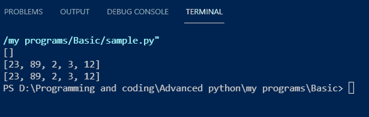

# Python 中元组到数组的转换——完整指南

> 原文：<https://www.askpython.com/python/array/convert-tuple-to-array>

在本文中，我们将学习如何在 Python 中将**元组转换成数组。Python 是一种很棒的编程语言。从它出现的那天到今天，它的受欢迎程度与日俱增。它在编程中如此受欢迎有一些原因。**

## 关于 Python 的快速背景

1.  这是一个开源项目
    1.  Python 的创造者 Guido Von Rossum 先生从开发之初就让它成为一个开源项目。他相信保持它的免费贡献将会给它增加更多的功能。不仅如此，不同的开发人员还可以使它跨平台，并为各种其他领域开发它。随着时间的推移，他的想法最终获得了成功。
    2.  开发者现在正在为它做贡献，各种模块正在帮助学习者非常容易地学习各种新概念。
2.  **庞大的库支持**
    1.  由于开源的贡献，各种模块和库是可用的。每个库独立于独立的任务。
    2.  这些库很容易添加到 python 环境中。pip 包(Python 的包安装程序)使它变得简单。
3.  **强大的开发者支持**
    1.  python 的开发者遍布世界各地。
    2.  他们不断发送越来越多的高级代码，让这个项目成为编码人员更好的平台。
4.  **从**中选择的域
    1.  这有不同的领域。**机器学习、数据科学、人工智能、网页抓取、网页开发、物联网和云计算**等。是这些领域中的一些。
    2.  核心应用还包括**软件开发**。
5.  **易学易懂**
    1.  Python 易学易懂。就是这么简单，一个人一天之内就能把基本的算术和输入操作搞清楚。
    2.  它是一种面向对象的多用途编程语言，具有最简单的类实现。

## Python 中的数组和列表

考虑到我们需要为一些编程相关的工作创建十个整型变量。我们需要做一些声明，很明显，这将覆盖十行额外的代码。编写这样的代码是一项单调乏味的任务。因此，我们有这个问题的数组。

Python 中的数组或列表是需要学习的最基本的数据结构之一。它们是属于一种或多种数据类型的元素的集合。背后的想法。我们可以多次访问数组中的元素。这也减少了许多行代码，并消除了额外变量的创建。

## Python 中列表和数组的区别

| **列表** | **数组** |
| 包含不同数据类型的元素。 | 包含单一数据类型的元素。 |
| 可通过循环迭代 | 可通过循环迭代 |
| 它通常在一维模型中操作 | 它通常在一维或多维空间中操作。 |

***Source – [Python List vs Array](https://www.askpython.com/python/difference-between-python-list-vs-array)***

当每个人都搞不清这两者时，主要问题就出现了。因此，为了清楚起见，我们将应用代码

## 用 Python 声明列表

让我们用 Python 声明一个列表

**代码:**

```py
list1 = [23, 34, 12, 22] # declaring a list
print(list1) # printing the list on the screen

```

**输出:**


List Output

我们可以通过各种方法来编辑列表。这些操作包括:

1.  添加新元素
2.  删除元素
3.  将元素与外部元素相乘。

### 1.添加新元素

**append()** 方法在列表末尾添加新元素。这个函数将我们需要添加到末尾的元素作为参数。

**代码:**

```py
list1 = [11, 34, 23, 33, 4]
list1.append(2) # adds 2 at the end

# Output :-  [11, 34, 23, 33, 4, 2]

```

我们还可以使用索引概念来编辑列表。索引是分配给列表和数组中每个元素的位置号。它从左到右和从右到左开始。

**代码:**

```py
list1 = [23, 2, 4, 44]
#       0   1  2  3  positive indexing starts from left to right
#      -4 -3 -2 -1   negative indexing starts from right to left

```

要访问它们，我们需要用方括号中的索引号调用列表。在下面的例子中，我们将访问第三个元素。记住，正指数从 0 开始，一直持续到 n-1。

**代码:**

```py
list1 = [11, 34, 23, 33, 4]
print(list1[2])
# Output :- 23

```

**说明:**

1.  索引从 0 开始，从 0 到 2 的计数为 3。它将给出 23 的输出。因此，要访问第三个元素，我们需要调用方括号中的 2。
2.  在第二行代码中，我们使用相同的属性更改了第零个位置的元素。

### 2.删除新元素

添加新元素的主要目的是好的，但是，当我们需要从列表中删除它们时，有一些操作。几个函数有助于移除对象。

1.  clear() 函数从列表中删除所有元素并返回空值
2.  **pop()** 函数将索引号整数作为参数，并删除与该索引位置相关的元素。
3.  **remove()** 函数从列表中移除我们需要在其中作为参数给出的元素。

**代码:**

```py
list1 = [23, 89, 2, 3, -1, 12]
list1.clear() # deleting each element from the list
print(list1)

list1 = [23, 89, 2, 3, -1, 12]
list1.pop(4) # deleting the element from 4th index of the list
print(list1)

list1 = [23, 89, 2, 3, -1, 12]
list1.remove(-1) # search and remove the specified element from the list
print(list1)

```

**输出:**



List Operations

## Python 中的数组是什么？

Python 有一个独立的库用于 **[数组操作](https://www.askpython.com/python/examples/arithmetic-operations-on-images)。**当我们使用 [**数组**模块](https://www.askpython.com/python/array/python-array-declaration)时，我们可以感受到某种程度的 C 编程体验。

我们知道在这个数据结构中只能存储相同数据类型的元素。因此，python 编译器有特殊的 Unicode 字符来识别其中的元素或对象的类型。

声明一个数组有一套规则。array()函数接受一些参数。它们特定于特定的数据类型。

| **类型代码** | **C-类型** | **Python 类型** |
| ' b ' | 带符号字符 | 整数 |
| ' b ' | 无符号字符 | 整数 |
| 你好 | 性格；角色；字母 | 无符号字符 |
| ' h ' | 带符号的短 | 整数 |
| ' h ' | 无符号短整型 | 整数 |
| 我 | 有符号整数 | 整数 |
| 我 | 无符号整数 | 整数 |
| 我 | 长签名 | 整数 |
| 我 | 无符号长整型 | 整数 |
| 问 | 署名龙龙 | 整数 |
| 问 | 无符号长整型 | 整数 |
| f ' | 漂浮物 | 漂浮物 |
| 迪 | 两倍 | 漂浮物 |

C 型特殊字符的分配是为了使事情更清楚。这些类型表示特定数组中元素的数据类型。上面的代码是一些基本的实现。

**代码；**

```py
from array import *
int_array = array('i', [1, 4, 55, 51, -2])
print('\n Integer array: ',int_array)

char_array = array('u', ['a', 'b', 'c', 'd'])
print('\n Character array: ', char_array)

float_array = array('f', [2.2, 4.3, -1.2, 9.0])
print('\n Floating point array: ', float_array, '\n')

```

**输出:**


Array Operations

### 数组到列表的转换

其他方法如 append()、pop()等。也适用于本模块。通过此[链接](https://docs.python.org/3/library/array.html)在文档页面查看更多信息。其他的特殊函数还包括将数组转换成普通的列表-**array . to list()**。

**代码:**

```py
from array import *

char_array = array('u', ['a', 'b', 'c', 'd'])
print('\n Character array: ', char_array)
print('Data type: ', type(char_array))

char_array = char_array.tolist()
print('\n','Converted array: ', char_array)
print('Data type: ', type(char_array))

```


Conversion Of Array To List

**注意:代码中的 type()函数返回变量的数据类型。**通过这个，我们检查数组的数据类型，把数组转换成列表。

## Python 中的元组是什么？

Python 中最基本的数据结构之一是 **[元组](https://www.askpython.com/python/tuple/python-tuple)** 。元组是不可变的数据结构。我们将元素放在圆括号内，并用逗号分隔它们。一旦我们创建了一个元组，就没有直接的方法来改变或编辑它。

**代码:**

```py
tup = (3, 1, 2, 4, 5, 6) # declaration of a tuple
print(tup) # printing it on the screen

# output - (3, 1, 2, 4, 5, 6)

```

### 1.从元组中检索元素

我们可以使用[索引方法](https://www.askpython.com/python/list/indexing-in-python)访问元组中的元素。就像列表一样，元组中的元素被分配了索引号，

```py
tup = (2, 34, 1, -1, -4, 3)
print(tup[3])
print(tup[4])
print(tup[-1])

```


Tuple operations

这里，我们从元组的第四、第五和最后一个位置提取元素。

## 将元组转换为数组和其他数据结构

Python 提供了几个函数和模块来将它们转换成其他数据结构。从字面上看，它们是简单的代码行。

### 将元组转换为数组

我们将在这里介绍两种方法。第一种是使用**阵列模块**，第二种是使用 **NumPy 模块**。

#### **使用数组模块**将元组转换为数组

以前，数组模块帮助我们声明纯数组。但是，我们也可以将它用于转换目的。所以，为了清楚起见，让我们用代码来理解。

```py
from array import *

tup = (23, 98, 3, -2, -4, 11)
print('\n tuple: ', tup)
conv_tup = array('i', tup)
print('\n Converted tuple to an array: ',conv_tup, '\n')

```


Conversion Using Array Module

**说明:**

1.  导入数组模块。
2.  声明一个元组。在屏幕上打印出来。
3.  然后我们使用数组函数。在那把**型代号**字符给定为**‘我’**。这将把元组转换成整数数组。在下一个参数中，我们给出了分隔逗号的元组。
4.  在屏幕上打印数组。

### 使用 Numpy 模块将元组转换为数组

[**Numpy**](https://www.askpython.com/python-modules/numpy/python-numpy-module)–numeric python 是一个非常好的数组相关操作库。对于复杂的数学计算，这是开发者的选择。

为此，我们使用该库中的 **array()** 方法。这个方法将 tuple 转换成一个 NumPy 数组，供我们使用。

**代码:**

```py
import numpy as np
tup = (23, 98, 3, -2, -4, 11)
print('\n tuple: ', tup)
print('Data type', type(tup))
conv_tup = np.array(tup)
print('\n Converted tuple to an array: ',conv_tup)
print('Data type', type(conv_tup),'\n')

```

**输出:**


Conversion Using Numpy Module

**说明:**

1.  正在导入 **NumPy** 模块。
2.  声明元组并在屏幕上打印出来。
3.  使用 type()打印数据类型。
4.  声明一个变量**conv _ 图**并调用 **np.array()** 方法，元组在其中作为参数。
5.  在屏幕上打印转换后的元组及其数据类型，以确认转换。

### 将元组转换为列表

**代码:**

```py
tup = (2, 34, 2\. -1, 9, 0) # declare a tuple
new_tup = list(tup) # converts tuple into list
print(new_tup)

# Output = [2, 34, 2\. -1, 9, 0)]

```

**说明:**

1.  首先，我们将一个元组声明为 tup。
2.  然后我们把一个变量设为 new_tup，然后我们调用里面的 **list()** 函数，我们把元组作为参数给出。
3.  它将它转换成一个普通的列表。
4.  然后我们把它打印在屏幕上

## 结论

所以，这里我们结束 python 中元组到数组的转换话题。这些代码实现起来非常简单，也很容易学习。所以，记录每一行代码，理解它的功能。本文还澄清了关于列表和元组的概念。