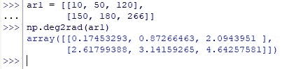
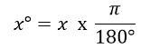
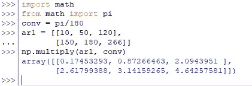

# 在 Python 中使用 Numpy 将角度转换为弧度

> 原文：<https://www.askpython.com/python-modules/numpy/converting-degrees-to-radians-numpy>

几何学是一门引人入胜的学科。所有这些形状和数字都有对肉眼来说是神秘的基础，但是可以用数学来解释。它被称为所有科学中的*女王是有原因的。这篇文章将讨论一个与几何学相关的属性——角度！*

像任何度量一样，角度也可以用特定的度量单位来度量。回忆过去美好的学生时代有助于我们记起用量角器画有角度的形状的时候&量角器上会刻上什么来帮助我们画角度。没错，就是*度*！

就像英里和千米一样，度也有一个同义的度量单位，可以用来测量角度——*弧度！*以无理数*π*(π)*弧度*为基础，用来求一个角度产生的弧长，而度数给我们一个角度产生的旋转。

## 使用 Numpy 将角度转换为弧度的不同方法

现在我们已经对什么是什么有了一个大概的了解，让我们直接进入它的编程部分。我们将从使用以下代码在 Python 中导入 [*NumPy* 库](https://www.askpython.com/python-modules/numpy/python-numpy-module)开始。

```py
import numpy as np

```

以下是使用 Python 将角度转换为弧度的不同技术。

*   使用 numpy.radians()
*   使用 numpy.deg2rad()
*   使用 *pi* (π)

* * *

### **技巧一——使用 numpy.radians( )**

用户可以使用 *numpy* 库中的 *radians( )* 函数将任何给定的角度转换为角度，既可以是一个实体，也可以是一个数组。让我们首先尝试使用下面的代码转换一个 180 度的实体。

```py
np.radians(180)

```


Converting Single Entity Using Numpy Radians

从上面可以看出，返回值 3.141592…是 *pi* (π)的值，因为 180 度与 *pi* 弧度相同。

* * *

### **技巧二——使用 numpy.deg2rad( )**

虽然也可以使用来自 *numpy* 库的 *deg2rad( )* 函数转换单个实体，但同样的操作也可以用于数组。因此，我们将使用 *deg2rad( )* 函数演示度数值数组到弧度的转换。对于上述技术也是如此，程序与下面给出的相同。

```py
ar1 = [[10, 50, 120],
       [150, 180, 266]]
np.deg2rad(ar1)

```



Converting An Array Of Degree Values

* * *

### **技巧三——使用 *pi* (π)**

这种技术利用了弧度从度数转换的基本原理；包括 Python 在内的所有软件都会用到的数学基础。有些事情说出来比说出来更好，所以这是将度数转换成弧度的公式。



Formula For Degrees To Radians Conversion

在前面的技术中已经指出，π是 180 度的弧度等价物。所以任何角度都要乘以π，然后除以 180 度，得到它的弧度等值。

好消息是，我们也将在 Python 中这样做！但是我们需要导入另一个库来获取 *pi，*的精确值，而不是使用 3.14 的近似值。我们将使用下面的代码导入 Python 中的*数学*库。

```py
import math
from math import pi

```

然后，应该为π/180 的值指定一个常数，如下所示。

```py
conv = pi/180

```

然后我们可以使用 *numpy* 库中的 *multiply( )* 函数进行转换，如下所示。



Converting Degrees To Radians Using Pi

* * *

## **结论**

既然我们已经到了本文的结尾，希望它已经详细阐述了如何使用 Python 中的 *numpy* 库将实体从角度转换为弧度。这里有另一篇文章详细介绍了[如何在 Python](https://www.askpython.com/python/how-to-use-numpy-divide-in-python) 中使用 *numpy* 来划分实体。AskPython 中还有许多其他有趣的&同样丰富的文章，可能对那些希望提高 Python 水平的人有很大帮助。当你享受这些的时候，再见！