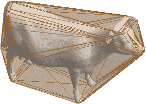
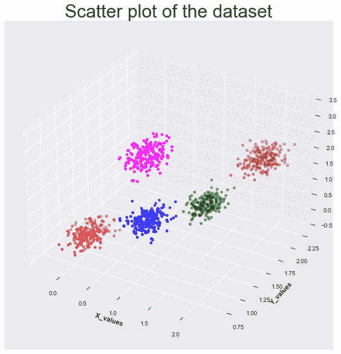
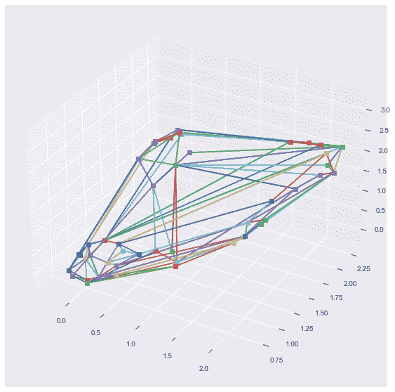
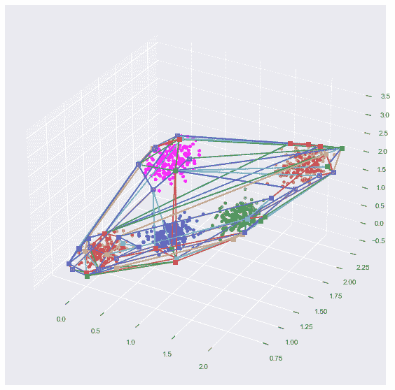

# Python 中的凸包

> 原文：<https://www.askpython.com/python/examples/convex-hulls-in-python>

在本教程中，我们将在凸包的帮助下完成一个不同的和独特的聚类方法的实现。但是在直接进入代码之前，理解概念总是很重要的！那么我们来了解一下什么是凸包。

* * *

## 凸包介绍

`Convex object`是一个内角不大于 180 度的物体。一个`Hull`暗示了物体外形的外部。一个`convex hull`包含了一组点，它作为一个聚类的边界，帮助确定一个聚类中的所有点。这是一个简单的奶牛凸包的真实例子。你可以看到外面的外壳将整头牛包裹在外壳内。



Convex Hulls Demonstration

* * *

## 凸包的代码实现

我们将首先在 sci-kit learn 库的帮助下创建本教程的样本数据集。我们将利用`make_blobs`功能。我们将为 5 个不同的集群创建数据。看看下面的代码。

```py
import numpy as np
from sklearn.datasets import make_blobs

# center points for the clusters
centers = [[0, 1, 0], [1.5, 1.5, 1], [1, 1, 1],[1,1,3],[2,2,2]]
# standard deviations for the clusters
stds = [0.13, 0.12, 0.12,0.15,0.14]

# create dataset using make_blobs - assign centers, standard deviation and the number of points
X, labels_true = make_blobs(n_samples=1000, centers=centers, cluster_std=stds, random_state=0)
point_indices = np.arange(1000)

```

总的来说，我们生成了分配给`five`个不同集群的`1000`个数据点。接下来，我们将尝试可视化数据。由于我们的数据集是三维形式的，我们将为数据绘制一个 3D 图。观察下面的代码。我们将绘制所有的数据点，并为图指定颜色来表示聚类。看看这个情节变得多么惊人！

***也读作:[使用 Matplotlib 的 Python 中的三维绘图](https://www.askpython.com/python-modules/matplotlib/3-dimensional-plots-in-python)***

```py
import matplotlib.pyplot as plt
plt.style.use('seaborn')

x,y,z = X[:,0],X[:,1],X[:,2]

fig = plt.figure(figsize = (20,10),facecolor="w") 
ax = plt.axes(projection="3d") 

list_colours = ["red", "green", "blue","magenta","brown"]
cluster_colors = [list_colours[i] for i in labels_true]

scatter_plot = ax.scatter3D(x,y,z,c =cluster_colors,marker ='o')
plt.title("Scatter plot of the dataset",fontsize=30) 
ax.set_xlabel('X_values', fontweight ='bold')  
ax.set_ylabel('Y_values', fontweight ='bold') 

plt.show()

```



Plotting Dataset ConvexHull

我们将从`scipy`的`spatial`模块导入`ConvexHull`和凸包绘图功能。我们将为我们生成的数据集分配凸包点。

```py
from scipy.spatial import ConvexHull, convex_hull_plot_2d
rng = np.random.default_rng()
hull = ConvexHull(X)

```

让我们使用下面的代码来可视化空间中的凸包。我们将使用创建的 hull 对象的`simplices`函数来绘制凸包的边界。

```py
fig = plt.figure(figsize = (20,10),facecolor="w") 
ax = plt.axes(projection="3d") 
for simplex in hull.simplices:
    ax.plot3D(X[simplex, 0], X[simplex, 1],X[simplex, 2], 's-') 

```



Plotting ConvexHull 1

看看凸包在 3D 空间看起来有多惊艳。

为了让事情变得更有趣一点，让我们使用下面提到的代码在一个图中同时绘制集群和船体。

```py
fig = plt.figure(figsize = (20,10),facecolor="w") 
ax = plt.axes(projection="3d") 
scatter_plot = ax.scatter3D(x,y,z,c =cluster_colors,marker ='o')
for simplex in hull.simplices:
    ax.plot3D(X[simplex, 0], X[simplex, 1],X[simplex, 2], 's-')

```



Plotting ConvexHull 2

看起来很棒，对吧？！

* * *

## 结论

恭喜你！现在你知道如何为你的图绘制这些惊人的凸包边界。我希望你喜欢本教程，并发现这是有益的和有趣的！如果你喜欢这个教程，我会向你推荐这些教程:

1.  [Python:检测轮廓](https://www.askpython.com/python/examples/python-detecting-contours)
2.  [使用 Python 进行图像边缘检测](https://www.askpython.com/python/examples/edge-detection-in-images)
3.  [Python 中的图像处理——边缘检测、调整大小、腐蚀和膨胀](https://www.askpython.com/python/examples/image-processing-in-python)

编码和绘图快乐！😃