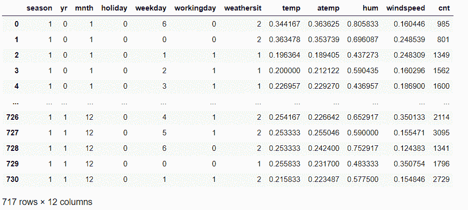
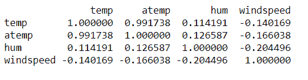
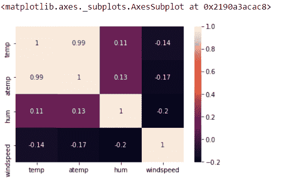

# Python 中的相关矩阵——实际实现

> 原文：<https://www.askpython.com/python/examples/correlation-matrix-in-python>

嘿，读者们！在本文中，我们将详细介绍 Python 中相关矩阵的出现和工作原理。所以，让我们现在就开始吧！

* * *

## 什么是相关回归分析？

在`Data Science and Machine Learning`的领域中，我们经常会遇到这样的情况，在这种情况下，我们有必要分析变量并执行特征选择。这就是相关回归分析发挥作用的时候了。

`Correlation Regression Analysis`使程序员能够分析连续自变量**和连续因变量**之间的关系。

也就是说，回归分析评估数据集的自变量之间以及自变量和响应(因变量)之间的可能性和关系。

相关回归分析利用相关矩阵来表示数据集变量之间的关系。

相关矩阵是一种矩阵结构，有助于程序员分析数据变量之间的关系。它表示范围 **0 和 1** 之间的相关值。

正值表示良好的相关性，负值表示低相关性，等于零(0)的值表示特定变量集之间没有相关性。

人们可以从回归分析和相关矩阵中得出以下观察结果:

*   理解数据集自变量之间的依赖关系。
*   帮助选择数据集的重要和非冗余变量。
*   仅适用于数值/连续变量。

现在让我们来关注一下相关矩阵在 Python 中的实现。

* * *

## 在 Python 中创建相关矩阵

让我们首先从探索本例中使用的数据集开始。如下所示，数据集包含 4 个独立的连续变量:

*   **温度**
*   atemp
*   **嗡嗡声**
*   **风速**



**Correlation Matrix Dataset**

这里，cnt 是响应变量。

现在，我们已经使用`corr() function`为数字列创建了一个相关矩阵，如下所示:

```py
import os
import pandas as pd
import numpy as np
import seaborn as sn

# Loading the dataset
BIKE = pd.read_csv("day.csv")

# Numeric columns of the dataset
numeric_col = ['temp','atemp','hum','windspeed']

# Correlation Matrix formation
corr_matrix = BIKE.loc[:,numeric_col].corr()
print(corr_matrix)

#Using heatmap to visualize the correlation matrix
sn.heatmap(corr_matrix, annot=True)

```

此外，我们使用了 [Seaborn](https://www.askpython.com/python-modules/python-seaborn-tutorial) 热图来可视化矩阵。

**输出:**



**Correlation Matrix**

因此，从上述矩阵中，可以得出以下观察结果

*   变量‘temp’和‘atemp’与相关值 **0.99** 高度相关。
*   因此，我们可以删除两个数据变量中的任何一个。



**Correlation Matrix-HEATMAP**

* * *

## 结论

到此，我们就结束了这个话题。如果你遇到任何问题，欢迎在下面评论。

在那之前，学习愉快！！