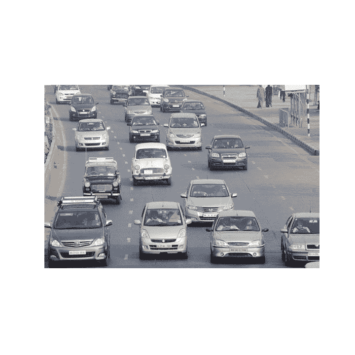
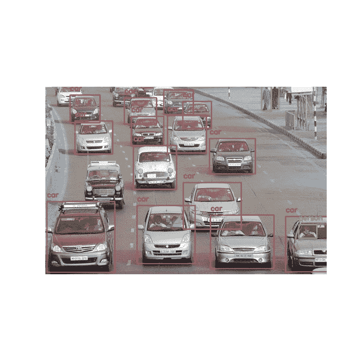
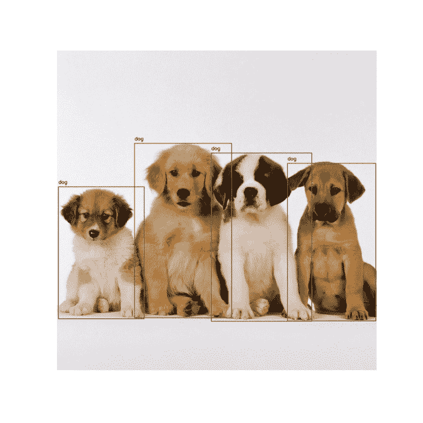

# 如何使用 Python 对一幅图像中的对象进行计数？

> 原文：<https://www.askpython.com/python/examples/count-objects-in-an-image>

你好，编程爱好者！今天我们将学习如何计算图像中的物体。为了计数图像，必须利用计算机视觉库。有许多库可以用来实现本教程的目标。

但是今天在本教程中，我们将利用`cvlib`库，它非常简单、容易，是 Python 中的一个高级库。如果您还没有安装这个库，使用`pip`命令做同样的事情。

## 导入所需的库以计算图像中的对象

我们需要一些模块/库来计数对象。下面的代码也是如此。

```py
import cv2
import numpy as np
import matplotlib.pyplot as plt
import cvlib as cv
from cvlib.object_detection import draw_bbox
from numpy.lib.polynomial import poly

```

我们需要以下模块:

*   [OpenCV 模块](https://www.askpython.com/python-modules/read-images-in-python-opencv)
*   [Numpy 模块](https://www.askpython.com/python-modules/numpy/python-numpy-module)
*   [Matplotlib 模块](https://www.askpython.com/python-modules/matplotlib/python-matplotlib)
*   Cvlib 模块
*   [cvlib 的对象检测](https://www.askpython.com/python/examples/image-processing-in-python)和绘制框子模块
*   我们也将利用 NumPy 多项式模块

## 加载和查看图像

为了加载图像，我们将使用 OpenCV 库的`imread`函数，并将图像的名称作为参数传递。确保图像与代码文件在同一个目录中。

为了查看图像，我们将使用 matplotlib 模块的`imshow`函数。代码如下所示。

```py
img = cv2.imread('image1.jpg')
img1 = cv2.cvtColor(img,cv2.COLOR_BGR2RGB)
plt.figure(figsize=(10,10))
plt.axis('off')
plt.imshow(img1)
plt.show()

```

屏幕上显示的输出如下。



Initial Loaded Image

## 在各种对象周围创建框

下面的代码将显示图像中对象周围的框。我们需要做的第一件事是利用`detect_common_objects`函数，并将我们的图像对象传递给它。

该函数将返回在检测到的对象周围生成的盒子、标签和盒子计数。为了画出这个盒子，我们需要`draw_bbox`函数，并将前一个函数接收到的输出传递给这个函数。

```py
box, label, count = cv.detect_common_objects(img)
output = draw_bbox(img, box, label, count)

```

为了显示输出图像，我们将再次使用 imshow 函数，输出结果非常准确。代码如下所示。

```py
output = cv2.cvtColor(output,cv2.COLOR_BGR2RGB)
plt.figure(figsize=(10,10))
plt.axis('off')
plt.imshow(output)
plt.show()

```



Output Image Counting Objects

## 计数图像中的对象

```py
print("Number of objects in this image are " +str(len(label)))

```

为了计算对象的数量，我们将通过简单地使用创建的标签列表上的`len`功能来计算生成的标签的数量，并打印图片中找到的对象的数量。在这张照片中，系统可以看到 17 个物体。

## 抽样输出

相同的概念用于另一个图像，结果如下。加载的初始图像如下。


Initial Loaded Image2

检测到图像中的对象后，输出如下所示。该程序检测到图像中出现的四只狗。



Output Image Counting Objects2

## 结论

恭喜你！现在，您可以尝试任何随机图像，并检查图像中有多少不同的对象。自己试试吧！

感谢您的阅读！