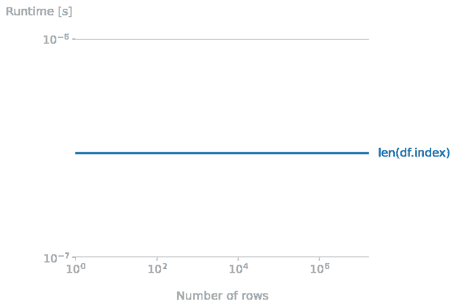
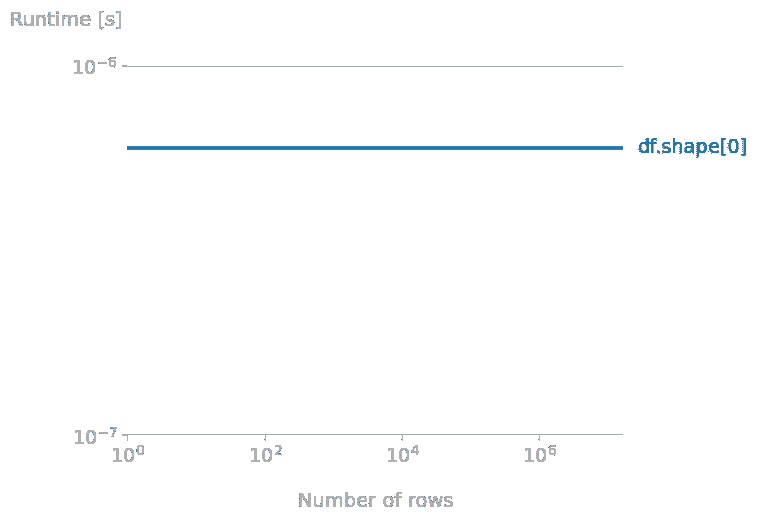
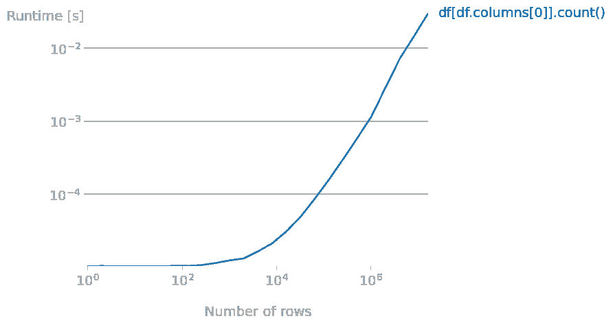
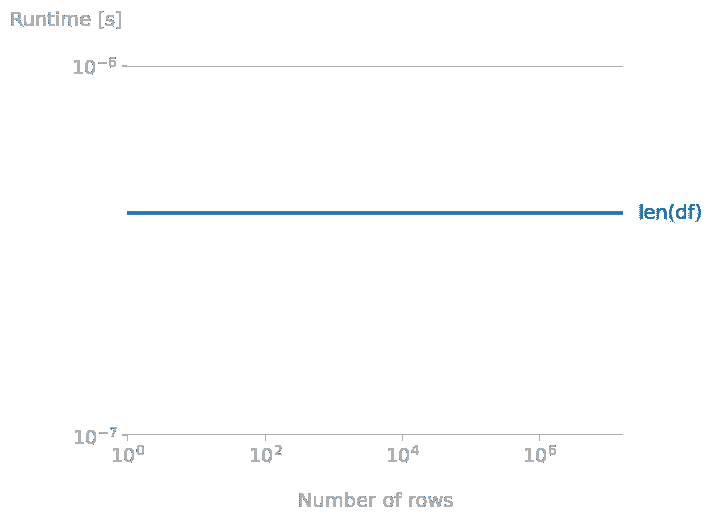
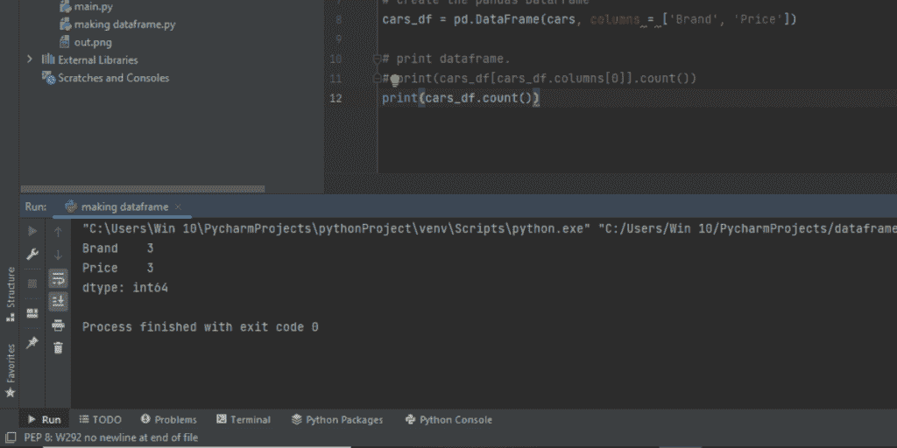
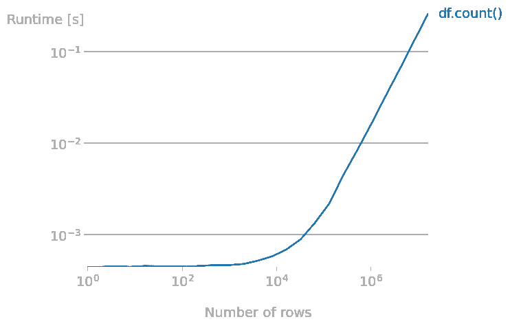
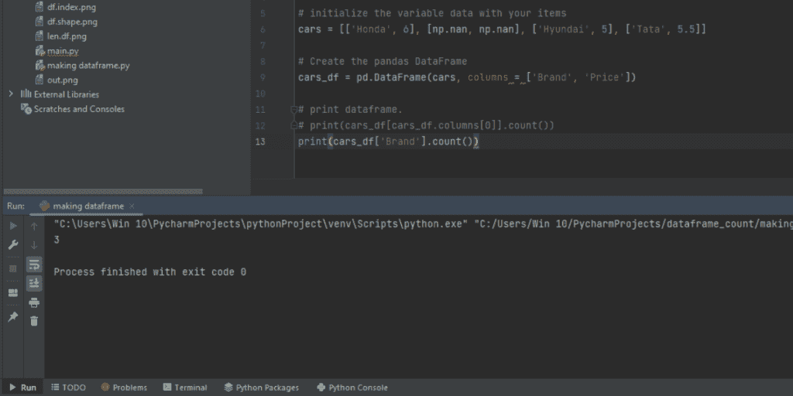

# 计算熊猫数据帧行数的 6 种方法

> 原文：<https://www.askpython.com/python-modules/pandas/count-pandas-dataframe-rows>

想学习如何计算熊猫数据框的行数？在这篇文章中，我们将学习如何用简单的方法做到这一点。Pandas 是一个 Python 库，用于轻松操作表格和数据框中的数据。Pandas 有很多系统函数，在本文中，我们将特别关注那些帮助我们获得数据帧行数的函数。

**让我们首先从[创建一个数据帧](https://www.askpython.com/python-modules/pandas/dataframe-rows-and-columns)开始。**

```py
# Import pandas library
import pandas as pd

# initialize the variable data with your items
cars = [['Honda', 6], ['Hyundai', 5], ['Tata', 5.5]]

# Create the pandas DataFrame
cars_df = pd.DataFrame(cars, columns = ['Brand', 'Price'])

# print dataframe.
print(cars)

```

## 熊猫数据帧的行数计算方法

主要有四个 pandas 函数来查找数据帧的行数。我们将讨论所有四个——它们的属性、语法、函数调用和时间复杂性。

### 方法 1: len(df.index)

**代码:**

```py
import pandas as pd

cars = [['Honda', 6], ['Hyundai', 5], ['Tata', 5.5]]

cars_df = pd.DataFrame(cars, columns = ['Brand', 'Price'])

# counting rows
print(len(cars_df.index))

```

上面的代码将返回数据框中的行数(在上面的示例中为 3)。len(df.index)语法用于大型数据库，因为它仅返回数据框的行数，并且它是返回数据框内元素的最快函数。尽管在属性上非常相似，但它比 len(df)(方法 4)快，因为它少执行一个函数调用。



len(df.index)

### 方法 2: df.shape[]

**代码:**

```py
import pandas as pd

cars = [['Honda', 6], ['Hyundai', 5], ['Tata', 5.5]]

cars_df = pd.DataFrame(cars, columns = ['Brand', 'Price'])

# counting rows
print(cars_df.shape[0])

```

该函数用于计算数据框中的行数和列数，语法 df.shape 返回[元组](https://www.askpython.com/python/tuple/python-tuple)的行数和列数。

[ ]括号用于表示索引，即 df.shape[0]返回行数，df.shape[1]返回列数。在时间比较中，它比(df.index)慢。timeit 测试表明，它比 len(df.index)慢 3 倍。



df.shape[0]

### 方法 3: df[df.column[0]]。计数()

**代码:**

```py
import pandas as pd

cars = [['Honda', 6], ['Hyundai', 5], ['Tata', 5.5]]

cars_df = pd.DataFrame(cars, columns = ['Brand', 'Price'])

# counting rows
print(cars_df[cars_df.columns[0]].count())

```

这个 pandas 函数计算数据帧第一列中所有非空的行。时间复杂度随着行数的增加而增加。在下面的图表中，您可以看到时间复杂性在前 10，000 行之前相当稳定，但之后开始增加。这个函数的缺点是它只计算非空的行，而忽略空的行。



df[df.column[0]].count

### 方法 4:贷款(df)

**代码:**

```py
import pandas as pd

cars = [['Honda', 6], ['Hyundai', 5], ['Tata', 5.5]]

cars_df = pd.DataFrame(cars, columns = ['Brand', 'Price'])

# counting rows
print(len(cars_df))

```

这个函数计算索引的长度，类似于 len(df.index)函数，但是稍微慢一点。如果我们精确地计算每个循环所用的时间，我们会发现 len(df)比 len(df.index)大约慢 200ns。这种差异可能看起来很小，但当使用大数据帧时，可能会导致较大的时间差。



len(df)

### 方法 5: df.count()

这个 pandas 函数给出了整个表的计数，类似于 df.shape[]函数，但是可读性有一些变化。不能调用此函数来返回单个列中的行数，而是返回 tablet 结构中的结果。

**代码:**

```py
import pandas as pd

cars = [['Honda', 6], ['Hyundai', 5], ['Tata', 5.5]]

cars_df = pd.DataFrame(cars, columns = ['Brand', 'Price'])

# counting rows and columns
print(cars_df.count())

```

**输出:**



**时间复杂度**



Time complexity of df.count()

## 方法六:df。[cols]。计数()

如果我们需要数据帧的计数，特别是列的计数，那么我们必须对 df.count()语法进行一些修改。df。[col]。count()语法是我们需要向编译器提及的。该语法按特定于列的方式对行中的元素进行计数。

使用时，此语法非常有用。csv 文件，其中包含大量的列。该语法还给出一列中空行的计数，这使得它更加可行。

**代码:**

```py
# Import pandas library
import numpy as np
import pandas as pd

# initialize the variable data with your items
cars = [['Honda', 6], [np.nan, np.nan], ['Hyundai', 5], ['Tata', 5.5]]

# Create the pandas DataFrame
cars_df = pd.DataFrame(cars, columns = ['Brand', 'Price'])

# counting column-specific row count
print(cars_df['Brand'].count())

```

**输出:**



## 结论

在本文中，我们学习了不同类型的语法和模块来计算数据帧的行数。我们学习了如何在程序中实现这些语法，并观察了它们的时间复杂度。还有一些输出可以让你更好地理解，使用不同的程序和语法可以得到什么样的结果。

希望本文能帮助您更好地理解数据框和行数的概念。