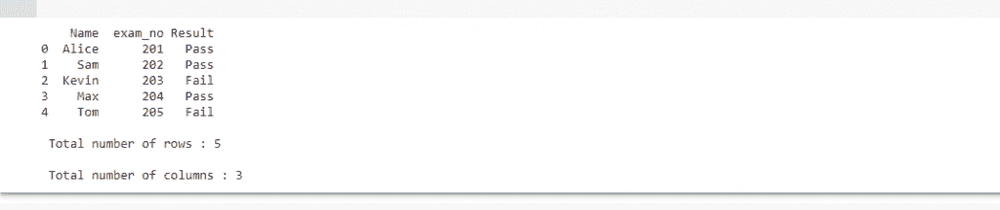

# 计算熊猫数据框架中的行和列

> 原文：<https://www.askpython.com/python-modules/pandas/count-rows-columns-dataframe>

你好，初学者！在这篇文章中，我们将学习获得熊猫数据帧的行和列总数的不同方法。让我们开始吧。

***也读作:[如何把一个熊猫 dataframe 转换成 Numpy 数组？](https://www.askpython.com/python-modules/numpy/pandas-dataframe-to-numpy-array)***

## 介绍

python 中的 DataFrame 是一种二维表格数据结构，具有许多行和列，包含不同的特性。它类似于电子表格。

我们可以使用不同的 python 对象(如列表或字典)创建自己的数据框，也可以使用*中已经可用的数据集。csv* 格式。在本文中，我们将创建自己的数据框。

为此，我们需要安装 python 的 pandas 库，然后在需要时导入它。使用 [pip 包管理器](https://www.askpython.com/python-modules/python-pip)来安装 Pandas

```py
pip install pandas

```

## 计算熊猫数据帧中的行和列的不同方法

我们的目标是计算给定数据帧中的行数和列数。让我们开始吧。

### 1.使用带有轴属性的 *len()* 方法

这里，我们将使用 [len()方法](https://www.askpython.com/python/list/length-of-a-list-in-python)来获得行和列的总数。DataFrame.axes[0]给出行数，DataFrame.axes[1]打印列数。

让我们看一个例子:

```py
#importing pandas
import pandas as pd

#creating dataframes
student_data = {"Name": ['Alice', 'Sam', 'Kevin', 'Max', 'Tom'],
        "exam_no": [201, 202, 203, 204, 205],
        "Result": ['Pass', 'Pass', 'Fail', 'Pass', 'Fail']}

#printing our dataframe
df1 = pd.DataFrame(student_data)
print(df1)

print("\n Total number of rows :", len(df1.axes[0]))
print("\n Total number of columns :", len(df1.axes[1]))

```

我们的数据框架由学生数据组成:他们的姓名、考试号和成绩。输出是:



### 2.使用*形状*属性

shape[]属性可用于了解数据框的形状/尺寸，以及其中的行和列的总数。数据框的 shape 属性的使用方式与我们上面使用轴[]的方式相同。

DataFrame.shape[0]给出行数，DataFrame.shape[1]给出列数。

考虑同一个例子，让我们看看如何使用 shape[]

```py
print("\n Dimension of dataframe :", df1.shape)

print("\n Total number of rows :", df1.shape[0])

print("\n Total number of columns :", df1.shape[1])

```

输出是:

```py
Dimension of dataframe : (5, 3)

Total number of rows : 5

Total number of columns : 3

```

### 3.使用*索引*和*列*关键字

与上面的例子类似，这里，index 关键字用于获取行数，column 关键字用于获取列数。使用与上面相同的示例，让我们了解这些关键字的用法:

```py
print("\n Total number of rows :", len(df1.index))
print("\n Total number of columns :", len(df1.columns))

```

这些代码行将产生与上述情况相同的输出:

```py
Total number of rows : 5

Total number of columns : 3

```

## 结论

因此，在本文中，我们已经看到了获取数据框中行和列总数的所有方法。我们对所有方法都使用了相同的示例，这样您就可以看到每种方法的语法是如何不同的，同时仍然生成相同的结果。在您的数据框上尝试这些方法，如果有任何问题，请随时提问。

谢谢大家！🙂