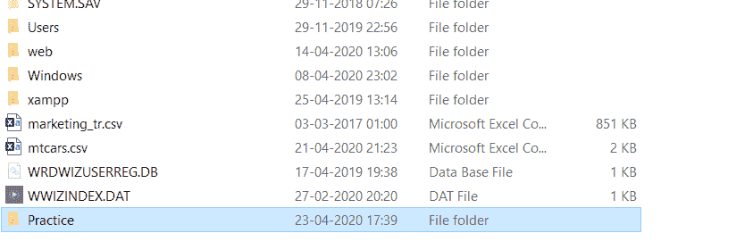
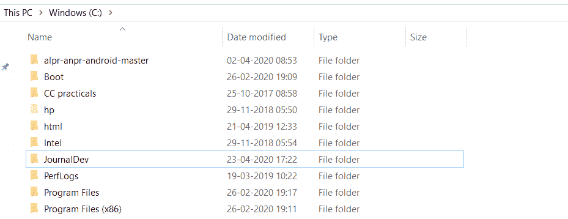
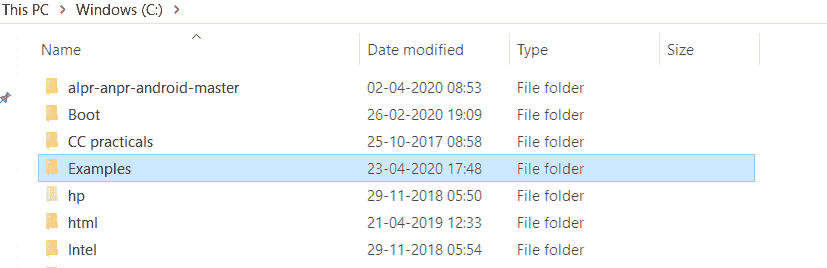
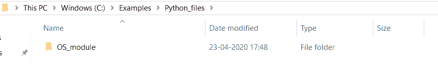

# 如何用 Python 创建目录

> 原文：<https://www.askpython.com/python/examples/create-a-directory-in-python>

大家好！在本文中，我们将揭示用 Python 创建目录的不同方法

* * *

## 用 Python 创建目录的步骤

[Python os 模块](https://www.askpython.com/python-modules/python-os-module-10-must-know-functions)包含各种内置函数，用于处理底层操作系统和文件并与之交互。

os 模块包含在系统中创建目录的各种内置函数。

在接下来的几节中，我们将了解使用 os 模块创建目录的各种方法。

* * *

### 技巧 1:使用 os.mkdir()方法在 Python 中创建目录

os 模块内置了`os.mkdir() method`在系统中创建一个目录。

**语法:**

```py
os.mkdir(path, mode)

```

*   `path`:用户希望创建目录的位置。它是一个字符串或字节值，包含要构建的目录的完整路径和名称。
*   `mode`:处理目录内文件操作需要赋予的权限。默认值为“ **0o777** ”。

**例 1:** 在指定位置用 Python 创建一个目录。

```py

import os 

main_dir = "C:/Practice"

os.mkdir(main_dir) 
print("Directory '% s' is built!" % main_dir) 

```

**输出:**

```py
Directory 'C:/Practice' is built!

```



**Creating a directory-2 using mkdir()**

**例 2:** 提供权限处理目录内的读写操作。

```py

import os 

main_dir = "C:/JournalDev"

os.mkdir(main_dir,mode = 0o666) 
print("Directory '% s' is built!" % main_dir) 

```

设置 mode = 0o666，允许在创建的目录中进行读写文件操作。

**输出:**

```py
Directory 'C:/JournalDev' is built!

```



**Creating a directory-1 using mkdir()**

* * *

### os.mkdir()函数的异常

如果指定位置的目录已经存在，os.mkdir()方法会引发一个`FileExistsError Exception`。

**举例:**

```py
import os 

main_dir = "C:/JournalDev"

os.mkdir(main_dir,mode = 0o666) 
print("Directory '% s' is built!" % main_dir) 

```

**输出:**

```py
FileExistsError                           Traceback (most recent call last)
<ipython-input-17-75731447cf21> in <module>
      3 main_dir = "C:/JournalDev"
      4 
----> 5 os.mkdir(main_dir,mode = 0o666)
      6 print("Directory '% s' is built!" % main_dir)
      7 

FileExistsError: [WinError 183] Cannot create a file when that file already exists: 'C:/JournalDev'

```

* * *

### 技巧 2:使用 os.makedirs()方法在系统中创建目录

os 模块有内置的 os.makedirs()方法来**在系统内创建嵌套或递归目录**。

也就是说，`os.makedirs() function`创建父目录、中间目录以及叶目录，如果它们中的任何一个不在系统文件中的话。

**语法:**

```py
os.makedirs(path,mode)

```

**举例:**

```py
import os 
main_dir = "C:/Examples/Python_files/OS_module"

os.makedirs(main_dir,mode = 0o666) 
print("Directory '% s' is built!" % main_dir) 

```

在上面的示例中，makedirs()函数通过该函数一次创建了中间目录“Python_files”和叶目录“OS_module”。

**输出:**

```py
Directory 'C:/Examples/Python_files/OS_module' is built!

```



**Creating a parent directory using makedirs()**


**Creating an Intermediate Directory Using makedirs()**



**Creating a Base Directory using makedirs()**

* * *

## 结论

因此，在本文中，我们已经了解了使用 os 模块在系统中创建目录的方法。

* * *

## 参考

*   Python 目录— JournalDev