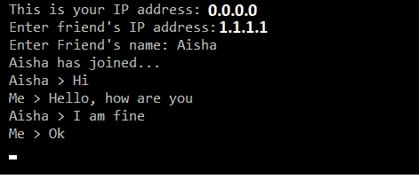

# 如何用 Python 创建聊天室？

> 原文：<https://www.askpython.com/python/examples/create-chatroom-in-python>

在本文中，我们将从头到尾用 Python 创建一个聊天室。在我们开始之前，让我们从概念上了解一下什么是聊天室。

## 什么是聊天室？

聊天室是世界各地的人们就各种话题相互交流的空间。主题可以从应用程序开发到厨房里的任何食谱。聊天室是学习如何交流的绝佳平台。在本文中，我将向您介绍如何使用套接字和 python 的基本概念来创建一个小型聊天室。

* * *

现在，在本教程中，我们将使用 python 中的套接字来构建一个实时聊天应用程序。让我们从套接字的概念开始。

## 什么是插座？

在网络术语中，套接字在 TCP/IP 协议簇中充当连接应用层和传输层的媒介。这些网络套接字存在于客户端和服务器端。

套接字编程是一种连接网络上两个节点以相互通信的方式。一个套接字(节点)监听一个 IP 上的特定端口，而另一个套接字与另一个套接字建立连接。服务器形成侦听器套接字，而客户端连接到服务器。


Client Server Model

## 聊天室服务器端套接字编程

服务器接受来自客户端的连接以建立网络接口。我们需要确保客户/用户是独特的。因此，我们为每个客户端分配一个唯一的 IP 地址。然而，许多用户喜欢用用户名来识别。因此，我们也将分配用户名。

服务器的作用是收集任何传入的消息，并将它们传递给其他客户端。

让我们开始编写服务器端的代码。首先，创建一个名为`server.py`的文件。

### 1.导入所需的库

```py
import socket
import sys
import time

```

首先，我们导入了`socket`库，因为这个 python 库包含了实现套接字的必要函数。

`sys`库提供系统模块，负责提供与系统目录、函数和方法相关的数据。

`time`模块使我们能够执行许多关于时间转换和描述的操作。

### 2.创建套接字并检索主机名

```py
new_socket = socket.socket()
host_name = socket.gethostname()
s_ip = socket.gethostbyname(host_name)
port = 8080

```

`socket()`函数是套接字库的构造函数，用于创建套接字。

一旦创建了套接字，我们就使用`gethostname()`检索主机名/本地设备名，这也是套接字库的一个功能。

当以参数`host_name`发送时,`gethostname()`检索另一个用户的 IP 地址，该 IP 地址存储在`s_ip`中。

`port`被指定为 8080。选择此端口是因为在大多数机器上这是一个默认的空闲端口。通常，3000、5000 等端口用于 express.js 等其他应用程序。您也可以在任何端口(如“1234”)上运行它。

### 3.绑定主机和端口

```py
new_socket.bind((host_name, port))
print( "Binding successful!”)
print("This is your IP: ", s_ip)

```

现在我们将使用在 socket 对象`new_socket`上调用的 bind 函数将端口和主机绑定在一起。一旦绑定成功，它打印“绑定成功！”在控制台上。

### 4.监听连接

```py
name = input('Enter name:')
new_socket.listen(1)

```

这里，我们使用接受一个参数的`listen()`函数，即`number_of_connections`。该参数可以是任何整数，如 1、2、3、…

### 5.接受传入连接

```py
conn, add= new_socket.accept()
print("Received connection from ", add[0])
print('Connection Established. Connected From: ',add[0])

```

第一个变量`conn`连接到套接字，变量“add”分配给客户端的 IP 地址。

### 6.存储传入的连接数据

```py
client = (conn.recv(1024)).decode()
print(client + ' has connected.')
conn.send(name.encode())

```

传入连接的细节存储在 client_name 变量中。客户端的名称最多可以有 1024 个字节。它在服务器上被解码，并打印出一条消息，表明它已被连接。然后，服务器发送主机名。

### 7.传递数据包/消息

```py
while True:
    message = input('Me : ')
    conn.send(message.encode())
    message = conn.recv(1024)
    message = message.decode()
    print(client, ':', message)

```

用户输入消息。这使用`encode()`编码，然后通过套接字发送。使用`send()`函数发送消息，该函数在前面调用 accept()函数期间创建的连接对象上调用。然后显示“消息已发送…”。

使用 conn 对象的`recv()`接收传入消息。它可以接收多达 1024 字节的信息。使用`decode()`在服务器端对消息进行解码。

### 完整的服务器端聊天室代码

以下是完整的服务器端聊天室代码:

```py
import time, socket, sys

new_socket = socket.socket()
host_name = socket.gethostname()
s_ip = socket.gethostbyname(host_name)

port = 8080

new_socket.bind((host_name, port))
print( "Binding successful!”)
print("This is your IP: ", s_ip)

name = input('Enter name: ')

new_socket.listen(1) 

conn, add = new_socket.accept()

print("Received connection from ", add[0])
print('Connection Established. Connected From: ',add[0])

client = (conn.recv(1024)).decode()
print(client + ' has connected.')

conn.send(name.encode())
while True:
    message = input('Me : ')
    conn.send(message.encode())
    message = conn.recv(1024)
    message = message.decode()
    print(client, ':', message)

```


Output Of Server On Command Prompt

## **聊天室客户端**套接字编程

我们将创建一个名为 **client.py** 的文件，并创建我们的代码来与聊天服务器连接和通信。

### 1.导入库

```py
import socket
import sys
import time

```

我们导入服务器端使用的相同库。

### 2.创建套接字并接受用户输入的主机名

```py
socket_server = socket.socket()
server_host = socket.gethostname()
ip = socket.gethostbyname(server_host)
sport = 8080

```

*   使用`socket()`方法在服务器上创建套接字。
*   在客户端检索服务器的主机名，并存储为`server_host`。
*   IP 地址存储在`ip`中。
*   服务器端口在`sport`变量中存储为 8080。

请注意，此端口必须与服务器端代码中提到的端口相匹配。

### 3.连接到服务器

```py
print('This is your IP address: ', ip)
server_host = input('Enter friend\'s IP address:')
name = input('Enter Friend\'s name: ')

socket_server.connect((server_host, sport))

```

首先输入服务器(朋友)的详细信息。请注意，输入准确的 IP 地址非常重要，否则通信将会失败。

服务器的主机名和端口以某种方式绑定在一起，并连接到套接字。

### 4.从服务器接收数据包/消息

```py
socket_server.send(name.encode())
server_name = socket_server.recv(1024)
server_name = server_name.decode()

print(server_name,' has joined...')
while True:
    message = (socket_server.recv(1024)).decode()
    print(server_name, ":", message)
    message = input("Me : ")
    socket_server.send(message.encode())  

```

为了接收消息，socket_server 调用 recv()函数来接受 1024 的数据。它存储在消息对象中，并使用 decode()函数进行解码。然后，该消息将打印出服务器的主机名和收到的消息。

客户端可以输入任何消息作为输入，并对其进行编码，然后使用套接字将其发送给服务器。

因此，我们使用套接字和 python 部署了一个实时聊天室。

### 完整的客户端聊天室代码

以下是我们聊天室客户端的完整代码:

```py
import time, socket, sys

socket_server = socket.socket()
server_host = socket.gethostname()
ip = socket.gethostbyname(server_host)
sport = 8080

print('This is your IP address: ',ip)
server_host = input('Enter friend\'s IP address:')
name = input('Enter Friend\'s name: ')

socket_server.connect((server_host, sport))

socket_server.send(name.encode())
server_name = socket_server.recv(1024)
server_name = server_name.decode()

print(server_name,' has joined...')
while True:
    message = (socket_server.recv(1024)).decode()
    print(server_name, ":", message)
    message = input("Me : ")
    socket_server.send(message.encode())  

```



Output Of Client On Command Prompt

## 结论

复制两个完整的代码片段，分别保存为 server.py 和 client.py，您将拥有自己的第一个 Python 聊天室！它非常容易使用，我相信您会学到很多套接字编程的实用方面。

## 参考

[https://docs.python.org/3/library/socket.html](https://docs.python.org/3/library/socket.html)

[https://docs.python.org/3/library/socketserver.html](https://docs.python.org/3/library/socketserver.html)