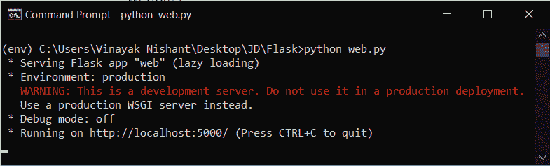
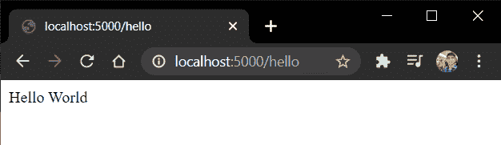

# Flask 简介-在 Flask 中安装并创建一个 Hello World 应用程序

> 原文：<https://www.askpython.com/python-modules/flask/create-hello-world-in-flask>

在本文中，我们将介绍 Flask web 框架以及如何安装它。稍后，我们将在 Flask 中编写一个简单的 Hello World 应用程序。

## **什么是 Flask Web 框架**？

Flask 是一个用 Python 写的 web 框架，用来创建 web 应用。它是一个“微型”web 框架，这意味着它不需要任何额外的工具或库。

**注意**“微”不代表它不能做其他框架能做的事情。这仅仅意味着你，作为一个开发者，可以决定 Flask 中的一切事情**，比如使用什么数据库等等。,**

**Flask 的一些默认决定，比如使用的模板引擎等等。，也可以根据需要进行更改。**

**因此，它不包括已经存在的第三方库或功能，如数据库抽象层、表单验证等。**

**总而言之，Flask 是一个开发人员友好的“微型”web 框架！！**

## ****将烧瓶安装到**系统中**

**我们可以使用 [**pip** 命令](https://www.askpython.com/python-modules/python-pip)将它安装到我们的设备中。在控制台/终端中，运行命令**

```py
pip install flask 
```

**就是这样！！烧瓶已安装。**

## ****打造 Hello World 应用****

**现在，我们将创建一个小网页，当访问它时，将显示“Hello World”**

**因此，创建一个 Python 文件，并在其中编写以下代码。我用过“ **app.py** ”这个名字；你想要什么都可以。**

### **1.导入 Flask 并创建 Flask 应用程序对象**

**我们在文件中做的第一件事是导入 Flask**

```py
from flask import Flask 
```

**然后我们创建一个 Flask 应用程序对象:**

```py
app = Flask(__name__) 
```

**这里 Flask 充当一个类对象。我们发送特殊的 python 变量 **__name__** 作为 Flask 类的参数。这个特殊的变量实际上给了每个文件一个唯一的名称。**

**所以当我们运行 Flask 应用程序时，为了让 Flask 知道这个应用程序是在一个特定的地方运行的，我们使用了这个特殊的变量。**

### **2.编写代码打印 hello world**

**创建 Flask 对象后，我们现在需要在浏览器上显示 Hello World 消息。所以添加代码:**

```py
@app.route('/hello')
def hello():
    return 'Hello World' 
```

**装饰者 **@app.route** ('/hello ')表示网页的 URL 端点。而网页会显示的内容是写在下面的函数里的。**

### **3.让服务器在特定端口上运行**

**我们使用下面的代码来启动服务器并提到端口，服务器就会运行。**

```py
app.run(host='localhost', port=5000) 
```

**LocalHost 意味着服务器将在您的本地计算机(端口=5000)上运行。**

### **4.Flask 中 hello world 应用程序的完整代码**

**就是这样。文件的最终代码:**

```py
from flask import Flask

app = Flask(__name__)

@app.route('/hello')
def hello():
    return 'Hello World'

app.run(host='localhost', port=5000) 
```

### **5.**运行 Hello World 应用程序****

**编码部分就这样了。现在在终端中，运行 Flask 文件:**

```py
python app.py 
```

**这里我使用了“ **app.py，**”作为我的文件名。在您的情况下，您将使用您的文件名。**

**

Terminal** 

**现在复制上面显示的网址 **(http://localhost:5000/)。**这将是你的主机网站的网址。我们将使用此主机网站 URL 的路由端点来打开我们的网页。**

**因此，点击 URL“**http://localhost:5000/hello**”来查看网页。**

**

webpage** 

**祝贺你，我们已经成功地建立了我们的第一个烧瓶网页**

## ****结论****

**本教程到此为止，各位！！在接下来的教程中，我们将学习更多关于 Flask 框架的知识。**

**所以敬请关注，继续编码！！**