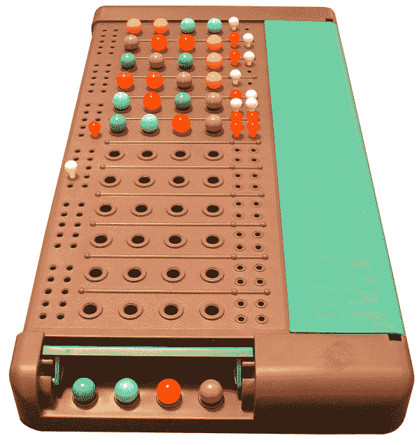
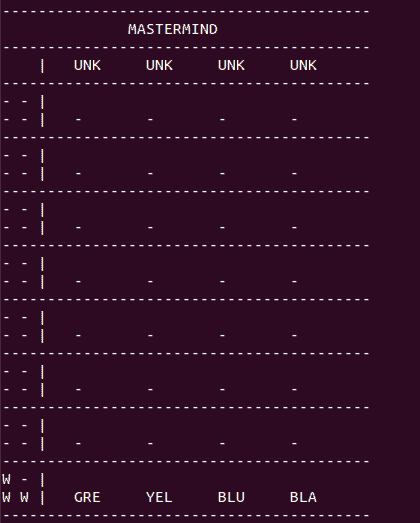
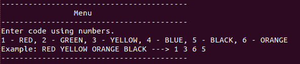

# 用 Python 创建智多星游戏——编写一个密码破解游戏

> 原文：<https://www.askpython.com/python/examples/create-mastermind-game-in-python>

摄魂师是一个双人密码破解游戏，其中一名玩家隐藏了一个由颜色组成的密码，而另一名玩家必须利用前一名玩家每回合提供的线索来猜测。

在本教程中，我们将使用 Python 语言创建自己的智多星游戏。在我们的智多星版本中，计算机将随机选择一个秘密代码，用户试图根据计算机给出的确定性线索来猜测它。

* * *

## Python 中的智多星游戏–演示

<https://www.askpython.com/wp-content/uploads/2020/07/mastermind_game-1.mp4>

* * *

事不宜迟，让我们进入游戏的设计部分。

## 策划游戏设计

最初的策划委员会如下所示。



Mastermind Board

棋盘被屏蔽的一端隐藏了密码，而棋盘的整体是基于密码破译者的猜测。一旦用户识别出隐藏的代码，游戏就结束了。

图中棋盘的右侧包含一系列白色和红色的小钉，用来表示与每次尝试相关的线索。

*   **红色**–选择的颜色之一位于正确的位置，就像密码一样
*   **白色**–所选颜色之一出现在代码中，但位置不正确。

该板在终端中的实现如下所示:



Game Design on Terminal

棋盘的顶端隐藏着密码，当玩家失去机会或破解密码时就会显示出来。直到那一刻，*【UNK】**【未知】*才显示出来。

棋盘的每一部分代表玩家的一个回合。游戏支持六种颜色，红色，绿色，黄色，蓝色，黑色，橙色。最左边的面板表示基于每个回合的线索。代表白色的“w”和代表红色的“R”在使用时都有其原始含义

在上面显示的图中，用户选择的四种颜色中有三种是正确的，但是根据密码，它们都不是正确的位置，因此线索中有三个“W”。

```py
# Function to print the mastermind board
def print_mastermind_board(passcode, guess_codes, guess_flags):

	print("-----------------------------------------")
	print("\t      MASTERMIND")
	print("-----------------------------------------")

	print("    |", end="")
	for x in passcode:
		print("\t" + x[:3], end="")
	print()	

	for i in reversed(range(len(guess_codes))):
		print("-----------------------------------------")
		print(guess_flags[i][0], guess_flags[i][1], "|")

		print(guess_flags[i][2], guess_flags[i][3], end=" |")
		for x in guess_codes[i]:
			print("\t" + x[:3], end="")

		print()	
	print("-----------------------------------------")

```

上面的代码片段负责在终端上显示摄魂板。

* * *

## 数据结构–游戏变量

为了方便游戏逻辑的开发，我们需要一些数据结构。

*   `colors`–游戏中涉及的颜色列表
*   `colors_map`–数字和颜色之间的映射
*   `passcode`–秘密代码
*   `show_passcode`–显示给用户的密码，一个未知的列表
*   玩家所做的猜测列表
*   给玩家的线索列表

```py
# The Main function
if __name__ == '__main__':

	# List of colors
	colors = ["RED", "GREEN", "YELLOW", "BLUE", "BLACK", "ORANGE"]

	# Mapping of colors to numbers	
	colors_map = {1:"RED", 2:"GREEN", 3:"YELLOW", 4:"BLUE", 5:"BLACK", 6:"ORANGE"}

	# Randomly selecting a passcode
	random.shuffle(colors)
	passcode = colors[:4]

	# Number of chances for the player
	chances = 8

	# The passcode to be shown to the user
	show_passcode = ['UNK', 'UNK', 'UNK', 'UNK']

	# The codes guessed by the player each turn
	guess_codes = [['-', '-', '-', '-'] for x in range(chances)]

	# The clues provided to the player each turn
	guess_flags = [['-', '-', '-', '-'] for x in range(chances)]

```

这些数据结构中的每一个在处理游戏逻辑时都会派上用场。

* * *

## 游戏循环

游戏开发最关键的部分之一是游戏循环，它负责玩家动作的正常运行和游戏变量的更新。

```py
# The current turn
turn = 0

# The GAME LOOP
while turn < chances:

```

游戏循环取决于机会的数量和当前回合。每当玩家的机会用尽时，它就会停止游戏。

* * *

## 游戏菜单

游戏菜单是游戏的一个简单方面，它帮助程序员用指令或规则与玩家互动。

我们的游戏菜单看起来像这样:



Game Menu

```py
# The GAME MENU
print("-----------------------------------------")
print("\t\tMenu")
print("-----------------------------------------")
print("Enter code using numbers.")
print("1 - RED, 2 - GREEN, 3 - YELLOW, 4 - BLUE, 5 - BLACK, 6 - ORANGE")
print("Example: RED YELLOW ORANGE BLACK ---> 1 3 6 5")
print("-----------------------------------------")
print_mastermind_board(show_passcode, guess_codes, guess_flags)

```

游戏菜单必须简单易懂。

* * *

## 处理玩家输入

处理玩家输入包括三个基本步骤:接受玩家输入，对其进行一些完整性检查，如果一切正常，将它存储到我们的数据结构中。

### 接受玩家输入

正如游戏菜单中提到的，玩家需要输入四个数字，每个数字对应一种特定的颜色，用空格隔开。

我们的工作是将这个播放器输入解析成一个整数列表，以便检索正确的颜色。

```py
# Accepting the player input 
try:	
	code = list(map(int, input("Enter your choice = ").split()))
except ValueError:
	clear()
	print("\tWrong choice!! Try again!!")
	continue

```

> **注意:**`clear()`函数负责通过清除之前的输出来保持终端的干净。它需要 Python 的`os`库。
> 
> 查看下面`clear()`函数声明的完整代码。

* * *

### 应用健全性检查

接下来是对玩家输入进行一些健全性检查。

```py
# Check if the number of colors nunbers are 4
if len(code) != 4:
	clear()
	print("\tWrong choice!! Try again!!")
	continue

# Check if each number entered corresponds to a number
flag = 0
for x in code:
	if x > 6 or x < 1:
		flag = 1

if flag == 1:			
	clear()
	print("\tWrong choice!! Try again!!")
	continue	

```

* * *

### 存储玩家移动

在我们知道玩家进行了有效的移动后，我们可以将它存储在游戏容器中。

```py
# Storing the player moves
for i in range(4):
	guess_codes[turn][i] = colors_map[code[i]]	

```

* * *

## 为每个动作设置线索

有两组标志要分配，如果颜色在正确的位置，如在密码中，则为“R”，如果颜色是正确的，但在错误的位置，则为“W”。

```py
# Process to apply clues according to the player input	
dummy_passcode = [x for x in passcode]	

pos = 0

# Loop to set up clues for the player move
for x in code:
	if colors_map[x] in dummy_passcode:
		if code.index(x) == passcode.index(colors_map[x]):
			guess_flags[turn][pos] = 'R'
		else:
			guess_flags[turn][pos] = 'W'
		pos += 1
		dummy_passcode.remove(colors_map[x])

random.shuffle(guess_flags[turn])				

```

需要记住的一件小事是重新排列旗帜，因为它可能会给出与颜色位置相关的提示。

* * *

## 检查赢的条件

我们要做的就是用隐藏代码检查最新的输入。

```py
# Check for win condition
if guess_codes[turn] == passcode:
	clear()
	print_mastermind_board(passcode, guess_codes, guess_flags)
	print("Congratulations!! YOU WIN!!!!")
	break

```

一旦玩家输入了正确的密码，我们就会显示一条获胜的信息并结束游戏。

* * *

## 更新圈数

一个小但非常重要的任务是在每次玩家成功移动后更新回合数。

```py
# Update turn	
turn += 1			
clear()

```

最后但并非最不重要的是处理损失情况。

* * *

## 检查损失情况

当玩家用尽了所有的机会，他就输了。当这种情况发生时，我们需要显示适当的消息。

```py
# Check for loss condiiton	
if turn == chances:
	clear()
	print_mastermind_board(passcode, guess_codes, guess_flags)
	print("YOU LOSE!!! Better luck next time!!!")	

```

使用 Python 语言创建摄魂师的说明到此结束。

* * *

## 完整的代码

```py
import random
import os

def clear():
	os.system("clear")

# Function to print the mastermind board
def print_mastermind_board(passcode, guess_codes, guess_flags):

	print("-----------------------------------------")
	print("\t      MASTERMIND")
	print("-----------------------------------------")

	print("    |", end="")
	for x in passcode:
		print("\t" + x[:3], end="")
	print()	

	for i in reversed(range(len(guess_codes))):
		print("-----------------------------------------")
		print(guess_flags[i][0], guess_flags[i][1], "|")

		print(guess_flags[i][2], guess_flags[i][3], end=" |")
		for x in guess_codes[i]:
			print("\t" + x[:3], end="")

		print()	
	print("-----------------------------------------")

# The Main function
if __name__ == '__main__':

	# List of colors
	colors = ["RED", "GREEN", "YELLOW", "BLUE", "BLACK", "ORANGE"]

	# Mapping of colors to numbers	
	colors_map = {1:"RED", 2:"GREEN", 3:"YELLOW", 4:"BLUE", 5:"BLACK", 6:"ORANGE"}

	# Randomly selecting a passcode
	random.shuffle(colors)
	passcode = colors[:4]

	# Number of chances for the player
	chances = 8

	# The passcode to be shown to the user
	show_passcode = ['UNK', 'UNK', 'UNK', 'UNK']

	# The codes guessed by the player each turn
	guess_codes = [['-', '-', '-', '-'] for x in range(chances)]

	# The clues provided to the player each turn
	guess_flags = [['-', '-', '-', '-'] for x in range(chances)]

	clear()

	# The current turn
	turn = 0

	# The GAME LOOP
	while turn < chances:

		print("-----------------------------------------")
		print("\t\tMenu")
		print("-----------------------------------------")
		print("Enter code using numbers.")
		print("1 - RED, 2 - GREEN, 3 - YELLOW, 4 - BLUE, 5 - BLACK, 6 - ORANGE")
		print("Example: RED YELLOW ORANGE BLACK ---> 1 3 6 5")
		print("-----------------------------------------")
		print_mastermind_board(show_passcode, guess_codes, guess_flags)

		# Accepting the player input 
		try:	
			code = list(map(int, input("Enter your choice = ").split()))
		except ValueError:
			clear()
			print("\tWrong choice!! Try again!!")
			continue	

		# Check if the number of colors nunbers are 4
		if len(code) != 4:
			clear()
			print("\tWrong choice!! Try again!!")
			continue

		# Check if each number entered corresponds to a number
		flag = 0
		for x in code:
			if x > 6 or x < 1:
				flag = 1

		if flag == 1:			
			clear()
			print("\tWrong choice!! Try again!!")
			continue	

		# Storing the player input
		for i in range(4):
			guess_codes[turn][i] = colors_map[code[i]]	

		# Process to apply clues according to the player input	
		dummy_passcode = [x for x in passcode]	

		pos = 0

		# Loop to set up clues for the player move
		for x in code:
			if colors_map[x] in dummy_passcode:
				if code.index(x) == passcode.index(colors_map[x]):
					guess_flags[turn][pos] = 'R'
				else:
					guess_flags[turn][pos] = 'W'
				pos += 1
				dummy_passcode.remove(colors_map[x])

		random.shuffle(guess_flags[turn])				

		# Check for win condition
		if guess_codes[turn] == passcode:
			clear()
			print_mastermind_board(passcode, guess_codes, guess_flags)
			print("Congratulations!! YOU WIN!!!!")
			break

		# Update turn	
		turn += 1			
		clear()

# Check for loss condiiton	
if turn == chances:
	clear()
	print_mastermind_board(passcode, guess_codes, guess_flags)
	print("YOU LOSE!!! Better luck next time!!!")	

```

* * *

## 结论

对于任何初学 Python 的程序员来说，创建我们自己的游戏的任务一开始可能会令人望而生畏。我们希望本文简化了某些 Python 概念，并使读者看起来可以完成任务。

如有任何建议或疑问，欢迎在下面发表评论。感谢您的阅读。