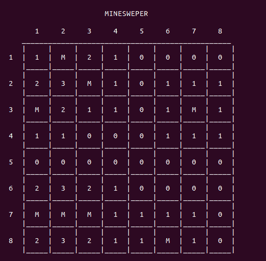
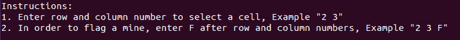

# 创建扫雷使用 Python 从基础到高级

> 原文：<https://www.askpython.com/python/examples/create-minesweeper-using-python>

在这篇文章中，我们将通过使用 Python 语言创建我们自己的基于终端的扫雷器的步骤。

## 关于游戏

扫雷是一个单人游戏，玩家必须清除包含地雷和数字的正方形网格。玩家必须借助相邻方块中的数字来防止自己落在地雷上。

* * *

## 游戏演示

创建扫雷游戏几个小时的后果。

<https://www.askpython.com/wp-content/uploads/2020/06/minesweeper-1.mp4>

* * *

## 使用 Python 设计扫雷艇

在创建游戏逻辑之前，我们需要设计游戏的基本布局。使用 Python 创建方形格网相当容易，方法是:

```py
# Printing the Minesweeper Layout
def print_mines_layout():
	global mine_values
	global n

	print()
	print("\t\t\tMINESWEEPER\n")

	st = "   "
	for i in range(n):
		st = st + "     " + str(i + 1)
	print(st)	

	for r in range(n):
		st = "     "
		if r == 0:
			for col in range(n):
				st = st + "______"	
			print(st)

		st = "     "
		for col in range(n):
			st = st + "|     "
		print(st + "|")

		st = "  " + str(r + 1) + "  "
		for col in range(n):
			st = st + "|  " + str(mine_values[r][col]) + "  "
		print(st + "|")	

		st = "     "
		for col in range(n):
			st = st + "|_____"
		print(st + '|')

	print()

```

每个迭代中显示的网格类似于下图:



Minesweeper Layout

`'M'`符号表示该单元格中存在“地雷”。我们可以清楚地看到，网格上的任何数字都表示相邻“八”单元格中的地雷数量。

像`mine_values`这样的变量的使用将在教程中进一步解释。

* * *

## 输入系统

任何游戏最重要的部分之一就是支持输入法。在我们的扫雷版本中，我们将使用行号和列号作为输入技术。

在开始游戏之前，脚本必须为玩家提供一组指令。我们的游戏打印如下。



Minesweeper Instructions

与网格一起显示的行号和列号对我们的输入系统很有帮助。众所周知，在没有任何指标的情况下跟踪地雷是很困难的。因此，扫雷有一个规定，使用'标志'来标记细胞，我们知道其中含有地雷。

* * *

## 数据存储

对于单个扫雷游戏，我们需要跟踪以下信息:

*   网格的**大小**。
*   第**号地雷**。
*   **“实际”网格值**–在游戏开始时，我们需要一个容器来存储游戏的真实值，玩家不知道。例如，地雷的位置。
*   **“明显的”网格值**–每次移动后，我们需要更新所有必须显示给玩家的值。
*   **标记位置**–已经标记的单元格。

这些值使用以下数据结构存储

```py
if __name__ == "__main__":

	# Size of grid
	n = 8
	# Number of mines
	mines_no = 8

	# The actual values of the grid
	numbers = [[0 for y in range(n)] for x in range(n)] 
	# The apparent values of the grid
	mine_values = [[' ' for y in range(n)] for x in range(n)]
	# The positions that have been flagged
	flags = []

```

《扫雷》的游戏逻辑没有太多。所有的努力都是为了设置扫雷艇的布局。

* * *

## 设置矿井

我们需要随机设置地雷的位置，这样玩家就不会预测它们的位置。这可以通过以下方式实现:

```py
# Function for setting up Mines
def set_mines():

	global numbers
	global mines_no
	global n

	# Track of number of mines already set up
	count = 0
	while count < mines_no:

		# Random number from all possible grid positions 
		val = random.randint(0, n*n-1)

		# Generating row and column from the number
		r = val // n
		col = val % n

		# Place the mine, if it doesn't already have one
		if numbers[r][col] != -1:
			count = count + 1
			numbers[r][col] = -1

```

在代码中，我们从网格中所有可能的单元格中选择一个随机数。我们一直这样做，直到我们得到所说的地雷数量。

> **注:**地雷的实际值储存为-1，而储存用于显示的值，用`'M'`表示地雷。
> 
> **注意:**[【randint】](https://www.askpython.com/python-modules/python-randint-method)功能只有在导入随机库后才能使用。这是通过在程序开始时写`'import random'`来完成的。

* * *

## 设置网格编号

对于网格中的每个单元，我们必须检查所有相邻的单元是否存在地雷。这通过以下方式实现:

```py
# Function for setting up the other grid values
def set_values():

	global numbers
	global n

	# Loop for counting each cell value
	for r in range(n):
		for col in range(n):

			# Skip, if it contains a mine
			if numbers[r][col] == -1:
				continue

			# Check up	
			if r > 0 and numbers[r-1][col] == -1:
				numbers[r][col] = numbers[r][col] + 1
			# Check down	
			if r < n-1  and numbers[r+1][col] == -1:
				numbers[r][col] = numbers[r][col] + 1
			# Check left
			if col > 0 and numbers[r][col-1] == -1:
				numbers[r][c] = numbers[r][c] + 1
			# Check right
			if col < n-1 and numbers[r][col+1] == -1:
				numbers[r][col] = numbers[r][col] + 1
			# Check top-left	
			if r > 0 and col > 0 and numbers[r-1][col-1] == -1:
				numbers[r][col] = numbers[r][col] + 1
			# Check top-right
			if r > 0 and col < n-1 and numbers[r-1][col+1]== -1:
				numbers[r][col] = numbers[r][col] + 1
			# Check below-left	
			if r < n-1 and col > 0 and numbers[r+1][col-1]== -1:
				numbers[r][col] = numbers[r][col] + 1
			# Check below-right
			if r < n-1 and col< n-1 and numbers[r+1][col+1]==-1:
				numbers[r][col] = numbers[r][col] + 1

```

这些值对玩家是隐藏的，因此它们存储在`numbers`变量中。

* * *

## 游戏循环

游戏循环是游戏中非常关键的部分。它需要更新玩家的每个动作以及游戏的结论。

```py
# Set the mines
set_mines()

# Set the values
set_values()

# Display the instructions
instructions()

# Variable for maintaining Game Loop
over = False

# The GAME LOOP	
while not over:
	print_mines_layout()

```

在循环的每一次迭代中，扫雷网格必须显示，玩家的移动也必须处理。

* * *

## 处理玩家输入

正如我们之前提到的，有两种玩家输入:

```py
# Input from the user
inp = input("Enter row number followed by space and column number = ").split()

```

### 标准输入

在正常的移动中，会提到行号和列号。玩家此举背后的动机是解锁一个没有地雷的细胞。

```py
# Standard Move
if len(inp) == 2:

	# Try block to handle errant input
	try: 
		val = list(map(int, inp))
	except ValueError:
		clear()
		print("Wrong input!")
		instructions()
		continue

```

### 标志输入

在标记移动中，玩家发送了三个值。前两个值表示单元格位置，而最后一个值表示标记。

```py
# Flag Input
elif len(inp) == 3:
	if inp[2] != 'F' and inp[2] != 'f':
		clear()
		print("Wrong Input!")
		instructions()
		continue

	# Try block to handle errant input	
	try:
		val = list(map(int, inp[:2]))
	except ValueError:
		clear()
		print("Wrong input!")
		instructions()
		continue

```

* * *

## 净化输入

存储输入后，为了游戏的顺利运行，我们必须做一些健全性检查。

```py
# Sanity checks
if val[0] > n or val[0] < 1 or val[1] > n or val[1] < 1:
	clear()
	print("Wrong Input!")
	instructions()
	continue

# Get row and column numbers
r = val[0]-1
col = val[1]-1

```

输入过程完成后，行号和列号将被提取并存储在`'r'`和`'c'`中。

* * *

## 处理标志输入

管理标志输入不是一个大问题。它要求在标记矿井的单元之前检查一些先决条件。

必须进行以下检查:

*   该单元格是否已被标记。
*   要标记的单元格是否已经向玩家显示。
*   旗帜的数量不超过地雷的数量。

在解决了这些问题之后，该单元被标记为地雷。

```py
# If cell already been flagged
if [r, col] in flags:
	clear()
	print("Flag already set")
	continue

# If cell already been displayed
if mine_values[r][col] != ' ':
	clear()
	print("Value already known")
	continue

# Check the number for flags 	
if len(flags) < mines_no:
	clear()
	print("Flag set")

	# Adding flag to the list
	flags.append([r, col])

	# Set the flag for display
	mine_values[r][col] = 'F'
	continue
else:
	clear()
	print("Flags finished")
	continue	 

```

* * *

## 处理标准输入

标准输入包括游戏的整体功能。有三种不同的情况:

### 在水雷上抛锚

一旦玩家选择了一个有地雷的格子，游戏就结束了。这可能是运气不好或判断失误造成的。

```py
# If landing on a mine --- GAME OVER	
if numbers[r][col] == -1:
	mine_values[r][col] = 'M'
	show_mines()
	print_mines_layout()
	print("Landed on a mine. GAME OVER!!!!!")
	over = True
	continue

```

当我们降落到一个有地雷的单元后，我们需要显示游戏中所有的地雷，并改变游戏循环背后的变量。

函数`'show_mines()'`对此负责。

```py
def show_mines():
	global mine_values
	global numbers
	global n

	for r in range(n):
		for col in range(n):
			if numbers[r][col] == -1:
				mine_values[r][col] = 'M'

```

### 访问“0”值的单元格。

创建游戏最棘手的部分是管理这个场景。每当玩家访问“0”值的单元时，必须显示所有相邻的元素，直到到达非零值的单元。

```py
# If landing on a cell with 0 mines in neighboring cells
elif numbers[r][n] == 0:
	vis = []
	mine_values[r][n] = '0'
	neighbours(r, col)	

```

这个目的是利用 **[递归](https://www.askpython.com/python/python-recursion-function)** 实现的。递归是一种编程工具，其中函数调用自己，直到基本情况得到满足。`neighbours`函数是一个递归函数，解决了我们的问题。

```py
def neighbours(r, col):

	global mine_values
	global numbers
	global vis

	# If the cell already not visited
	if [r,col] not in vis:

		# Mark the cell visited
		vis.append([r,col])

		# If the cell is zero-valued
		if numbers[r][col] == 0:

			# Display it to the user
			mine_values[r][col] = numbers[r][col]

			# Recursive calls for the neighbouring cells
			if r > 0:
				neighbours(r-1, col)
			if r < n-1:
				neighbours(r+1, col)
			if col > 0:
				neighbours(r, col-1)
			if col < n-1:
				neighbours(r, col+1)	
			if r > 0 and col > 0:
				neighbours(r-1, col-1)
			if r > 0 and col < n-1:
				neighbours(r-1, col+1)
			if r < n-1 and col > 0:
				neighbours(r+1, col-1)
			if r < n-1 and col < n-1:
				neighbours(r+1, col+1)	

		# If the cell is not zero-valued 			
		if numbers[r][col] != 0:
				mine_values[r][col] = numbers[r][col]

```

对于这个游戏的特殊概念，使用了一个新的数据结构，即`vis`。`vis`的作用是在递归过程中跟踪已经访问过的单元。没有这些信息，递归将永远继续下去。

在显示了所有零值单元格及其相邻单元格之后，我们可以转到最后一个场景。

### 选择非零值单元格

处理这种情况不需要任何努力，因为我们需要做的只是改变显示值。

```py
# If selecting a cell with atleast 1 mine in neighboring cells	
else:	
	mine_values[r][col] = numbers[r][col]

```

* * *

## 结束游戏

有一个要求，检查游戏的完成，每次移动。这通过以下方式实现:

```py
# Check for game completion	
if(check_over()):
	show_mines()
	print_mines_layout()
	print("Congratulations!!! YOU WIN")
	over = True
	continue

```

函数`check_over()`，负责检查游戏的完成情况。

```py
# Function to check for completion of the game
def check_over():
	global mine_values
	global n
	global mines_no

	# Count of all numbered values
	count = 0

	# Loop for checking each cell in the grid
	for r in range(n):
		for col in range(n):

			# If cell not empty or flagged
			if mine_values[r][col] != ' ' and mine_values[r][col] != 'F':
				count = count + 1

	# Count comparison 			
	if count == n * n - mines_no:
		return True
	else:
		return False

```

我们计算非空或未标记的细胞数量。当这个计数等于除了含有地雷的细胞之外的总细胞数时，则游戏被视为结束。

* * *

## 每次移动后清除输出

随着我们不断地在终端上打印东西，终端变得拥挤。因此，必须有不断清除它的规定。这可以通过以下方式实现:

```py
# Function for clearing the terminal
def clear():
	os.system("clear")

```

> **注意:**在使用该功能之前，需要导入`os`库。可以通过程序开始时的`'import os'`来完成。

* * *

## 完整的代码

下面是扫雷游戏的完整代码:

```py
# Importing packages
import random
import os

# Printing the Minesweeper Layout
def print_mines_layout():

	global mine_values
	global n

	print()
	print("\t\t\tMINESWEEPER\n")

	st = "   "
	for i in range(n):
		st = st + "     " + str(i + 1)
	print(st)	

	for r in range(n):
		st = "     "
		if r == 0:
			for col in range(n):
				st = st + "______"	
			print(st)

		st = "     "
		for col in range(n):
			st = st + "|     "
		print(st + "|")

		st = "  " + str(r + 1) + "  "
		for col in range(n):
			st = st + "|  " + str(mine_values[r][col]) + "  "
		print(st + "|")	

		st = "     "
		for col in range(n):
			st = st + "|_____"
		print(st + '|')

	print()

# Function for setting up Mines
def set_mines():

	global numbers
	global mines_no
	global n

	# Track of number of mines already set up
	count = 0
	while count < mines_no:

		# Random number from all possible grid positions 
		val = random.randint(0, n*n-1)

		# Generating row and column from the number
		r = val // n
		col = val % n

		# Place the mine, if it doesn't already have one
		if numbers[r][col] != -1:
			count = count + 1
			numbers[r][col] = -1

# Function for setting up the other grid values
def set_values():

	global numbers
	global n

	# Loop for counting each cell value
	for r in range(n):
		for col in range(n):

			# Skip, if it contains a mine
			if numbers[r][col] == -1:
				continue

			# Check up	
			if r > 0 and numbers[r-1][col] == -1:
				numbers[r][col] = numbers[r][col] + 1
			# Check down	
			if r < n-1  and numbers[r+1][col] == -1:
				numbers[r][col] = numbers[r][col] + 1
			# Check left
			if col > 0 and numbers[r][col-1] == -1:
				numbers[r][col] = numbers[r][col] + 1
			# Check right
			if col < n-1 and numbers[r][col+1] == -1:
				numbers[r][col] = numbers[r][col] + 1
			# Check top-left	
			if r > 0 and col > 0 and numbers[r-1][col-1] == -1:
				numbers[r][col] = numbers[r][col] + 1
			# Check top-right
			if r > 0 and col < n-1 and numbers[r-1][col+1] == -1:
				numbers[r][col] = numbers[r][col] + 1
			# Check below-left	
			if r < n-1 and col > 0 and numbers[r+1][col-1] == -1:
				numbers[r][col] = numbers[r][col] + 1
			# Check below-right
			if r < n-1 and col < n-1 and numbers[r+1][col+1] == -1:
				numbers[r][col] = numbers[r][col] + 1

# Recursive function to display all zero-valued neighbours	
def neighbours(r, col):

	global mine_values
	global numbers
	global vis

	# If the cell already not visited
	if [r,col] not in vis:

		# Mark the cell visited
		vis.append([r,col])

		# If the cell is zero-valued
		if numbers[r][col] == 0:

			# Display it to the user
			mine_values[r][col] = numbers[r][col]

			# Recursive calls for the neighbouring cells
			if r > 0:
				neighbours(r-1, col)
			if r < n-1:
				neighbours(r+1, col)
			if col > 0:
				neighbours(r, col-1)
			if col < n-1:
				neighbours(r, col+1)	
			if r > 0 and col > 0:
				neighbours(r-1, col-1)
			if r > 0 and col < n-1:
				neighbours(r-1, col+1)
			if r < n-1 and col > 0:
				neighbours(r+1, col-1)
			if r < n-1 and col < n-1:
				neighbours(r+1, col+1)	

		# If the cell is not zero-valued 			
		if numbers[r][col] != 0:
				mine_values[r][col] = numbers[r][col]

# Function for clearing the terminal
def clear():
	os.system("clear")		

# Function to display the instructions
def instructions():
	print("Instructions:")
	print("1\. Enter row and column number to select a cell, Example \"2 3\"")
	print("2\. In order to flag a mine, enter F after row and column numbers, Example \"2 3 F\"")

# Function to check for completion of the game
def check_over():
	global mine_values
	global n
	global mines_no

	# Count of all numbered values
	count = 0

	# Loop for checking each cell in the grid
	for r in range(n):
		for col in range(n):

			# If cell not empty or flagged
			if mine_values[r][col] != ' ' and mine_values[r][col] != 'F':
				count = count + 1

	# Count comparison 			
	if count == n * n - mines_no:
		return True
	else:
		return False

# Display all the mine locations					
def show_mines():
	global mine_values
	global numbers
	global n

	for r in range(n):
		for col in range(n):
			if numbers[r][col] == -1:
				mine_values[r][col] = 'M'

if __name__ == "__main__":

	# Size of grid
	n = 8
	# Number of mines
	mines_no = 8

	# The actual values of the grid
	numbers = [[0 for y in range(n)] for x in range(n)] 
	# The apparent values of the grid
	mine_values = [[' ' for y in range(n)] for x in range(n)]
	# The positions that have been flagged
	flags = []

	# Set the mines
	set_mines()

	# Set the values
	set_values()

	# Display the instructions
	instructions()

	# Variable for maintaining Game Loop
	over = False

	# The GAME LOOP	
	while not over:
		print_mines_layout()

		# Input from the user
		inp = input("Enter row number followed by space and column number = ").split()

		# Standard input
		if len(inp) == 2:

			# Try block to handle errant input
			try: 
				val = list(map(int, inp))
			except ValueError:
				clear()
				print("Wrong input!")
				instructions()
				continue

		# Flag input
		elif len(inp) == 3:
			if inp[2] != 'F' and inp[2] != 'f':
				clear()
				print("Wrong Input!")
				instructions()
				continue

			# Try block to handle errant input	
			try:
				val = list(map(int, inp[:2]))
			except ValueError:
				clear()
				print("Wrong input!")
				instructions()
				continue

			# Sanity checks	
			if val[0] > n or val[0] < 1 or val[1] > n or val[1] < 1:
				clear()
				print("Wrong input!")
				instructions()
				continue

			# Get row and column numbers
			r = val[0]-1
			col = val[1]-1	

			# If cell already been flagged
			if [r, col] in flags:
				clear()
				print("Flag already set")
				continue

			# If cell already been displayed
			if mine_values[r][col] != ' ':
				clear()
				print("Value already known")
				continue

			# Check the number for flags 	
			if len(flags) < mines_no:
				clear()
				print("Flag set")

				# Adding flag to the list
				flags.append([r, col])

				# Set the flag for display
				mine_values[r][col] = 'F'
				continue
			else:
				clear()
				print("Flags finished")
				continue	 

		else: 
			clear()
			print("Wrong input!")	
			instructions()
			continue

		# Sanity checks
		if val[0] > n or val[0] < 1 or val[1] > n or val[1] < 1:
			clear()
			print("Wrong Input!")
			instructions()
			continue

		# Get row and column number
		r = val[0]-1
		col = val[1]-1

		# Unflag the cell if already flagged
		if [r, col] in flags:
			flags.remove([r, col])

		# If landing on a mine --- GAME OVER	
		if numbers[r][col] == -1:
			mine_values[r][col] = 'M'
			show_mines()
			print_mines_layout()
			print("Landed on a mine. GAME OVER!!!!!")
			over = True
			continue

		# If landing on a cell with 0 mines in neighboring cells
		elif numbers[r][col] == 0:
			vis = []
			mine_values[r][col] = '0'
			neighbours(r, col)

		# If selecting a cell with atleast 1 mine in neighboring cells	
		else:	
			mine_values[r][col] = numbers[r][col]

		# Check for game completion	
		if(check_over()):
			show_mines()
			print_mines_layout()
			print("Congratulations!!! YOU WIN")
			over = True
			continue
		clear()	

```

* * *

## 结论

我们希望这个关于创建我们自己的扫雷游戏的教程既有趣又易懂。如有任何疑问，欢迎在下面评论。我的 [Github 账户](https://github.com/Aprataksh/Minesweeper)上也有完整的代码。