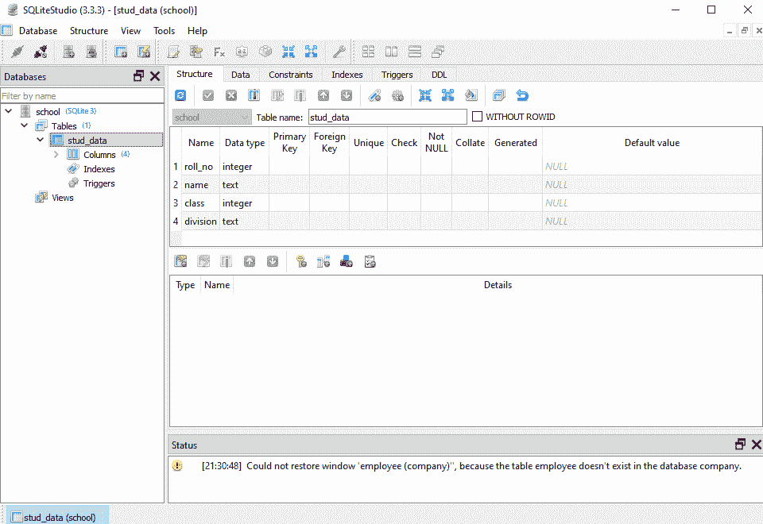

# Sqlite 使用 Python“如果不存在则创建表”

> 原文：<https://www.askpython.com/python-modules/create-table-if-not-exists-sqlite3>

嘿，Python 爱好者(特别是程序员😂不是贪吃蛇的人)这里我们讨论和实现一个新的主题:-**“Sqlite-使用 Python 创建不存在的表”。**

现在我们都知道一个非常著名的 SQLite 插件 sqlite3，它与默认的 Python 环境协作。这有助于我们制作实时应用程序，然后将它们连接到数据库，而无需使用本地主机或在线服务器。

我们可以称之为 SQLite3，它是一种无需任何配置设置就可以在本地机器上运行的应用程序。因此，为了使事情变得简单，我们将编写一个脚本来检查该表是否存在。如果它不存在，它会自动为我们创建一个。这就像制造一个智能工具。所以，让我们去争取吧！

***也读作:[检查表格是否存在——Python SQLite3](https://www.askpython.com/python-modules/check-if-a-table-exists-python-sqlite3)***

## 使用 Python SQLite3 创建一个不存在的表

创建一个名为 Table Creation 的文件夹，然后在同一文件夹的一个文件中添加以下代码。

**代码:**

```py
import sqlite3

connection = sqlite3.connect('database/school.db') # file path

# create a cursor object from the cursor class
cur = connection.cursor()

cur.execute('''
   CREATE TABLE stud_data(
       roll_no integer, 
       name text, 
       class integer, 
       division text    
   )''')

print("\nDatabase created successfully!!!")
# committing our connection
connection.commit()

# close our connection
connection.close()

```

**输出:**

```py
Database created successfully!!!

```

我们创建了一个包含学生数据表**“stud _ data”**的学校数据库。该表有四列:**卷号、姓名、班级和部门。**当我们在 SQLite studio 中将它可视化时，它看起来是这样的:



Visualizing The table in the studio

### 删除表格

我们将特意删除该表，然后创建我们的智能脚本。

**删除表格的代码:**

```py
import sqlite3

connection = sqlite3.connect('database/school.db')

connection.execute("DROP TABLE stud_data")

print("Your table has been deleted!!!")

connection.close()

```

**DROP TABLE "table_name"** 查询删除表。确保添加各自的表名。

**输出:**

```py
Your table has been deleted!!!

```

### 创建和删除表的完整代码

这一部分包含的主要脚本将检查该表是否存在于数据库中。如果出现这种情况，则会创建一个具有相同名称和参数的新表。

**代码:**

```py
import sqlite3

connection = sqlite3.connect('database/school.db')

cur = connection.cursor() 

try:
    cur.execute("SELECT * FROM stud_data")

    # storing the data in a list
    data_list = cur.fetchall() 
    print('Roll_Number' + '\t Name')
    print('--------' + '\t\t-------------')
    for item in items:
        print(item[0] + ' | ' + item[1] + '\t' + item[2])   

except sqlite3.OperationalError:
    print("No such table: stud_data")
    if(sqlite3.OperationalError): # if this error occurs
        try:
            print("Creating a new table: ")
            cur.execute('''

                CREATE TABLE stud_data(
                roll_no integer, 
                name text, 
                class integer, 
                division text

            )''')

            print("New table created successfully!!!")
            print("Here are the contents of the table: \n1: roll_no. \n2: name \n3: class \n4:division.")

        except sqlite3.Error() as e:
            print(e, " occured")

connection.commit()
connection.close()

```

**输出:**

```py
No such table: stud_data
Creating a new table: 
New table created successfully!!!
Here are the contents of the table: 
1: roll_no.
2: name
3: class
4: division.

```

**说明:**

1.  我们定义了两个 try 块。第一个检查一个表是否存在。如果不是，If 条件跳转到新的 try 块，为我们创建一个新表。
2.  在第一个 try 块中:使用 SQLite 查询: **"SELECT * FROM table_name"** 将尝试从表中获取所有的行和列。
3.  如果表不存在，try 块抛出 **sqlite。操作错误**。except 块处理它。它下面的 **if()** 语句打开第二个 **[try-except 块](https://www.askpython.com/python/python-exception-handling)。**
4.  然后，第二个 try 语句完成用相同的参数创建新表的任务。
5.  except 块使用 **sqlite 检查任何常见错误。Error()** 方法并处理它。
6.  代码的第二部分只是执行一个查询，创建一个新表 **stud_data** 并将其插入到我们的数据库中。

## 正在总结…

这是我们检查 SQLite 数据库中是否存在表的方法。建议在实现解决方案之前理解代码是如何工作的。感谢阅读。