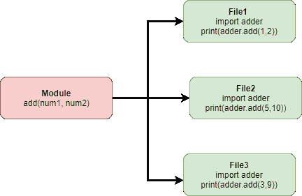

# 创建 Python 模块

> 原文：<https://www.askpython.com/python-modules/creating-a-python-module>

那么，你学习 Python 已经有一段时间了。作为初学者，通常的做法是编写一个单文件程序，使用[类](https://www.askpython.com/python/oops/python-classes-objects)和[函数](https://www.askpython.com/python/python-functions)来组织所有代码。

但是随着你越来越高级，你的代码越来越复杂，你需要学习使用多个文件。

## Python 模块到底是什么？

Python 模块是一个 Python 文件，其中包含您希望包含在应用程序中的类、方法或变量。

在高级 Python 应用程序中，常见的做法是将可重用的函数或类组合在一个文件中，然后导入程序的其他部分。



Python Module Example 1

这被称为 Python 模块。然后可以导入该模块，变量和函数可以多次重用，而不必每次都声明或创建它们。

[目录]

## 如何创建 Python 模块？

这很简单，但我们将把它分解成小块，以便您理解它，并能够在现实世界中应用它。

### 1.创建包含方法的文件

我们将首先创建一个基本方法，它将两个数字相加，并接受这两个数字作为参数。

```py
name = "AskPython"
def add(num1, num2):
        return num1 + num2

```

这是我们的模块。上面的代码只是一个返回传递给它的两个数之和的方法。将上面的代码保存为`adder.py`，我们将进入下一步。

### 2.创建主文件以导入模块

我们的下一步是在程序中导入定制的 python 模块。现在，这与导入任何其他模块完全相同。

唯一的区别是模块文件位于本地，而不是在系统路径中。

```py
import adder
nums = adder.add(5, 10)
print(nums)

```


This is the output that we’ll receive when the above program is run

在上面的例子中，我已经导入了我们的“加法器”文件。不需要加上**”。py"** 导入时的扩展名。

### 3.仅导入一个函数

假设在我们的模块中，我们有多个函数执行多个任务。但是在我们导入模块的程序中，我们只需要这些函数中的一个。没有必要导入整个模块。

在这种情况下，我们可以一起使用`from`和`import` 。

```py
from adder import add

nums = add(5, 10)
print(nums)

```


Importing the function individually gives us the same output

正如您所看到的，由于我们正在导入一个特定的函数，Python 允许我们使用该函数，就像它是文件的原生函数一样，而不必用模块名来引用它。

### 4.使用我们模块中的变量

您可能已经注意到了我们模块中的两个变量。我们添加这些是为了演示如何从模块中直接导入变量，而不改变它们的值。

```py
import adder

nums = adder.add(5, 10)
print(nums)

print(adder.name)

```


Importing variables from modules

## 从不同目录导入模块

您不需要将模块存储在与主文件相同的文件夹中。如果有很多文件，那会变得很不方便。

此外，如果你把一个模块导入到不同的程序中，使用这个模块会很困难。

相反，您可以在文件夹中组织模块，并且仍然以与以前相同的方式导入它们。我们只需对 import 语句做一点小小的修改，其他一切都会运行良好。

有多种方法可以导入程序中不在根目录下的模块。让我们从简单的开始。

### 1.通过指定文件夹名称导入

我们上面使用的**点符号**或 **`from..import`** 可以用来导入位于一个目录中的模块。让我们将“adder.py”模块放在名为 **modules** 的目录中。


Modules In Directory 1

```py
import modules.adder as adder

nums = adder.add(5, 10)
print(nums)

print(adder.name)

```

在这个例子中，我们使用**作为**，将我们的模块名从“modules.adder”重命名为“adder”。

这样做的原因是，在没有重命名的情况下，每次我们需要从模块中调用函数时，我们都必须指定“modules.adder.add(5，10)”等等。

我们不需要在`import`语句中重命名模块。我们也可以稍后在程序中创建一个保存模块名称的变量，并使用该变量调用模块中的函数。

`adder = modules.adder`

这也可以，但是在程序开始的时候声明新的名字可以提高代码的可读性，让下一个程序员更容易处理你的代码。

另一种方法是使用 **from..导入**。这使我们不必为了在程序中使用而重命名模块。我需要对导入命令做的唯一改变是使用模块导入加法器中的

```py
from modules import adder

nums = adder.add(5, 10)
print(nums)

print(adder.name) 
```

### **2.将路径追加到 sys.path**

**当导入模块时，Python 首先查看预定义的路径，以找到与名称匹配的模块。它查找的第一个目录是当前目录，之后它移动到其他列出的目录。**

**让我们把 sys.path 打印出来，看看 Python 在研究哪些路径。**

```py
import sys
print(sys.path) 
```

**

Sys Path In Python Linux** 

**上面的输出是在 Linux 计算机上生成的。如果您使用的是 Windows 电脑，您将获得不同的路径列表。**

**因为 sys.path 是一个 Python 列表，所以我们可以向它追加路径。**

```py
import sys
sys.path.append("modules")
import adder

nums = adder.add(5, 10)
print(nums)

print(adder.name) 
```

**我们导入了 sys 模块，并将我们的“模块”目录附加到它上面。因此，任何时候你需要在这个程序的 **modules** 目录中导入一个模块，你可以简单地指定名称，然后你就可以开始工作了。**

### **3.使模块在系统范围内可用**

**我们在上面的例子中打印出了 sys.path。我们知道 Python 会默认查看这些目录，不管你的代码放在哪里。**

**如果我们将我们的模块移动到这些目录中的一个，您将可以很容易地从您将来在计算机上创建的任何程序中访问该模块。**

**请注意，当将程序移植到不同的系统时，您将需要复制该模块。所以对于特定于程序的模块，最好将它们组织在父目录中的文件夹中，并从那里导入。**

## **结论**

**现在，您应该能够用 Python 创建自定义模块并编写多文件程序。请记住，使用类将代码组织在多个文件中对于代码的可重用性来说是一个更好的选择。**

**您现在需要的许多功能在未来的应用程序中也会有用，您创建的这些单独的模块只需导入即可，这样在高级应用程序中可以节省您的工作时间。**