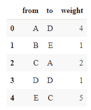
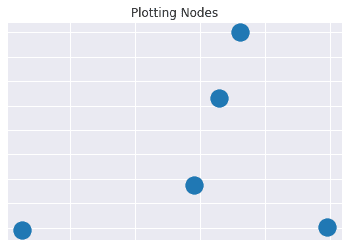
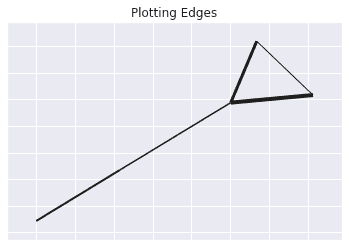
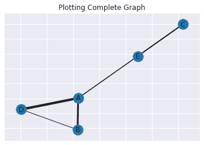

# 从熊猫数据框架创建加权图

> 原文：<https://www.askpython.com/python/examples/creating-weighted-graph-dataframe>

嘿伙计们！在本教程中，我们将了解如何从熊猫数据框构建我们自己的加权图。

* * *

## 从熊猫数据帧中创建一个加权图

任何 python 程序的第一项任务都是将必要的模块/库导入代码。

```py
import pandas as pd
import numpy as np
import networkx as nx
import matplotlib.pyplot as plt

```

下一个任务是创建一个数据框，在后面的部分中需要为其绘制图表。同样可以在[熊猫](https://www.askpython.com/python-modules/pandas/python-pandas-module-tutorial)和 [numpy 模块](https://www.askpython.com/python-modules/numpy/python-numpy-module)的帮助下获得。

首先，我们创建一个随机种子，它将有助于在一个特定的范围内生成一些随机整数，这些整数将在后面的部分中作为边的权重。接下来，使用`DataFrame`函数创建数据框，并将图表数据传递给该函数。

```py
r = np.random.RandomState(seed=5)
weights = r.random_integers(1, 5, size=(5,))
df = pd.DataFrame({'from':['A','B','C','D','E'],'to':['D','E','A','D','C'],'weight':weights})
df.head()

```



Dataframe 2 Graph Data

接下来，我们将分别借助于`draw_networkx_nodes`、`draw_networkx_edges`和`draw_networkx_labels`函数，通过分别绘制节点、边和标签来尝试可视化权重增加图。

### 可视化节点

```py
fig, ax = plt.subplots()
pos = nx.spring_layout(G)
plt.title("Plotting Nodes")
nx.draw_networkx_nodes(G, pos, ax = ax)

```



Dataframe 2 Graph Only Nodes

### 可视化边缘

```py
fig, ax = plt.subplots()
pos = nx.spring_layout(G)
plt.title("Plotting Edges")
nx.draw_networkx_edges(G, pos, width=durations, ax=ax)

```



Dataframe 2 Graph Only Edges

### 可视化完整的图表

```py
fig, ax = plt.subplots()
pos = nx.spring_layout(G)
plt.title("Plotting Complete Graph")
nx.draw_networkx_nodes(G, pos, ax = ax)
nx.draw_networkx_edges(G, pos, width=durations, ax=ax)
_ = nx.draw_networkx_labels(G, pos, labels, ax=ax)

```



Dataframe 2 Graph Complete Graph

* * *

## 结论

恭喜你！您刚刚学习了如何在 [NetworkX 库](https://www.askpython.com/python-modules/networkx-package)中使用 pandas 数据框构建图表。希望你喜欢它！😇

喜欢这个教程吗？我建议你看看下面提到的教程:

1.  [NetworkX 包——Python 图形库](https://www.askpython.com/python-modules/networkx-package)
2.  [计算未加权图中节点间的距离](https://www.askpython.com/python/examples/distance-between-nodes-unweighted-graph)
3.  [Python 中的图形操作【附简单例子】](https://www.askpython.com/python/examples/graph-operations)
4.  [用 Python 实现图形](https://www.askpython.com/python/examples/graph-in-python)

感谢您抽出时间！希望你学到了新的东西！！😄

* * *