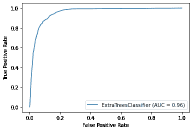

# Python 中的犯罪预测——完全指南

> 原文：<https://www.askpython.com/python/examples/crime-prediction-in-python>

今天我们将讲述如何用 Python 进行犯罪预测。在当今世界，犯罪每天都在上升，而执法人员的数量却在减少，因此我们可以利用机器学习模型来预测一个人是否是罪犯。

## 用 Python 实现犯罪预测

在本文中，我们将开发一个模型，根据一个人的一些特征来预测他是否是罪犯。

数据集取自 techgig。你可以在这里 [获得 Python 笔记本、数据字典、数据集](https://github.com/abhi9599fds/Posts_code) [](https://github.com/abhi9599fds/Posts_code) [***。***](https://raw.githubusercontent.com/abhi9599fds/Posts_code/master/train.csv)

* * *

### **第一步:导入所有需要的库**

在我们进入犯罪预测的主要部分之前，让我们导入必要的库。

```py
import pandas as pd
import numpy as np
import matplotlib.pyplot as plt
import seaborn as sns

```

### **第二步:加载数据集**

下一步是使用[熊猫模块](https://www.askpython.com/python-modules/pandas/python-pandas-module-tutorial)的`read_csv`函数将数据文件加载到我们的程序中。

```py
df = pd.read_csv('train.csv')
df.head()

```

### **第三步:数据清理**

下一步是查看其中是否有任何丢失的值。出于本教程的考虑，我们已经删除了所有丢失的值。

```py
print(df.isna().sum())

```

### **第四步:列车测试分割**

在这一步中，使用 80-20 规则和`sklearn`库函数将数据分成[个训练和测试数据集](https://www.askpython.com/python/examples/split-data-training-and-testing-set)。

```py
from sklearn.ensemble import ExtraTreesClassifier
from sklearn.model_selection import train_test_split
from sklearn.metrics import confusion_matrix , plot_roc_curve
from imblearn.over_sampling import SMOTE
smote = SMOTE()

#stratify for equal no. of classes in train and test set
x_train,x_test ,y_train,y_test = train_test_split(df.iloc[:,1:-1],df.iloc[:,-1], stratify=df.iloc[:,-1],test_size=0.2 ,random_state = 42)

X_re ,y_re= smote.fit_resample(x_train,y_train)

```

为了解决犯罪类别不平衡的问题，我们采用了 **SMOTE(合成少数过采样方法)**，一种数据集平衡技术。我们只会平衡训练数据，不会平衡测试数据。

总之，Smote 使用聚类来产生用于过采样的不平衡类的新实例。

### **步骤 5:创建基于树的分类器**

基于树的模型可以用于许多类别特征。使用了树外分级机。

```py
clf = ExtraTreesClassifier()
clf.fit(X_re,y_re)
clf.score(x_test,y_test)

```

输出显示的分数为`0.94335`，如果我们仔细观察的话，这已经很不错了。

### **第六步:显示 ROC 曲线**

最后，让我们使用下面提到的代码为我们的模型绘制 ROC 曲线。

```py
plot_roc_curve( clf,x_test,y_test)

```



ROCCurve CrimePrediction

* * *

## **结论**

恭喜你！您刚刚学习了如何使用 Python 编程语言和机器学习来构建犯罪预测器。希望你喜欢它！😇

喜欢这个教程吗？无论如何，我建议你看一下下面提到的教程:

1.  [利用 Python 预测股价](https://www.askpython.com/python/examples/stock-price-prediction-python)
2.  [用 Python 进行加密价格预测](https://www.askpython.com/python/examples/crypto-price-prediction)
3.  [利用 Python 进行股票价格预测](https://www.askpython.com/python/examples/stock-price-prediction-python)
4.  [Python 中的票房收入预测——简单易行](https://www.askpython.com/python/examples/box-office-revenue-prediction)

感谢您抽出时间！希望你学到了新的东西！！😄

* * *