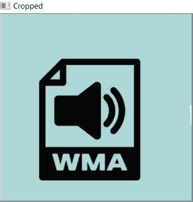

# 如何在 Python 中裁剪图像

> 原文：<https://www.askpython.com/python/examples/crop-an-image-in-python>

你好！在这篇文章中，我们将关注 Python 中裁剪图像的不同方法。现在，让我们揭开和理解背景函数被用来裁剪图像。

* * *

## 技巧 1: Python PIL 裁剪图像

**PIL** 代表“ **Python 图像库**”。PIL 在 **python 解释器**中增加了**图像编辑**和**格式化功能**。因此，它具有许多用于图像处理和图形分析的内置功能。

PIL 内置了裁剪图像矩形部分的功能。

**语法:**

```py
Image.crop(left, top, right, bottom)

```

*   `top` 和`left`:这些参数代表**左上坐标**，即(x，y) = (left，top)。
*   `bottom` 和`right`:这些参数代表**右下角坐标**，即(x，y) =(右，下)。

要裁剪的区域如下所示:

*   **左< = x <右**
*   **顶部< = y <底部**

**举例:**

```py
from PIL import Image 

img = Image.open(r"C:\Users\HP\OneDrive\Desktop\<image>.png") 

left = 0
top = 50
right = 510
bottom = 292

img_res = img.crop((left, top, right, bottom)) 

img_res.show() 

```

在上面的例子中，`Image.open(r"image path")`是 PIL 在**读取模式**下打开图像的函数。

我们已经为左、右、上、下坐标分配了特定的值。

`Image.show()`功能用于显示裁剪后的图像。

**原始图像**:


**Image Used For Cropping Purpose**

**裁剪后的图像(输出):**


**Cropped Image Using PIL**

* * *

## 技术 2:使用 OpenCV 在 Python 中裁剪图像

**Python OpenCV** 是一个拥有大量可用于实时计算机视觉的函数的库。它包含了一套很好的函数来处理图像的处理和操作。

为了使用 OpenCV 处理图像，用户需要安装版本为**3.0 和更高版本**的 OpenCV 库。

首先，我们需要使用下面的代码片段在我们的程序中导入 OpenCV 库:

```py
import cv2

```

OpenCV 实际上在裁剪图像的方法中对作为数组传递的图像进行切片。

**语法:**

```py
image[start_x:end_x, start_y:end_y]

```

*   **image[]** 实际上是通过传递 x 和 y 坐标的起始和结束索引，以数组的形式对图像进行切片。
*   因此，x 和 y 的起始和结束坐标之间的图像作为裁剪的数组对象返回。

**举例:**

```py
import cv2
image = cv2.imread(r"C:\Users\HP\OneDrive\Desktop\<image>.png")

y=0
x=0
h=300
w=510
crop_image = image[x:w, y:h]
cv2.imshow("Cropped", crop_image)
cv2.waitKey(0)

```

`cv2.imread(r"image path")`功能用于在读取模式下打开图像。

此外，提供了 x 轴和 y 轴的开始和结束索引，因此图像被裁剪。

`cv2.imshow()`功能用于显示裁剪后的图像。我们在这里使用了与之前相同的图像。

**裁剪后的图像(输出):**



**Cropped Image Using OpenCV**

* * *

## 结论

因此，在本文中，我们已经了解了用 Python 裁剪图像的方法。

* * *

## 参考

*   [使用 OpenCV-stack overflow 在 Python 中裁剪图像](https://stackoverflow.com/questions/15589517/how-to-crop-an-image-in-opencv-using-python)