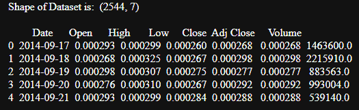
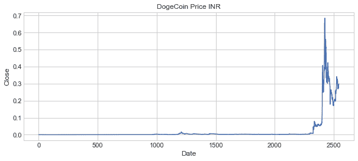
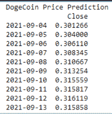

# 用 Python 进行加密价格预测

> 原文：<https://www.askpython.com/python/examples/crypto-price-prediction>

今天在本教程中，我们将使用机器学习算法来预测一种被称为 Dogecoin 的加密货币的未来价格。我们正在使用 Python 作为编程语言。

* * *

## Dogecoin 是什么？

`Dogecoin`是一种**加密货币**，拥有令人愉快的品牌形象，旨在成为加密货币的有益介绍。Dogecoin，也被称为“笑话”硬币，是由俄勒冈州程序员比利·马库斯·T4 提出的。

他推断，一种不太严肃的硬币，如 Dogecoin，即使规模较小，也比比特币更有可能被普通大众接受。


Dogecoin Logo

Dogecoin 可以用来付款和买东西，但它不是保值的好方法。这主要是因为 Dogecoin 对通过采矿产生的硬币数量没有寿命限制，这使得它本质上极度膨胀。

* * *

## 1.导入模块

除了导入各种模块，如 numpy、pandas、matplotlib 和 seaborn，我们还设置了绘图样式和 seaborn 绘图。

```py
import numpy as np
import pandas as pd
import matplotlib.pyplot as plt
import seaborn as sns
from seaborn import regression
sns.set()
plt.style.use('seaborn-whitegrid')

```

* * *

## 2.探索数据

既然我们已经导入了模块，我们将加载可以从[这里](https://www.codespeedy.com/wp-content/uploads/2021/09/Dogecoin.csv)下载的数据集。

数据集包含超过 2.5k 个数据点和 7 个属性，即不同日期的开盘价和收盘价。

```py
data = pd.read_csv("Dogecoin.csv")
print("Shape of Dataset is: ",data.shape,"\n")
print(data.head())

```



Initial Dogecoin Datapoints

* * *

## 3.可视化 Dogecoin 数据

如果不使用 matplotlib 库可视化数据集，ML 模型就不完整，matplotlib 库可以使用下面提到的代码来实现。

我们将使用线性线图可视化`Close`属性和`Date`属性。

```py
data.dropna()
plt.figure(figsize=(10, 4))
plt.title("DogeCoin Price INR")
plt.xlabel("Date")
plt.ylabel("Close")
plt.plot(data["Close"])
plt.show()

```



Close Vs Date Visualize

* * *

## 4.应用机器学习模型

作为 ML 模型，对于 Dogecoin 数据集，我们将使用`AutoTS`模型并将该模型导入到程序中。

然后，创建一个 AutoTS 模型对象，以便使用 fit 函数将数据点拟合到模型中，然后使用`predict`函数预测所有数据点的价格。

最后，显示由 AutoTS 模型预测的价格。下面介绍了实现这一目标的代码。

```py
from autots import AutoTS
model = AutoTS(forecast_length=10, frequency='infer', ensemble='simple', drop_data_older_than_periods=200)
model = model.fit(data, date_col='Date', value_col='Close', id_col=None)

prediction = model.predict()
forecast = prediction.forecast
print("DogeCoin Price Prediction")
print(forecast)

```



Final Output Dogecoin Price

* * *

## 结论

我希望你理解这个概念，并且理解预测不同日期的 Dogecoin 价格的实现。

编码快乐！😇

想了解更多？查看下面提到的教程:

1.  [利用 Python 进行股票价格预测](https://www.askpython.com/python/examples/stock-price-prediction-python)
2.  [Python predict()函数–您需要知道的一切！](https://www.askpython.com/python/examples/python-predict-function)
3.  [Python 中的手写数字识别](https://www.askpython.com/python/examples/handwritten-digit-recognition)
4.  [Python 中的计算精度—分类误差度量](https://www.askpython.com/python/examples/calculating-precision)

* * *