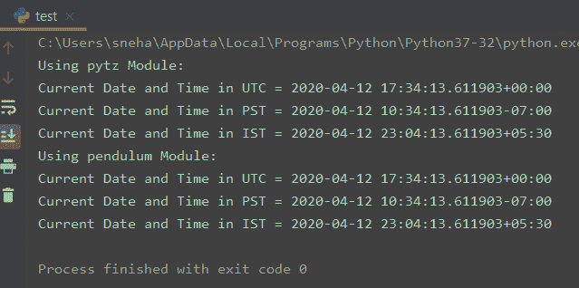

# 用 Python 获取当前日期和时间

> 原文：<https://www.askpython.com/python/examples/current-date-and-time-in-python>

## 介绍

今天在本教程中，我们将讨论如何在 Python 编程中获取**当前日期和时间**。

很多时候，用户可能需要当前的系统日期和时间来进行各种操作。这个问题可以通过 **Python** 中的各种内置方法和模块轻松解决。

此外，像`pytz`和`pendulum`这样的 python 模块允许用户获得指定**时区**的当前日期和时间。这个特性非常有用，因为它使代码更加可靠。

* * *

## 在 Python 中获取当前日期和时间的方法

现在让我们开始理解在 Python 中获取当前日期和时间的不同需求。

### 日期时间模块

`datetime`模块提供了在 Python 中操作日期和时间的类。

在下面的例子中，我们尝试使用`today()`方法从 date 类中获取当前日期。

```py
from datetime import date

today = date.today()
print("Date :", today)

```

**输出**:

```py
Date : 2020-04-12

```

这里，`today()`返回当前的**当地日期**。同时我们打印出日期。

现在让我们看另一个例子。这次我们将使用`datetime`模块打印系统的本地日期和当前时间。

```py
import datetime

#datetime object
dt = datetime.datetime.now()

print("Datetime object =", dt)

# printing in dd/mm/YY H:M:S format using strftime()
dt_string = dt.strftime("Date: %d/%m/%Y  time: %H:%M:%S")
print("Current date and time =", dt_string)

```

**输出**:

```py
Datetime object = 2020-04-12 23:16:58.958467
Current date and time = Date: 12/04/2020  time: 23:16:58

```

在上面的代码中，

*   来自 **datetime** 类的`now()`方法返回当前的本地日期和时间。因此，此时， **dt** 持有包含日期和时间信息的日期时间对象
*   接下来，我们使用`strftime()`方法将 **dt** (日期时间对象)转换成可格式化的字符串
*   最后，我们以我们想要的方式打印出**当前日期**和**时间**

### 使用钟摆模块

**钟摆**是一个时区库，简化了日期时间操作。类似于`datetime`模块，钟摆模块也提供了一个`now()`方法，返回本地日期和时间。

使用 PIP 命令可以很容易地安装 Pendulum:

```py
pip install pendulum

```

**例**，

```py
import pendulum
time = pendulum.now()
print(time)

```

**输出**:

```py
2020-04-12 23:07:22.940108+05:30

```

如前所述，`now()`方法返回当前的**日期**和**时间**，我们可以从上面的输出中看到。

* * *

## Python 中某个时区的当前日期和时间

当我们谈论可靠性或跨平台代码可用性时，Python 提供了大量这样的特性。在大多数情况下，用户需要特定的**时区**的日期或时间，使用一些像`pytz`或`pendulum`这样的模块使得在这样的环境中工作更加容易。

`pytz`模块将 **Olson tz** 数据库引入 Python，并允许精确的跨平台时区计算。

另一方面，`pendulum`是一个类似的库，它继承自**日期时间**模块。它使用一种更干净的方法，比它的对手(`pytz`)更快。

这两个模块都可以使用下面的 **PIP** 命令进行安装，

对于`pytz`模块:

```py
pip install pytz

```

对于`pendulum`模块:

```py
pip install pendulum

```

### 例子

现在让我们举一个例子，我们试图获取并打印不同**时区**的日期和时间。这将通过使用`pytz`和`pendulum`模块来完成。

```py
import pytz
from datetime import datetime

utc = pytz.timezone('UTC')
pst = pytz.timezone('America/Los_Angeles')
ist = pytz.timezone('Asia/Calcutta')

print("Using pytz Module:")
print('Current Date and Time in UTC =', datetime.now(utc))
print('Current Date and Time in PST =', datetime.now(pst))
print('Current Date and Time in IST =', datetime.now(ist))

import pendulum

utc1 = pendulum.timezone('UTC')
pst1 = pendulum.timezone('America/Los_Angeles')
ist1 = pendulum.timezone('Asia/Calcutta')

print("Using pendulum Module:")
print('Current Date Time in UTC =', datetime.now(utc1))
print('Current Date Time in PST =', datetime.now(pst1))
print('Current Date Time in IST =', datetime.now(ist1))

```

**输出**:



Current Date And Time In Time Zone – Output

这里，

*   对于这两种情况，首先我们使用为 **pytz** 和**钟摆**模块定义的`timezone()`方法，同时通过所需的时区
*   然后我们将这些时区对象从 **datetime** 类传递给`now()`方法。方法返回给定时区的准确日期和时间。因此，我们直接把它打印出来。

* * *

## 结论

因此，在本教程中，我们学习了在 Python 中获取**当前日期和时间的各种方法或技术。**

如有任何进一步的问题，欢迎使用下面的评论。

* * *

## 参考

*   [Python 摆锤模块](https://www.askpython.com/python-modules/python-pendulum-module)，
*   [日期时间模块](https://docs.python.org/3.2/library/datetime.html)–Python 文档，
*   [如何在 Python 中获取当前时间？](https://stackoverflow.com/questions/415511/how-do-i-get-the-current-time)–堆栈溢出问题，
*   [从 UTC 时间获取时区本地时间:箭头 vs 钟摆 vs pytz](https://stackoverflow.com/questions/49325624/get-timezone-local-time-from-utc-time-arrow-vs-pendulum-vs-pytz)–堆栈溢出问题。