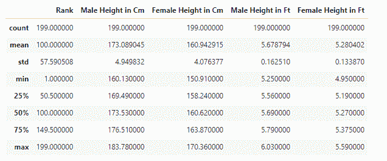

# Python 中的数据分析与熊猫

> 原文：<https://www.askpython.com/python-modules/pandas/data-analysis>

数据分析是当今世界最重要的工具之一。如今，数据存在于生活的各个领域，无论是生物数据还是科技公司的数据。不管你在处理什么样的数据，你必须知道如何过滤和分析你的数据。今天我们将讨论 Python 中的一个数据分析工具，即 Pandas。

让我们首先了解 Python 中用于数据分析的一些主要库。

## Python 中用于数据分析的主要库

Python 有许多强大的数据分析工具，例如 Python 库，它为数据分析师提供了分析数据的必要功能。

*   **[Numpy](https://www.askpython.com/python/numpy-trigonometric-functions) 和 [Scipy](https://www.askpython.com/python-modules/python-scipy) :** 这两个库都非常强大，广泛用于科学计算。
*   Pandas: Pandas 是一个用于数据操作的健壮工具。Pandas 是一个相对较新的工具，已经被添加到数据科学库中。
*   Matplotlib: Matplotlib 是一个优秀的包，主要用于绘图和可视化。您可以使用 Matplotlib 绘制各种图形，如直方图、线图、热度图等。
*   Scikit-Learn: Scikit-Learn 是一款优秀的机器学习工具。这个库拥有机器学习和统计建模所需的所有必要工具。
*   统计模型:这是另一个优秀的统计建模工具。这个库允许用户建立统计模型并进行分析。
*   **[Seaborn](https://www.askpython.com/python-modules/python-seaborn-tutorial) :** Seaborn 也广泛用于数据可视化。它基于 Matplotlib，是用于在 Python 中构建统计图形的。

在这篇文章中，我们将从所有这些工具中了解熊猫，并对熊猫进行动手数据分析。

## 熊猫是什么，为什么它在数据分析中如此有用？

Pandas 是构建在 Numpy 包之上的开源 python 库。它提供了所有必要的功能和方法，使数据分析过程更快更容易。由于其灵活性和更简单的语法，它最常用于数据分析。Pandas 在处理 Excel 电子表格、表格数据或 SQL 时非常有用。

Pandas 中的两个主要数据结构是数据帧和序列。数据帧是一种二维数据结构。在本文中，我们将使用熊猫数据框架。数据可以以各种格式导入，用于 Python 中的数据分析，例如 CSV、JSON 和 SQL。

现在让我们进入数据分析部分。

## 安装不同的环境并导入熊猫

首先，你需要安装熊猫。你可以用不同的环境来做同样的事情。你可以使用 Anaconda 直接在你的电脑上运行 Pandas，也可以通过谷歌云上的浏览器使用 T2 Jupyter 笔记本。Anaconda 附带了许多预安装的包，可以很容易地在 Mac、Windows 或 Linux 上下载。

让我们来看看如何安装和导入熊猫的以下步骤。要在您的环境中安装 Pandas，请使用 [pip 命令](https://www.askpython.com/python-modules/python-pip)。

```py
pip install pandas

```

注意:如果你使用 Google Colab，你不需要添加这个命令，因为 Google Colab 预装了 Pandas。

现在，要将 Pandas 导入到您的环境中，请键入以下命令。

```py
import pandas as pd

```

现在我们知道了如何安装和导入 Pandas，让我们更深入地理解 Pandas Dataframe 是什么。

## 熊猫数据框

Pandas DataFrame 是一个二维数据结构，几乎像一个二维数组。DataFrame 具有标记轴(行和列),并且是可变的。

让我们进入动手数据分析部分。

在本文中，我们使用的数据来自一个关于“2022 年各国男女身高”的 Kaggle 竞赛。

**链接到数据集**:[https://www . ka ggle . com/majy hain/height-of-male-and-female-by-country-2022](https://www.kaggle.com/majyhain/height-of-male-and-female-by-country-2022)

让我们现在加载数据集并读取它。

## 读取 CSV 文件并加载数据

要将文件读入 DataFrame，需要将文件的路径作为以下函数的参数。

```py
df = pd.read_csv("C://Users//Intel//Documents//Height of Male and Female by Country 2022.csv")
df.head()

```

这里我们使用了 read_csv 函数，因为我们正在读取 csv 文件。


借助 head 功能，您可以检查数据帧的前 n 个条目。如果您没有传递条目数，默认情况下将显示前 5 行。

## 评估熊猫数据框架

现在，我们将看看我们正在处理的数据帧。

让我们看看我们正在使用的数据的维度。为此，我们需要传递以下命令。

```py
df.shape

```

```py
(199, 6)

```

[形状函数](https://www.askpython.com/python-modules/pandas/pandas-shape-attribute)将返回一个包含行数和列数的元组。我们可以看到，我们的数据帧有 199 行和 6 列，或特征。

接下来，在 info 函数的帮助下，我们将看到数据集的摘要。

```py
df.info

```

```py
<bound method DataFrame.info of      Rank            Country Name  Male Height in Cm  Female Height in Cm  \
0       1             Netherlands             183.78               170.36   
1       2              Montenegro             183.30               169.96   
2       3                 Estonia             182.79               168.66   
3       4  Bosnia and Herzegovina             182.47               167.47   
4       5                 Iceland             182.10               168.91   
..    ...                     ...                ...                  ...   
194   195              Mozambique             164.30               155.42   
195   196        Papua New Guinea             163.10               156.89   
196   197         Solomon Islands             163.07               156.79   
197   198                    Laos             162.78               153.10   
198   199             Timor-Leste             160.13               152.71   

     Male Height in Ft  Female Height in Ft  
0                 6.03                 5.59  
1                 6.01                 5.58  
2                 6.00                 5.53  
3                 5.99                 5.49  
4                 5.97                 5.54  
..                 ...                  ...  
194               5.39                 5.10  
195               5.35                 5.15  
196               5.35                 5.14  
197               5.34                 5.02  
198               5.25                 5.01  

[199 rows x 6 columns]>

```

您可以看到输出为我们提供了一些关于数据帧的有价值的信息。它显示数据类型、内存使用、非空值和列名。

接下来，我们将对数据集的统计数据有一点了解。

```py
df.describe()

```



在输出中，我们可以看到数据集中每个要素的计数、平均值、中值、标准差、上下四分位数以及最小值和最大值。

## 数据处理和分析

让我们先快速查看一下数据集中的不同要素，以帮助您更好地理解数据集。

**国家名称:**已收集数据的国家的名称。

**男性身高厘米:**男性人口身高厘米

**女性身高厘米**-女性人口身高厘米

**男性身高英尺**。-男性人口的身高，单位为英尺。

以英尺为单位的女性身高。-女性人口的身高，单位为英尺。

### 设置数据帧索引

现在，让我们设置数据框索引。

我们可以从我们的数据中看到，第一列“排名”对于不同的国家是不同的，从数字 1 开始。我们可以利用这一点，将“Rank”列设置为索引。

```py
df.set_index('Rank',inplace=True)
df.index

```

让我们再看一次数据框。

```py
df= pd.read_csv("C://Users//Intel//Documents//Height of Male and Female by Country 2022.csv", index_col='Rank')
df.head()

```


数据集现在看起来更有条理了。

### 行和列

您已经知道数据帧有行和列。可以使用以下命令轻松访问数据框中的列:

```py
df.columns

```

```py
Index(['Country Name', 'Male Height in Cm', 'Female Height in Cm',
       'Male Height in Ft', 'Female Height in Ft'],
      dtype='object')

```

```py
df['Country Name'].head()

```

```py
Rank
1               Netherlands
2                Montenegro
3                   Estonia
4    Bosnia and Herzegovina
5                   Iceland
Name: Country Name, dtype: object

```

我们还可以使用以下命令重命名我们的列:

```py
df.rename(columns={'Male Height in Cm': 'Male Height in Centimeter'}, inplace=True)

```

```py
df.head()

```


您还可以向数据框中添加列。让我们来看看如何做到这一点。

```py
df_copy = df.copy()
df_copy['Height Ratio'] = 'N'

```

```py
df_copy.head()

```


我们已经为新列指定了值“N”。

让我们假设您有另一个数据帧，您想追加或添加到现有的数据帧(df_copy)。我们可以在 append 函数的帮助下做到这一点。

```py
data_to_append = {'Country Name': ['X', 'Y'],
                  'Male Height in Centimeter': ['172.43', '188.94'],
                  'Female Height in Cm': ['150.99', '160.99'],
                  'Male Height in Ft': ['6.09', '5.44'],
                  'Female Height in Ft': ['5.66', '6.66'],
                  'Height Ratio': ['Y', 'N']}

df_append = pd.DataFrame(data_to_append)
df_append

```


```py
df_copy = df_copy.append(df_append, ignore_index=True)
df_copy.tail()

```


我们可以使用 drop 函数从数据帧中删除行和列。

要删除行，您应该使用以下代码:

```py
df_copy.drop(labels=179, axis=0, inplace=True)

```

对于删除列，下面的代码将起作用:

```py
df_copy.drop(labels='Height Ratio', axis=1, inplace=True)

```

### 过滤数据

我们也可以选择我们需要的特定数据。我们将使用一种最简单的方法 loc 和 iloc 来选择数据。

**例如:**

我们使用 loc 根据标签/索引来访问行和列。

```py
df.loc[193]

```

```py
Country Name                  Nepal
Male Height in Centimeter    164.36
Female Height in Cm          152.39
Male Height in Ft              5.39
Female Height in Ft               5
Name: 193, dtype: object

```

您还可以使用以下代码来可视化列。

```py
df.loc[193, ['Country Name', 'Male Height in Centimeter','Female Height in Cm']]

```

```py
Country Name                  Nepal
Male Height in Centimeter    164.36
Female Height in Cm          152.39
Name: 193, dtype: object

```

现在，如果你想看到身高在 17 厘米以上的男性人群，我们将在 loc 中添加一个条件。

```py
df.loc[df['Male Height in Centimeter'] >= 170]

```


如果您只想选择第一行和第一列中的数据，您可以使用 [iloc](https://www.askpython.com/python/built-in-methods/python-iloc-function) 。iloc 基于整数位置或布尔数组选择数据。

```py
df.iloc[0,0]

```

```py
'Netherlands'

```

您也可以选择整行。在本例中，我们访问了第 10 行。

```py
df.iloc[10,:]

```

```py
Country Name                 Ukraine
Male Height in Centimeter     180.98
Female Height in Cm           166.62
Male Height in Ft               5.94
Female Height in Ft             5.47
Name: 11, dtype: object

```

我们也可以选择整个列。在本例中，我们选择了最后一列。

```py
df.iloc[:,-1]

```

```py
Rank
1      5.59
2      5.58
3      5.53
4      5.49
5      5.54
       ... 
195    5.10
196    5.15
197    5.14
198    5.02
199    5.01
Name: Female Height in Ft, Length: 199, dtype: float64

```

您也可以选择多行和多列。

```py
df.iloc[100:199, 2:5]

```


在下一节中，我们将学习如何寻找丢失的数据。

### 使用缺失值

识别数据帧中缺失值的第一步是使用 isnull 函数。

```py
df.isnull()

```


我们可以看到，输出是与原始数据帧具有相同维度的相同对象，数据集的每个元素都具有布尔值。

在这种情况下，丢失的值被认为是真的，否则它们将被认为是假的。在这种情况下，我们可以有把握地说，我们没有任何丢失的值。但是，我们将使用下面的命令对数据进行另一次质量检查。

```py
df.isnull().sum()

```

```py
Country Name                 0
Male Height in Centimeter    0
Female Height in Cm          0
Male Height in Ft            0
Female Height in Ft          0
dtype: int64

```

让我们检查每列缺失值的比例。

```py
df.isnull().sum() / df.shape[0]

```

```py
Country Name                 0.0
Male Height in Centimeter    0.0
Female Height in Cm          0.0
Male Height in Ft            0.0
Female Height in Ft          0.0
dtype: float64

```

我们可以看到，对于所有列，缺失值的比例为零。

### 绘制数据

这是任何数据分析项目中最重要的部分。在这一部分，我们将学习如何使用熊猫来可视化我们的数据。我们将使用 Pandas 中的情节功能来构建情节。

注意:还有许多其他 Python 库提供了更好的数据可视化。如果任何人想要更详细和详细的情节，他们可以使用 Matplotlib 和 Seaborn 库。

**[直方图](https://www.askpython.com/python-modules/matplotlib/histogram-basic-to-advanced)**

直方图有助于您快速了解和可视化数据集中数值变量的分布。直方图会将每个数值变量中的值划分到多个条块中，并对每个条块中的观察值总数进行计数。直方图有助于分布数据并获得关于数据的直接直觉。

在下面的例子中，我们为特征“男性身高(厘米)”绘制了直方图

```py
df['Male Height in Centimeter'].plot(kind='hist')

```


你可以从直方图中看到，大多数 f 男性群体的身高为 175 cm 和 180cm。

**[散点图](https://www.askpython.com/python-modules/matplotlib/matplotlib-subplots)**

散点图有助于您可视化两个变量之间的关系。该图建立在笛卡尔坐标上。散点图将值显示为点的集合，每个点表示一个变量的值，该变量表示 X 轴上的位置，另一个变量表示 Y 轴上的位置。

在以下示例中，我们构建了一个散点图来了解两个变量(即男性身高和女性身高)之间的关系。

```py
df.plot(x='Male Height in Centimeter', y='Female Height in Cm', kind='scatter')

```


## 结论

在这篇文章中，我们学习了很多关于使用 Pandas 进行数据分析的知识，我认为这将有助于您理解如何使用 Pandas。如今，Pandas 是数据科学中广泛使用的工具，并在工作领域取代了 Excel。Pandas 以其简单的语法和灵活性使数据分析变得更加容易。希望你和熊猫玩得开心！