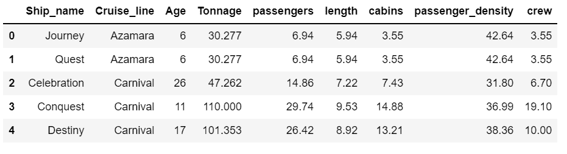
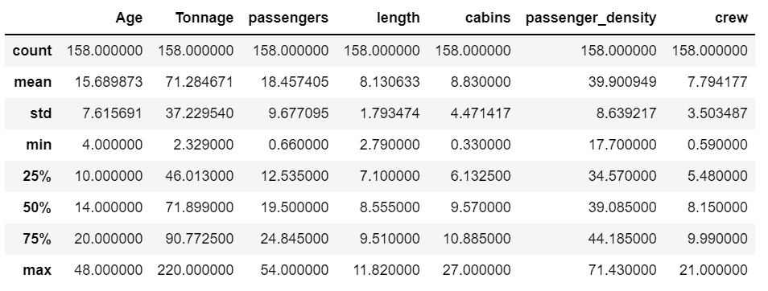
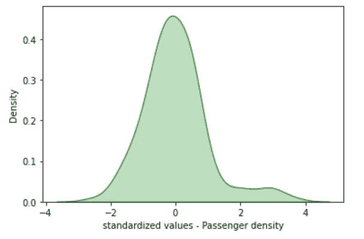
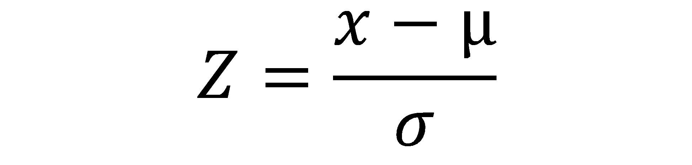
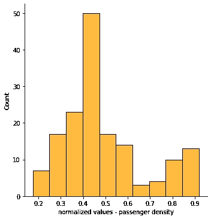
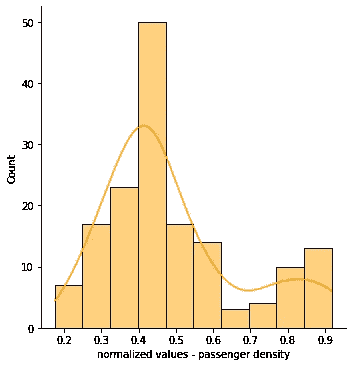

# Python 中的数据缩放|标准化和规范化

> 原文：<https://www.askpython.com/python/examples/data-scaling-in-python>

我们已经读过一个关于数据预处理的故事。在这其中，也就是 [**的数据预处理、**](https://www.journaldev.com/54101/select-and-filter-data-pandas-python) 的数据转换，或者说缩放是最关键的一步。你可能会想到它的重要性，因为无论何时你处理数据，它都包含不同尺度的多个变量和值。

## Python 中的数据缩放

对于一个算法来说，为了发挥其最佳性能，数据应该在相同的范围内。谈到 python 中的数据缩放，我们得到了两个关键技术—**标准化和规范化。**

在这个故事中，让我们看看标准化和规范化技术如何应用于我们手中的数据。

* * *

## 导入数据

我们将在整个过程中使用游轮数据集。让我们导入数据，并尝试应用上面提到的缩放技术。

```py
#Data

import pandas as pd

data = pd.read_csv('cruise_ship_data.csv')

```



Image 6

我们已经导入了**游轮**数据集。让我们更好地了解一些基本的数据统计。

```py
#Data shape

data.shape

```

**(158，9)**

*   我们的数据包含 158 行和 9 个变量。

```py
#data columns

data.columns

```

**索引(['船舶名称'，'邮轮线路'，'年龄'，'吨位'，'乘客'，'长度'，'客舱'，'乘客密度'，'船员']，dtype= '对象')**

*   这是数据中的变量列表。

```py
#summary statistics 

data.describe()

```



Image 7

*   **汇总统计邮轮数据。**

通过使用汇总统计数据，我们可以看到所有特性的值的范围或比例。例如，从上面的数据中，我们可以看到变量**“Age”中的值位于【4，48】**之间，变量**“Crew”中的值位于【0，21】**之间，以此类推。您可以观察到所有属性都有不同范围的值。

因此，我们需要使用数据标准化和规范化等[数据](https://www.journaldev.com/54101/select-and-filter-data-pandas-python)转换技术来扩展数据。让我们看看我们能做些什么。

* * *

## 1.Python 数据缩放–标准化

数据标准化是我们将所有数据置于同一尺度下的过程。这将有助于我们分析并将数据输入到模型中。


Image 9

这是数据标准化过程背后的数学原理。

在计算数据的标准化值之前，我们需要安装 sklearn 库。您可以运行下面的代码来 pip 安装 **scikit-learn** 库。

```py
#install scikit learn

pip install scikit-learn

```

```py
#import pandas
import pandas as pd

#import numpy
import numpy as np

#import seaborn 
import seaborn as sns

#import matplotplib 
import matplotlib.pyplot as plt 

```

嗯，我们都很喜欢我们的图书馆。现在，让我们标准化数据中的值。为此，我们将遵循一个流程或一些步骤。

```py
#define the columns 

cols = ['Age', 'Tonnage', 'passengers', 'length', 
        'cabins','passenger_density','crew']

#Call the sklearn librart and import scaler values 
from sklearn.preprocessing import StandardScaler

#call the standard scaler 
std_scaler = StandardScaler()

#fit the values to the function 
Stand_Sc = std_scaler.fit_transform(data[cols].iloc[:,range(0,7)].values)

#use seaborn for KDE plot
sns.kdeplot(Stand_Sc[:,5],fill=True, color = 'Green')

#Label the plot 
plt.xlabel('standardized values - Passenger density')

#Print the plot 
plt.show()

```

这里-

*   我们已经定义了列，并从 sklearn 库中导入了**标准缩放器**。
*   我们将数据(定义的列)拟合到定标器。
*   创建了一个 **KDE(核密度估计)**图。
*   标为图的轴。输出图将如下所示



Image 10

**推论**

***如果取近似值，数据位于-3 到 3 的刻度之间。您也可以说这些值距离平均值(0)有 3 个标准偏差。***

* * *

## 2.Python 数据缩放–标准化

数据标准化是标准化数据的过程，即通过避免数据的偏斜。一般来说，归一化的数据将呈钟形曲线。

这也是维护数据质量和可维护性的标准过程。数据标准化有助于细分过程。

下面是归一化公式，供你参考。



在上面的部分中，我们已经标准化了数据。类似地，使用 sklearn 规格化器，我们可以规格化数据中的值。

确保您的列与前一列相同。

```py
#Import Normalizer from sklearn
from sklearn.preprocessing import Normalizer

#initialize normalizer
data_norm = Normalizer()

#Fit the data
Normalize = data_norm.fit_transform(data[cols].iloc[:,range(0,7)].values)

#Distribution plot 
sns.displot(Normalize[:,5],fill=True, color = 'orange')

#Add the axis labels 
plt.xlabel('normalized values - passenger density')

#Display the plot 
plt.show()

```

这里-

*   我们在标准化过程中使用了相同的数据，即变量。
*   从 sklearn 库中导入了规格化器。
*   使用 seaborn 和 display plot 绘制分布图。



Image 11

我们也可以在这个情节中加入 KDE 元素。这将增加更多的可读性，也更容易消化信息。

这可以通过添加参数–`kde = True` 来实现

```py
#Import Normalizer from sklearn
from sklearn.preprocessing import Normalizer

#initialize normalizer
data_norm = Normalizer()

#Fit the data
Normalize = data_norm.fit_transform(data[cols].iloc[:,range(0,7)].values)

#Distribution plot 
#sns.displot(Normalize[:,5],fill=True, color = 'orange')
sns.displot(Normalize[:,5],fill=True, color = 'orange', kde=True)

#Add the axis labels 
plt.xlabel('normalized values - passenger density')

#Display the plot 
plt.show()

```



Image 12

推论——

***在这里，你可以观察到数值在-1 到 1 的范围内。***

* * *

## 数据扩展–关键点

1.  数据标准化是最常用的过程，因为它提供了多种好处。
2.  您也可以使用标准化来检测异常值。范围-2 到 2 之外的任何值都可以被视为异常值。
3.  最后，数据转换有助于避免偏差并提高模型准确性。

* * *

## 数据缩放–结论

python 中的数据缩放是建模前必须遵循的基本流程。相似范围内的数据可以令人惊讶地提高模型的预测能力。这个故事关注两种主要的数据扩展技术，即标准化和规范化。我希望这将有助于以一种简单的方式更好地理解缩放。

目前就这些。快乐的蟒蛇！！！😛

**更多阅读:** [数据归一化](http://agiledata.org/essays/dataNormalization.html)