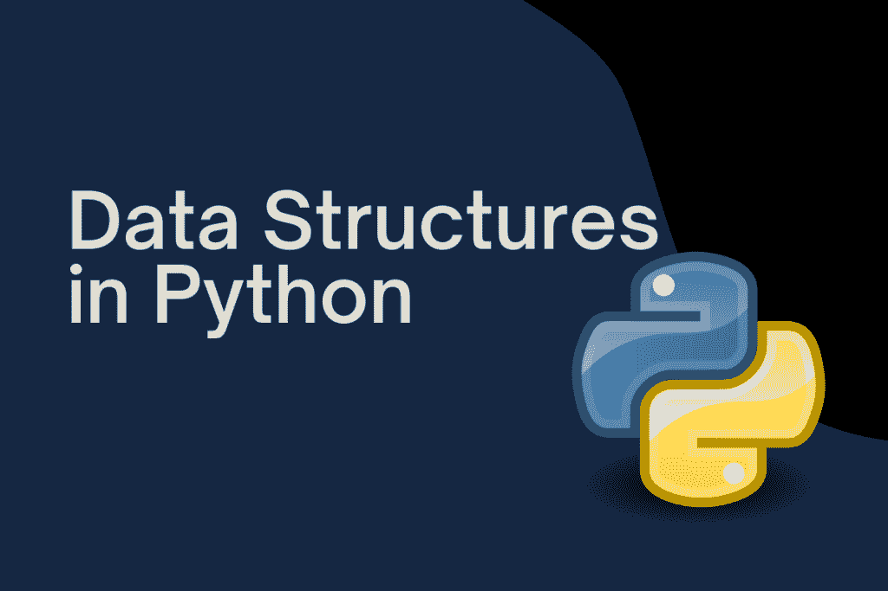
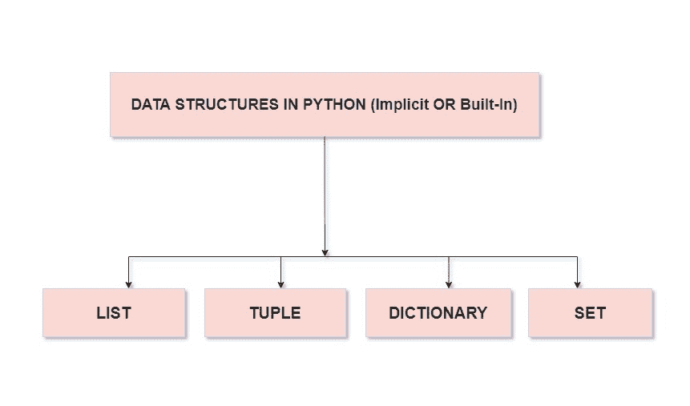

# Python 中的数据结构

> 原文：<https://www.askpython.com/python/data-structures-in-python>



在任何编程语言中，我们都需要处理数据。现在，我们需要处理数据的最基本的事情之一是以一种有组织的方式有效地存储、管理和访问数据，以便可以随时根据我们的需要使用数据。数据结构被用来满足我们所有的需求。

## 什么是数据结构？

数据结构是编程语言的基本构件。它旨在提供一种系统的方法来满足本文前面提到的所有需求。Python 中的数据结构有**列表、元组、字典、集合**。它们被视为 Python 中的**隐式或内置数据结构。我们可以使用这些数据结构并对其应用多种方法来管理、关联、操作和利用我们的数据。**

我们还有自定义的数据结构，即**自定义的**即 **[栈](https://www.askpython.com/python/python-stack)、[队列](https://www.askpython.com/python-modules/python-queue)、[树](https://www.askpython.com/python/examples/binary-tree-implementation)、[链表](https://www.askpython.com/python/examples/linked-lists-in-python)和[图](https://www.askpython.com/python/examples/graph-in-python)** 。它们允许用户完全控制其功能，并将其用于高级编程目的。然而，*对于本文，我们将关注内置的数据结构。*



Implicit Data Structures Python

## 目录

列表帮助我们以多种数据类型顺序存储数据。它们类似于数组，只是它们可以同时存储不同的数据类型，如字符串和数字。列表中的每个项目或元素都有一个指定的索引。由于 *Python 使用基于 0 的索引*，第一个元素的索引为 0，计数继续进行。列表的最后一个元素从-1 开始，可以用来访问从最后一个到第一个的元素。要创建一个列表，我们必须将项目写在**方括号**内。

关于列表要记住的最重要的事情之一是它们是**可变的**。这仅仅意味着我们可以通过使用索引操作符作为赋值语句的一部分直接访问列表中的元素来改变它。我们还可以在我们的列表上执行操作来获得想要的输出。让我们浏览一下代码，以便更好地理解列表和列表操作。

**1。创建列表**

```py
#creating the list
my_list = ['p', 'r', 'o', 'b', 'e']
print(my_list)

```

输出

```py
['p', 'r', 'o', 'b', 'e']

```

**2。从列表中访问项目**

```py
#accessing the list 

#accessing the first item of the list
my_list[0]

```

输出

```py
'p'

```

```py
#accessing the third item of the list
my_list[2]

```

```py
'o'

```

**3。向列表添加新项目**

```py
#adding item to the list
my_list + ['k']

```

输出

```py
['p', 'r', 'o', 'b', 'e', 'k']

```

**4。移除项目**

```py
#removing item from the list
#Method 1:

#Deleting list items
my_list = ['p', 'r', 'o', 'b', 'l', 'e', 'm']

# delete one item
del my_list[2]

print(my_list)

# delete multiple items
del my_list[1:5]

print(my_list)

```

输出

```py
['p', 'r', 'b', 'l', 'e', 'm']
['p', 'm']

```

```py
#Method 2:

#with remove fucntion
my_list = ['p','r','o','k','l','y','m']
my_list.remove('p')

print(my_list)

#Method 3:

#with pop function
print(my_list.pop(1))

# Output: ['r', 'k', 'l', 'y', 'm']
print(my_list)

```

输出

```py
['r', 'o', 'k', 'l', 'y', 'm']
o
['r', 'k', 'l', 'y', 'm']

```

**5。排序列表**

```py
#sorting of list in ascending order

my_list.sort()
print(my_list)

```

输出

```py
['k', 'l', 'm', 'r', 'y']

```

```py
#sorting of list in descending order

my_list.sort(reverse=True)
print(my_list)

```

输出

```py
['y', 'r', 'm', 'l', 'k']

```

**6。查找列表的长度**

```py
#finding the length of list

len(my_list)

```

输出

```py
5

```

## 元组

元组与列表非常相似，关键区别在于元组是不可变的，不像列表。一旦我们创建了一个元组或者拥有了一个元组，我们就不允许改变其中的元素。然而，如果我们在一个元组中有一个元素，它本身就是一个列表，只有这样我们才能在这个列表中访问或更改。为了创建一个元组，我们必须在**括号**中写入条目。像列表一样，我们也有类似的方法可以用于元组。让我们通过一些代码片段来理解使用元组。

**1。创建元组**

```py
#creating of tuple

my_tuple = ("apple", "banana", "guava")
print(my_tuple)

```

输出

```py
('apple', 'banana', 'guava')

```

**2。从元组中访问项目**

```py
#accessing first element in tuple

my_tuple[1]

```

输出

```py
'banana'

```

**3。元组的长度**

```py
#for finding the lenght of tuple

len(my_tuple)

```

输出

```py
3

```

**4。将元组转换为列表**

```py
#converting tuple into a list

my_tuple_list = list(my_tuple)
type(my_tuple_list)

```

输出

```py
list

```

**5。反转一个元组**

```py
#Reversing a tuple

tuple(sorted(my_tuple, reverse=True)) 

```

输出

```py
('guava', 'banana', 'apple')

```

**6。对元组进行排序**

```py
#sorting tuple in ascending order

tuple(sorted(my_tuple)) 

```

输出

```py
('apple', 'banana', 'guava')

```

**7。从元组**中移除元素

为了从元组中删除元素，我们首先将元组转换为一个列表，就像我们在上面的一个方法中所做的那样(第 4 点)，然后遵循列表的相同过程，并显式删除整个元组，只需使用**del 语句**。

## 词典

Dictionary 是一个集合，简单地说就是用来存储带有某个键的值，并提取给定键的值。我们可以将其视为一组**键:值对**和字典中的每个**键**都应该是**唯一的**，这样我们就可以相应地访问相应的**值**。

使用包含键:值对的**花括号{ }** 来表示字典。字典中的每一对都用逗号分隔。字典中的元素是**无序的**当我们访问或存储它们时，顺序并不重要。

它们是可变的，这意味着我们可以在字典中添加、删除或更新元素。下面是一些代码示例，以便更好地理解 python 中的字典。

需要注意的重要一点是，我们不能使用可变对象作为字典中的键。因此，列表不允许作为字典中的键。

**1。创建字典**

```py
#creating a dictionary

my_dict = {
    1:'Delhi',
    2:'Patna',
    3:'Bangalore'
}
print(my_dict)

```

```py
Output

```

```py
{1: 'Delhi', 2: 'Patna', 3: 'Bangalore'}

```

这里，整数是字典的键，与整数相关的城市名是字典的值。

**2。从字典中访问项目**

```py
#access an item

print(my_dict[1])

```

输出

```py
'Delhi'

```

**3。字典的长度**

```py
#length of the dictionary

len(my_dict)

```

输出

```py
3

```

**4。整理字典**

```py
#sorting based on the key 

Print(sorted(my_dict.items()))

#sorting based on the values of dictionary

print(sorted(my_dict.values()))

```

输出

```py
[(1, 'Delhi'), (2, 'Bangalore'), (3, 'Patna')]

['Bangalore', 'Delhi', 'Patna']

```

**5。** **在字典中添加元素**

```py
#adding a new item in dictionary 

my_dict[4] = 'Lucknow'
print(my_dict)

```

输出

```py
{1: 'Delhi', 2: 'Patna', 3: 'Bangalore', 4: 'Lucknow'}

```

**6。从字典中删除元素**

```py
#for deleting an item from dict using the specific key

my_dict.pop(4)
print(my_dict)

#for deleting last item from the list

my_dict.popitem()

#for clearing the dictionary

my_dict.clear()
print(my_dict)

```

输出

```py
{1: 'Delhi', 2: 'Patna', 3: 'Bangalore'}
(3, 'Bangalore')
{}

```

## 设置

Set 是 python 中的另一种数据类型，它是一个没有重复元素的无序集合。集合的常见用例是删除重复值和执行成员测试。**花括号**或 **`set()`** 功能可用于创建集合。需要记住的一点是，在创建空集时，我们必须使用 **`set()`、**和 **`not { }`。后者创建一个空字典。**

下面是一些代码示例，以便更好地理解 python 中的集合。

**1。创建一个** **集合**

```py
#creating set

my_set = {"apple", "mango", "strawberry", "apple"}
print(my_set)

```

输出

```py
{'apple', 'strawberry', 'mango'}

```

**2。从集合中访问项目**

```py
#to test for an element inside the set

"apple" in my_set

```

输出

```py
True
```

**3。集合长度**

```py
print(len(my_set))

```

输出

```py
3

```

**4。对器械包进行分类**

```py
print(sorted(my_set))

```

输出

```py
['apple', 'mango', 'strawberry']

```

**5。** **在集合中添加元素**

```py
my_set.add("guava")
print(my_set)

```

输出

```py
{'apple', 'guava', 'mango', 'strawberry'}

```

**6。从集合**中移除元素

```py
my_set.remove("mango")
print(my_set)

```

输出

```py
{'apple', 'guava', 'strawberry'}

```

## 结论

在本文中，我们介绍了 python 中最常用的数据结构，也看到了与它们相关的各种方法。

## 进一步阅读

*   [Python 中的列表](https://www.askpython.com/python/list/python-list)
*   [Python 字典](https://www.askpython.com/python/dictionary/python-dictionary-dict-tutorial)
*   [Python 中的元组](https://www.askpython.com/python/tuple/python-tuple)
*   [Python 集合](https://www.askpython.com/python/set/python-set)

## 参考

请查看 Python 数据结构的官方文档，其中包含了关于 Python 数据结构的详尽信息。