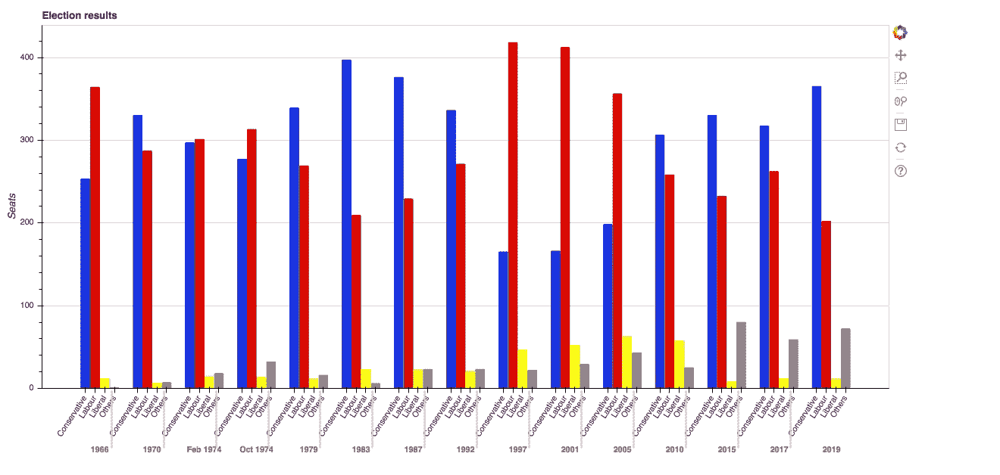
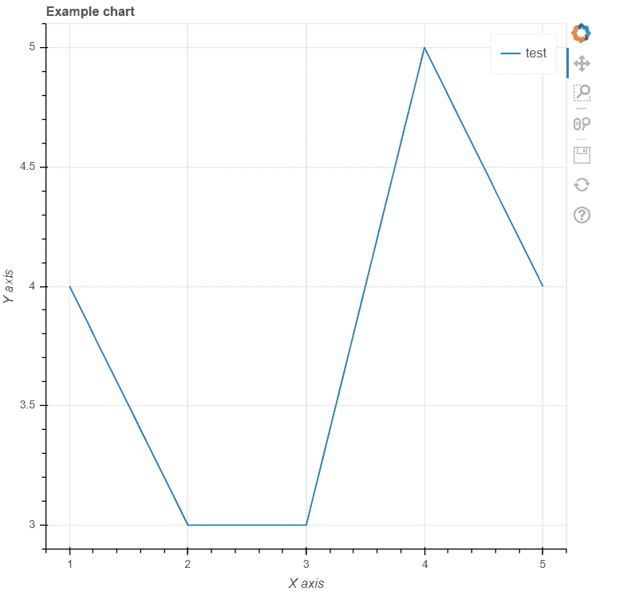
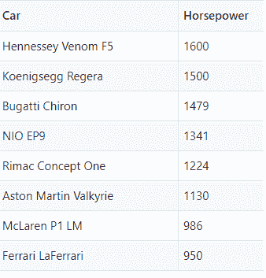
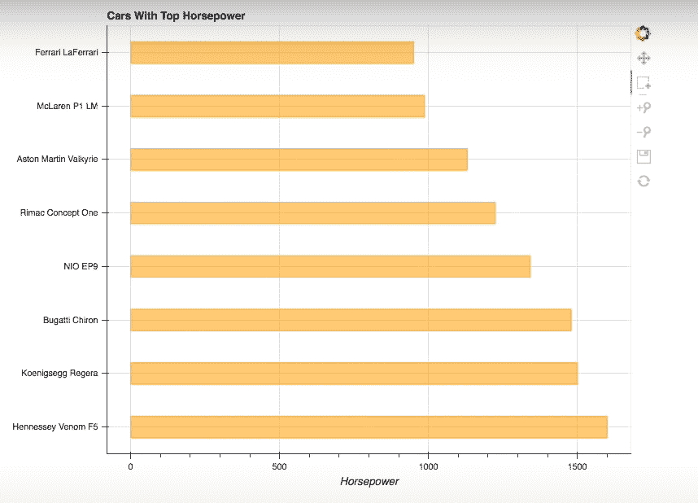

# 使用 Python Bokeh 的数据可视化

> 原文：<https://www.askpython.com/python-modules/data-visualization-using-python-bokeh>

在本文中，我们将研究使用 Python 散景的数据可视化。

Bokeh 允许用户接收任何格式的数据，如 CSV、JSON、硬编码数据或数据库。我们可以使用这个库创建散点图、折线图等。它在业内被广泛用于股票市场分析，因为它非常容易与不同的 web 框架(如 JS、Django 和 HTML)集成。

请继续阅读这篇文章，了解散景的用法

## Python 散景的特性

1.  交互:Bokeh 是一个非常具有交互性的库，除了静态绘图之外，它还提供了图形交互的功能。
2.  强大的库:Bokeh 是一个强大的库，因为它允许为用例添加 JavaScript。
3.  可移植性:散景图的输出可以在任何 web 框架上呈现，比如 Django 和 Python，也可以在 Jupyter 笔记本上呈现。
4.  **灵活**:易于绘制定制和复杂的用例。
5.  与其他流行工具的交互:允许与 pydata 工具轻松交互，如 Pandas 和 Jupyter notebook。



Bokeh Is Interactive

## 使用 Python 散景从数据可视化开始

每当我们使用 python 做任何事情时，创建一个虚拟环境是一个很好的实践，最好的方法是运行命令`pip install pipenv`。一旦你运行这个命令，你就可以访问`pipenv`命令，并且可以运行`pipenv shell`。这确保了虚拟环境的设置。

现在可以使用虚拟环境安装散景和 [Python 熊猫](https://www.askpython.com/python-modules/pandas/python-pandas-module-tutorial)。您可以使用以下命令:

```py
pipenv install bokeh pandas

```

我们将使用 pandas，因为这个库允许我们以数据帧的形式读取 CSV 文件。

### 1.绘制线图

在从 CSV 文件开始绘制图表之前，我们将带您浏览绘制简单折线图的过程，让您熟悉散景。

```py
from bokeh.plotting import figure, output_file, show

```

*   `figure`模块将帮助用户创建地块。
*   `output_file`将定义要生成的 HTML 文件的名称。
*   `show`模块将生成并显示 HTML 文件。

```py
x=[1,2,3,4,5]
y=[4,3,3,5,4]

```

对于数据，我们只创建两个列表-[1，2，3，4，5]和[4，3，3，5，4]。

这些点有(1，4)，(2，3)，(3，3)，等等。

```py
output_file('index.html')

```

我们使用上面的代码将输出文件设置为`index.html`。

```py
p = figure(
    title = 'Example chart',
    x_axis_label = 'X axis',
    y_axis_label = 'Y axis'
)

```

我们使用图()来创建情节。数字()包含多个属性。有关详细信息，您可以参考本模块的文档。

我们将使用`title`、`x_axis_label`和`y_axis_label`。

```py
p.line(x, y, legend="test", line_width=1.5)

```

现在来渲染字形，我们将使用上面的代码片段。我们指定前面定义的两个列表`x`和`y`。我们还指定了其他参数，如`legend`和`line_width`。

请注意，这里使用这些参数是因为我们使用的是`line`图。对于其他类型的图表，这些参数往往会有所不同。

```py
show(p)

```

我们使用`show()`函数显示结果，结果显示在`index.html`上，如下所示。还附上了完整的代码。

```py
from bokeh.plotting import figure, output_file, show
x=[1,2,3,4,5]
y=[4,3,3,5,4]

# defining the output file
output_file('index.html')

# Adding the plot
p = figure(
    title = 'Example chart',
    x_axis_label = 'X axis',
    y_axis_label = 'Y axis'
)

# Rendering the graph
p.line(x, y, legend="test", line_width=1.5)

# Display the results
show(p)

```



Output Chart Shown On index.html

### 2.从 CSV 文件绘制图形

为了绘制图表，我们将使用一个简单的汽车数据集，它有两列，即汽车名称和马力。我们将使用图表来理解这些参数之间的相关性。数据集如下所示



Dataset

可以使用散景将上述数据集绘制成直方图(hbar ),其代码如下:

```py
from bokeh.plotting import figure, output_file, show, save, ColumnDataSource
from bokeh.models.tools import HoverTool
from bokeh.transform import factor_cmap
from bokeh.palettes import Blues8
from bokeh.embed import components
import pandas

df = pandas.read_csv('cars.csv')

source = ColumnDataSource(df)

output_file('index.html')
car_list = source.data['Car'].tolist()

# Add plot
p = figure(
    y_range=car_list,
    plot_width=800,
    plot_height=600,
    title='Cars With Top Horsepower',
    x_axis_label='Horsepower',
    tools="pan,box_select,zoom_in,zoom_out,save,reset"
)

# Render glyph
p.hbar(
    y='Car',
    right='Horsepower',
    left=0,
    height=0.4,
    fill_color=factor_cmap(
      'Car',
      palette=Blues8,
      factors=car_list
    ),
    fill_alpha=0.9,
    source=source,
    legend='Car'
)

# Add Legend
p.legend.orientation = 'vertical'
p.legend.location = 'top_right'
p.legend.label_text_font_size = '10px'

# Show results
show(p)

```

在`index.html`上呈现的输出如下:



Graph Output

## 结论

因此，我们来到这篇文章的结尾。Bokeh 是一个强大的数据可视化库，可以用于所有项目。一定要试试这篇文章中的例子，并在下面的评论区告诉我们你的感受。