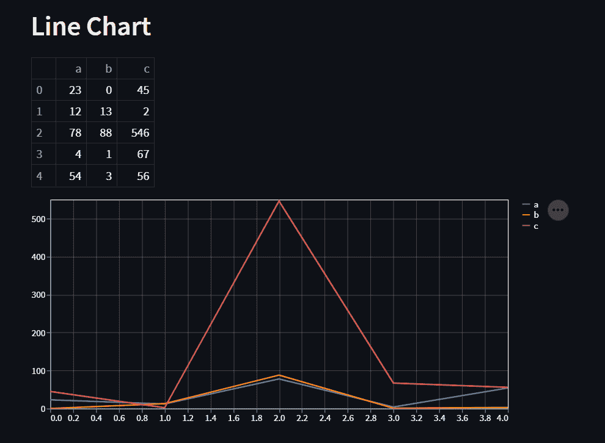
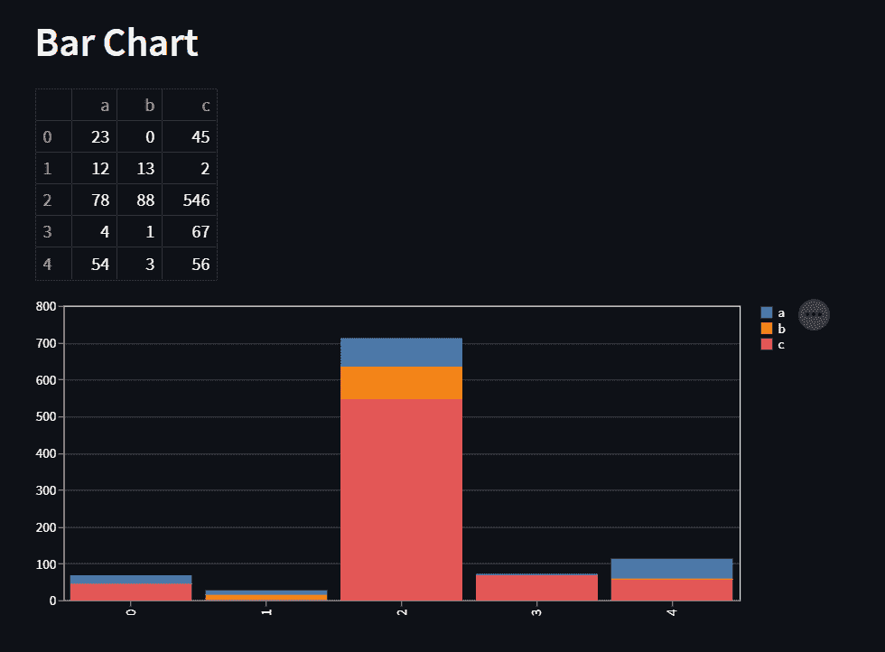
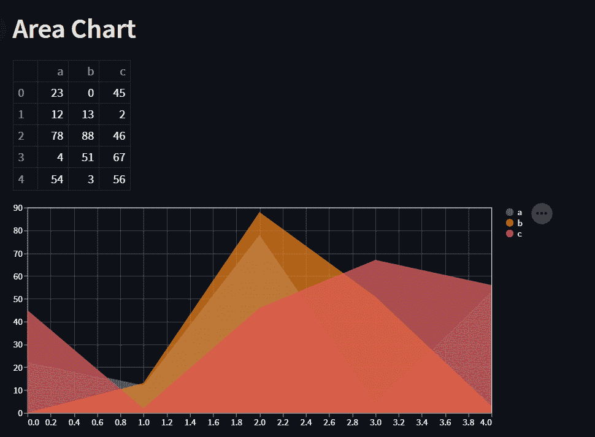
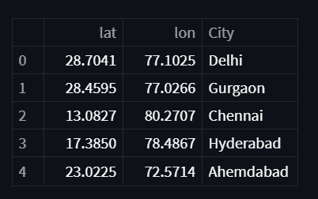
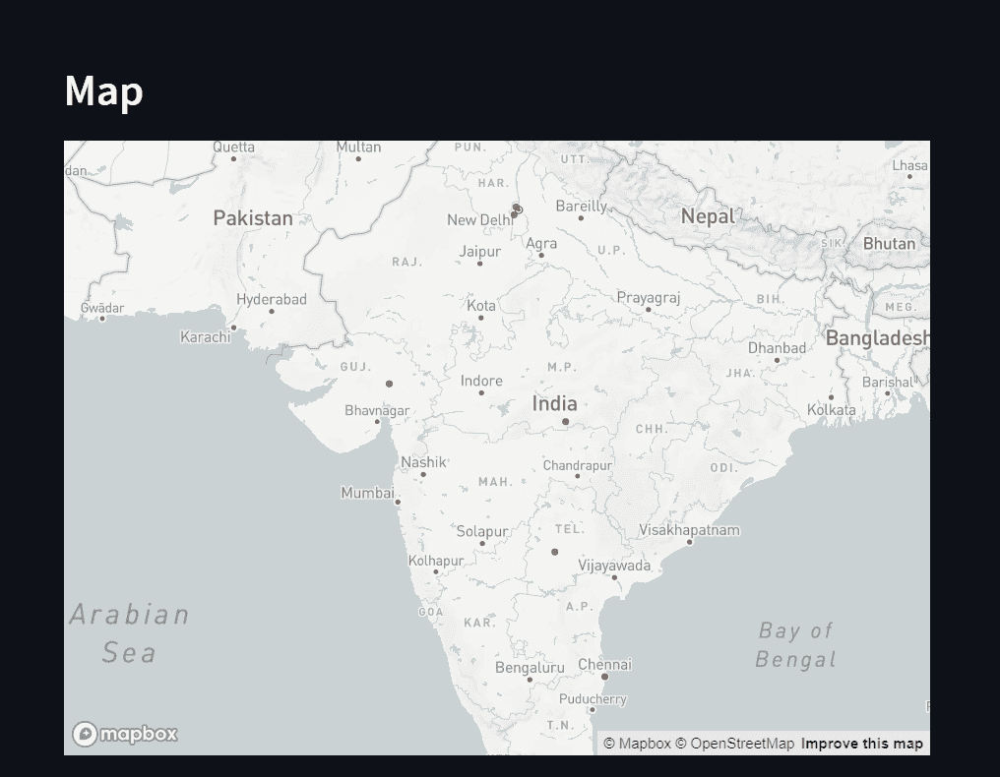

# 使用 Streamlit 实现数据可视化——完整指南

> 原文：<https://www.askpython.com/python-modules/data-visualization-using-streamlit>

数据可视化是以图形格式表示数据。这有助于我们更好、更容易地理解数据。数据可视化可以在图表、图形、地图等视觉元素的帮助下进行。

在本教程中，我们将学习如何使用 Streamlit 绘制不同的图表。让我们开始吧！

***亦读:[细流简介](https://www.askpython.com/python-modules/introduction-to-streamlit)***

* * *

## 细流中的折线图

它是通过将一系列数据点连接成一条连续的线而执行的信息的图形表示。它是数据可视化技术的最简单形式之一。

```py
import streamlit as st
import pandas as pd

st.header("Line Chart")

data = {"a":[23, 12, 78, 4, 54], "b":[0, 13 ,88, 1, 3], 
"c":[45, 2, 546, 67, 56]}

df = pd.DataFrame(data)
df
st.line_chart(data=df)

```

**输出:**



Streamlit Line Chart

在这里，我们采用了一些任意数据，首先使用[熊猫](https://www.askpython.com/python-modules/pandas)库创建了一个数据框，然后使用`line_chart`函数绘制了图表。我们还在绘制图表之前显示了数据框，以便快速参考。

***也读:[使用 Streamlit 的计算器 App 简单的分步方法](https://www.askpython.com/python-modules/calculator-app-using-streamlit)***

* * *

## 细流中的条形图

条形图以垂直或水平矩形条的形式表示数据。每个条形的高度与其代表的值成比例。Streamlit 提供了一个`bar_chart`函数来绘制数据可视化条形图。

```py
import streamlit as st
import pandas as pd

st.header("Bar Chart")

data = {"a":[23, 12, 78, 4, 54], "b":[0, 13 ,88, 1, 3], 
"c":[45, 2, 546, 67, 56]}

df = pd.DataFrame(data)
df
st.bar_chart(data=df)

```

**输出:**



Streamlit Bar Chart

由于数据框包含 5 行，因此输出中的每一行都有对应的条形。这些条形包含特定行中每列值的分布，并且每列用不同的颜色表示。

***也读作:[使用 Streamlit 部署机器学习模型——房价预测 GUI](https://www.askpython.com/python-modules/machine-learning-model-streamlit-house-price-prediction-gui)***

* * *

## Streamlit 中的面积图

面积图是折线图和条形图的组合。数据点被绘制出来，然后用线连接起来。然后，线下面的区域被着色。类似地，也绘制其他值，然后给该区域着色，得到分层图表。我们可以使用 Streamlit 的`area_chart`函数绘制这样一个图表。

```py
import streamlit as st
import pandas as pd

st.header("Area Chart")

data = {"a":[23, 12, 78, 4, 54], "b":[0, 13 ,88, 51, 3], 
"c":[45, 2, 46, 67, 56]}

df = pd.DataFrame(data)
df
st.area_chart(df)

```

**输出:**



Streamlit Area Chart

这里，数据框中每列的区域用不同的颜色表示，如上图所示。根据所提供的数据，有些领域也有重叠。

***也可以理解为:[Streamlit 中的主题化——定制 Streamlit 应用外观的两种方法](https://www.askpython.com/python-modules/streamlit-theming)***

* * *

## 细流中的地图

作为数据可视化的一部分，我们还可以在 Streamlit web 应用程序中显示地图。Streamlit 中的`map`功能可以帮助您显示上面有数据点的地图。我们可以使用列名**“lat”**或**“latitude”**来表示纬度，使用**“lon”**或**“longitude”**来表示经度。需要将这些列添加到要绘制的数据中以绘制地图。

```py
import streamlit as st
import pandas as pd

st.header("Map")

data = {"lat":[28.704060, 28.459497, 13.082680, 17.385044, 23.0225],
        "lon":[77.102493, 77.026634, 80.270721, 78.486671, 72.5714],
        "City": ["Delhi", "Gurgaon", "Chennai", "Hyderabad", "Ahemdabad"]}

df = pd.DataFrame(data)
df
st.map(data=df)

```

**输出:**



Streamlit Map Data



Streamlit Map

此示例中的数据包含印度一些城市的位置，如上图所示。这张地图用红点标出了这些特定的城市。在这里，当我们运行 Streamlit 应用程序时，地图也可以放大和缩小。

请注意，Streamlit 允许我们将这些图表保存为“SVG”或“PNG ”,并使用 Vega 编辑器进行编辑。此外，所有的视觉元素也可以放大和缩小。

* * *

## 结论

仅此而已！我们已经学习了如何使用 Python 和 Streamlit 执行数据可视化。使用 Streamlit 的另一种数据可视化方式是使用 Python 库，如 [Matplotlib](https://www.askpython.com/python-modules/matplotlib) 、 [Plotly](https://www.askpython.com/python-modules/python-plotly-tutorial) 、 [Bokeh](https://www.askpython.com/python-modules/data-visualization-using-python-bokeh) 等。你可以在同一个网站上查看我们的教程来了解它们。

* * *

## 参考

*   [简化官方文档](https://docs.streamlit.io/library/api-reference/charts)