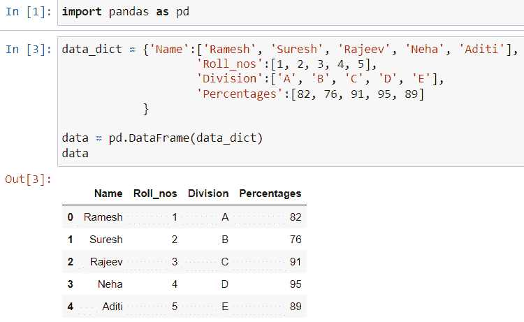
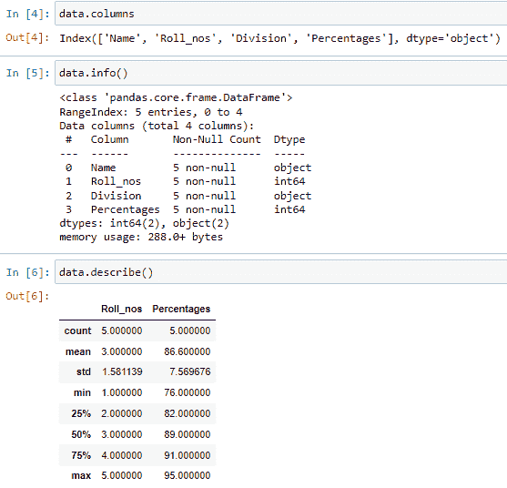
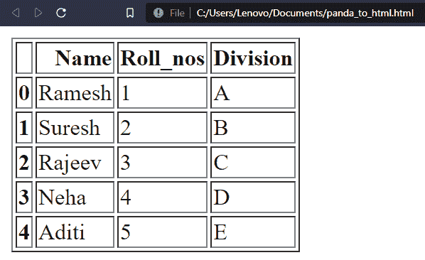

# 在 Pandas 中显示 HTML 格式的数据框

> 原文：<https://www.askpython.com/python-modules/pandas/dataframe-in-html>

在本文中，我们将讨论熊猫模块中的一些核心功能。如果一些数据科学爱好者正在阅读这篇文章，那么他们这次得到了一篇易于阅读的文章。但是，那些不熟悉 Python 和 Pandas 的人需要一些关于这个 Python 包的核心知识。

## 开始在 HTML 中显示熊猫数据框架

我们的任务是学习如何将一个基本的数据帧转换成 HTML 格式。我们将在本文中介绍以下步骤:

1.  在 Pandas 中创建/导入基本数据框。
2.  打印它的信息。
3.  将其转换成 HTML 格式。
4.  如何处理这种格式？
5.  如何在浏览器中查看？

### 1.在 Pandas 中创建基本数据框

Pandas 中的数据框是相互连接的数据元素的表格表示。一个方面的变化反映在另一方面。因此，要创建它，我们需要将一个 Python 字典传递给 pd。DataFrame()函数和我们的工作便于进一步处理。

```py
import pandas as pd
data_dict = {'Name':['Ramesh', 'Suresh', 'Rajeev', 'Neha', 'Aditi'], 
                    'Roll_nos':[1, 2, 3, 4, 5], 
                    'Division':['A', 'B', 'C', 'D', 'E'],
                    'Percentages':[82, 76, 91, 95, 89]
            }

data = pd.DataFrame(data_dict)
data

```



Creates a basic dataframe that holds student data

**代码解释:**

1.  导入熊猫模块
2.  创建一个包含 4 列的简单 Python 字典:
    1.  名字
    2.  卷号
    3.  分开
    4.  百分率
3.  将字典传递给 DataFrame()函数。给它分配一个变量作为数据。
4.  然后调用这个变量，它会以**表格**格式打印出来。

### 2.打印基本信息

然后试着打印这个数据框的基本信息。这对于使用 [dataframe.describe 方法](https://www.askpython.com/python-modules/pandas/dataframes-in-python)来说很简单。

```py
data.columns # displays a list of columns in the data frame 
data.info()  #  displays the basic info related to data frame
data.describe() # describes the basic statistical data

```



Displaying the basic info of the data frame

### 2.将其转换为 HTML 格式

Pandas 模块有一个 HTML 函数，可以在相应的代码中传递给定的数据帧。这个函数的名字是 **to_html()** 。这个函数的主要优先级是我们需要使用**点(' . '来调用它)运算符**与我们各自的数据框名称。 ***举例:*****data frame . to _ html()**。让我们把这一点也应用到我们的问题上。

```py
data_html = data.to_html()
print(data_html)

```

**代码解释:**

1.  创建 data_html 变量。在这个过程中，调用与我们的数据帧相关的 to_html 函数。
2.  称之为变量。

这会生成以下 HTML 格式的代码:

```py
<table border="1" class="dataframe">
  <thead>
    <tr style="text-align: right;">
      <th></th>
      <th>Name</th>
      <th>Roll_nos</th>
      <th>Division</th>
      <th>Percentages</th>
    </tr>
  </thead>
  <tbody>
    <tr>
      <th>0</th>
      <td>Ramesh</td>
      <td>1</td>
      <td>A</td>
      <td>82</td>
    </tr>
    <tr>
      <th>1</th>
      <td>Suresh</td>
      <td>2</td>
      <td>B</td>
      <td>76</td>
    </tr>
    <tr>
      <th>2</th>
      <td>Rajeev</td>
      <td>3</td>
      <td>C</td>
      <td>91</td>
    </tr>
    <tr>
      <th>3</th>
      <td>Neha</td>
      <td>4</td>
      <td>D</td>
      <td>95</td>
    </tr>
    <tr>
      <th>4</th>
      <td>Aditi</td>
      <td>5</td>
      <td>E</td>
      <td>89</td>
    </tr>
  </tbody>
</table>

```

因此，我们已经成功地将我们的熊猫数据帧转换为 HTML 格式。

### 4.如何处理这种格式？

现在可能会出现一个问题，这种格式有什么用。

我们可以将它插入我们的网页或任何我们想显示目录的网站。

事实上，任何想要以表格形式显示部分数据的人都不需要创建这么大的 HTML 代码。他只需用 Python 写几行代码，他的工作就结束了。

### 5.如何在浏览器中查看？

这是 HTML 代码，所以我们需要知道它的输出是什么。所以，我们可以让事情变得更简单。

1.  将这段代码复制并粘贴到原始文档中，并将扩展名保存为**。html** 。
2.  然后在你喜欢的浏览器中打开它。
3.  这是输出:



Pandas To HTML

这样，我们网站的表格就准备好了。

## 结论

就是它！我希望你通过这篇文章学到了一些有趣的概念。现在就开始探索，让我们知道你的想法！

[https://www . ask python . com/python-modules/pandas/read-text-file-pandas](https://www.askpython.com/python-modules/pandas/read-text-file-pandas) https://www . ask python . com/python-modules/pandas/pandas-shape-attribute