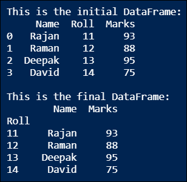
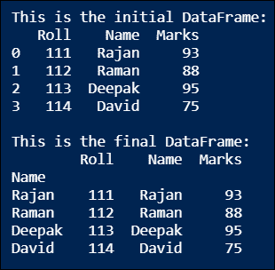
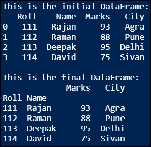
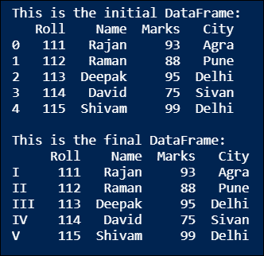
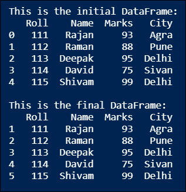
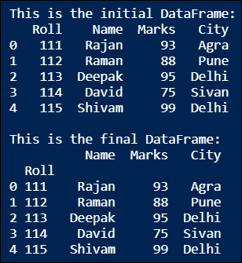

# 熊猫数据帧索引:设置熊猫数据帧的索引

> 原文：<https://www.askpython.com/python-modules/pandas/dataframe-indexing>

读者你好！在本教程中，我们将讨论在 Python 中设置熊猫 DataFrame 对象索引的不同方法。

* * *

## 我们所说的熊猫数据框架的索引是什么意思？

在 Python 中，当我们使用在 Pandas 模块中自动(默认)定义的`pd.DataFrame()`函数创建一个 [Pandas 数据帧](https://www.askpython.com/python-modules/pandas/dataframes-in-python)对象时，会生成行索引和列索引形式的地址，以表示数据帧中被称为索引的每个数据元素/点。

但是，行索引称为数据帧的**索引**，列索引简称为列。Pandas DataFrame 对象的索引唯一地标识它的行。让我们开始关于在 Python 中设置 Pandas DataFrame 对象的索引的不同方法的核心讨论。

## 创建时设置数据帧的索引

在 Python 中，我们可以在使用`index`参数创建数据帧时设置它的索引。在这个方法中，我们创建一个 Python 列表，并将其传递给其索引的`pd.DataFrame()`函数的`index`参数。让我们通过 Python 代码来实现这一点。

```py
# Import Pandas module
import pandas as pd 

# Create a Python dictionary
data = {'Name': ['Rajan', 'Raman', 'Deepak', 'David', 'Shivam'],
        'Marks': [93, 88, 95, 75, 99],
        'City': ['Agra', 'Pune', 'Delhi', 'Sivan', 'Delhi']}

# Create a Python list of Roll NOs
Roll = [11, 12, 13, 14, 15]

# Create a DataFrame from the dictionary
# and set Roll column as the index
# using DataFrame() function with index parameter
df = pd.DataFrame(data, index = Roll)
print(df)

```

**输出:**


## 使用现有列设置数据帧的索引

在 Python 中，我们可以通过以下方式轻松地将 Pandas DataFrame 对象的任何现有列设置为其索引。

### 1.将列设置为索引(不保留列)

在这个方法中，我们将使用`inplace`参数，它是 Python Pandas 模块的`set_index()`函数的可选参数。默认情况下，`inplace`参数的值为`False`。但是这里我们将把`inplace`的值设为`True`。以便数据帧的旧索引被现有列替换，该列已作为新索引传递给`pd.set_index()`函数。让我们通过 Python 代码来实现这一点。

```py
# Import Pandas module
import pandas as pd 

# Create a Python dictionary
data = {'Name': ['Rajan', 'Raman', 'Deepak', 'David'],
        'Roll': [11, 12, 13, 14],
        'Marks': [93, 88, 95, 75]}

# Create a DataFrame from the dictionary
df = pd.DataFrame(data)
print("\nThis is the initial DataFrame:")
print(df)

# Set the Roll column as the index
# using set_index() function
df = df.set_index('Roll')
print("\nThis is the final DataFrame:")
print(df)

```

**输出:**



### 2.将列设置为索引(保留该列)

在这个方法中，我们将使用`drop`参数，它是 Python Pandas 模块的`set_index()`函数的可选参数。默认情况下，`drop`参数的值为`True`。但是这里我们将把`drop`参数的值设置为`False`。以便已被设置为新索引的列不会从数据帧中删除。让我们通过 Python 代码来实现这一点。

```py
# Import Pandas module
import pandas as pd 

# Create a Python dictionary
data = {'Roll': [111, 112, 113, 114],
        'Name': ['Rajan', 'Raman', 'Deepak', 'David'],
        'Marks': [93, 88, 95, 75]}

# Create a DataFrame from the dictionary
df = pd.DataFrame(data)
print("\nThis is the initial DataFrame:")
print(df)

# Set the Name column as the index
# using set_index() function with drop
df = df.set_index('Name', drop = False)
print("\nThis is the final DataFrame:")
print(df)

```

**输出:**



### 3.将多个列设置为数据帧的索引

在这个方法中，我们可以将 Pandas DataFrame 对象的多列设置为其索引，方法是创建 DataFrame 的列名列表，然后将其传递给`set_index()`函数。这就是为什么在这种情况下，该指数被称为**多指数**。让我们通过 Python 代码来实现这一点。

```py
# Import Pandas module
import pandas as pd 

# Create a Python dictionary
data = {'Roll': [111, 112, 113, 114],
        'Name': ['Rajan', 'Raman', 'Deepak', 'David'],
        'Marks': [93, 88, 95, 75],
        'City': ['Agra', 'Pune', 'Delhi', 'Sivan']}

# Create a DataFrame from the dictionary
df = pd.DataFrame(data)
print("\nThis is the initial DataFrame:")
print(df)

# Set the Roll & Name column as the multi-index
# using set_index() function and list of column names
df = df.set_index(['Roll', 'Name'])
print("\nThis is the final DataFrame:")
print(df)

```

**输出:**



## 使用 Python 对象设置数据帧的索引

在 Python 中，我们可以通过以下方式将任何 Python 对象如**列表、**或**系列**设置为 Pandas DataFrame 对象的索引。

### 1.Python 列表作为数据帧的索引

在这个方法中，我们可以使用`pd.Index()`、`range()`和`set_index()`函数来设置熊猫数据帧对象的索引。首先，我们将使用`range()`函数创建一个 Python 数字序列，然后将其传递给返回 DataFrame 索引对象的`pd.Index()`函数。然后，我们将返回的 DataFrame index 对象传递给`set_index()`函数，将其设置为 DataFrame 的新索引。让我们通过 Python 代码来实现这一点。

```py
# Import Pandas module
import pandas as pd 

# Create a Python dictionary
data = {'Roll': [111, 112, 113, 114, 115],
        'Name': ['Rajan', 'Raman', 'Deepak', 'David', 'Shivam'],
        'Marks': [93, 88, 95, 75, 99],
        'City': ['Agra', 'Pune', 'Delhi', 'Sivan', 'Delhi']}

# Create a DataFrame from the dictionary
df = pd.DataFrame(data)
print("\nThis is the initial DataFrame:")
print(df)

# Create a Python list
list = ['I', 'II', 'III', 'IV', 'V']

# Create a DataFrame index object
# using pd.Index() function
idx = pd.Index(list)

# Set the above DataFrame index object as the index
# using set_index() function
df = df.set_index(idx)
print("\nThis is the final DataFrame:")
print(df)

```

**输出:**



### 2.Python 范围作为数据帧的索引

在这个方法中，我们可以使用`pd.Index()`和`set_index()`函数设置 Pandas DataFrame 对象的索引。首先，我们将创建一个 Python 列表，然后将其传递给返回 DataFrame 索引对象的`pd.Index()`函数。然后，我们将返回的 DataFrame index 对象传递给`set_index()`函数，将其设置为 DataFrame 的新索引。让我们通过 Python 代码来实现这一点。

```py
# Import Pandas module
import pandas as pd 

# Create a Python dictionary
data = {'Roll': [111, 112, 113, 114, 115],
        'Name': ['Rajan', 'Raman', 'Deepak', 'David', 'Shivam'],
        'Marks': [93, 88, 95, 75, 99],
        'City': ['Agra', 'Pune', 'Delhi', 'Sivan', 'Delhi']}

# Create a DataFrame from the dictionary
df = pd.DataFrame(data)
print("\nThis is the initial DataFrame:")
print(df)

# Create a DataFrame index object
# using pd.Index() & range() function
idx = pd.Index(range(1, 6, 1))

# Set the above DataFrame index object as the index
# using set_index() function
df = df.set_index(idx)
print("\nThis is the final DataFrame:")
print(df)

```

**输出:**



### 3.Python 系列作为数据帧的索引

在这个方法中，我们可以使用`pd.Series()`和`set_index()`函数设置 Pandas DataFrame 对象的索引。首先，我们将创建一个 Python 列表并将其传递给`pd.Series()`函数，该函数返回一个可用作 DataFrame 索引对象的 Pandas 系列。然后，我们将返回的 Pandas 系列传递给`set_index()`函数，将其设置为 DataFrame 的新索引。让我们通过 Python 代码来实现这一点。

```py
# Import Pandas module
import pandas as pd 

# Create a Python dictionary
data = {'Roll': [111, 112, 113, 114, 115],
        'Name': ['Rajan', 'Raman', 'Deepak', 'David', 'Shivam'],
        'Marks': [93, 88, 95, 75, 99],
        'City': ['Agra', 'Pune', 'Delhi', 'Sivan', 'Delhi']}

# Create a DataFrame from the dictionary
df = pd.DataFrame(data)
print("\nThis is the initial DataFrame:")
print(df)

# Create a Pandas series
# using pd.Series() function & Python list
series_idx = pd.Series([5, 4, 3, 2, 1])

# Set the above Pandas series as the index
# using set_index() function
df = df.set_index(series_idx)
print("\nThis is the final DataFrame:")
print(df)

```

**输出:**

```py
This is the initial DataFrame:
   Roll    Name  Marks   City
0   111   Rajan     93   Agra
1   112   Raman     88   Pune
2   113  Deepak     95  Delhi
3   114   David     75  Sivan
4   115  Shivam     99  Delhi

This is the final DataFrame:
   Roll    Name  Marks   City
5   111   Rajan     93   Agra
4   112   Raman     88   Pune
3   113  Deepak     95  Delhi
2   114   David     75  Sivan
1   115  Shivam     99  Delhi

```

## 4.设置数据帧的索引，保留旧索引

在这个方法中，我们将使用`append`参数，它是 Python Pandas 模块的`set_index()`函数的可选参数。默认情况下，`append`参数的值为`False`。但是这里我们将把 append 参数的值设置为`True`。从而数据帧的旧索引被传递给`set_index()`函数的新索引所附加。让我们通过 Python 代码来实现这一点。

```py
# Import Pandas module
import pandas as pd 

# Create a Python dictionary
data = {'Roll': [111, 112, 113, 114, 115],
        'Name': ['Rajan', 'Raman', 'Deepak', 'David', 'Shivam'],
        'Marks': [93, 88, 95, 75, 99],
        'City': ['Agra', 'Pune', 'Delhi', 'Sivan', 'Delhi']}

# Create a DataFrame from the dictionary
df = pd.DataFrame(data)
print("\nThis is the initial DataFrame:")
print(df)

# Set Roll column as the index of the DataFrame
# using set_index() function & append
df = df.set_index('Roll', append = True)
print("\nThis is the final DataFrame:")
print(df)

```

**输出:**



## 结论

在本教程中，我们学习了以下内容:

*   熊猫数据帧对象的索引是什么？
*   如何在创建数据帧时设置索引？
*   如何将 DataFrame 的现有列设置为索引或多索引？
*   如何将列表、范围或熊猫系列等 Python 对象设置为索引？
*   如何设置新的索引保持旧的？