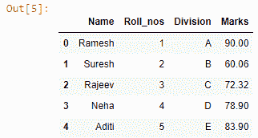

# Pandas dataframe.insert()函数——完整指南

> 原文：<https://www.askpython.com/python-modules/pandas/dataframe-insert-function>

在本文中，我们将看到数据框架。 **insert()** 功能来自熊猫。该函数用于列转换技术。所以，让我们马上开始吧！

熊猫图书馆是收集数据并将其呈现给用户的最重要的图书馆之一。这个 API 建立在 matplotlib 和 NumPy 库的基础上，这表明它是纯 Python 制作的。从读取复杂和巨大的数据集到对它们进行统计分析，这个软件包学习和使用都非常简单。

### 什么是数据帧？

数据帧的概念对熊猫用户来说并不陌生。它是以表格格式表示数据的行和列的集合。就像普通的一样，但是我们可以使用一些代码行修改表格的每个单元格。这节省了大量的工作时间，因为我们不需要在整个表中搜索该元素。

我们将创建一个样本数据集，然后进一步实现。要创建一个，必须给它一个字典，字典中有键形式的列和值形式的行。

**代码:**

```py
import pandas as pd

data_dict = {'Name':['Ramesh', 'Suresh', 'Rajeev', 'Neha', 'Aditi'], 
                    'Roll_nos':[1, 2, 3, 4, 5], 
                    'Division':['A', 'B', 'C', 'D', 'E'] }

data = pd.DataFrame(data_dict)
data

```

**输出:**


Creating a sample datafame

现在我们已经准备好了基本数据集，让我们检索一些关于它的信息。

### 从熊猫数据框架中获取基本信息

**代码:**

```py
data.columns
data.info()

```

**输出图像:**


Basic information about the dataframe

### 使用 dataframe.insert()函数添加列

我们将在数据帧中插入列。insert 函数用于显式地放置任何列及其值。这方面的文件如下:

```py
Signature: data.insert(loc, column, value, allow_duplicates=False) -> None
Docstring:
Insert column into DataFrame at specified location.

Raises a ValueError if `column` is already contained in the DataFrame,
unless `allow_duplicates` is set to True.

Parameters
----------
loc : int
    Insertion index. Must verify 0 <= loc <= len(columns).
column : str, number, or hashable object
    Label of the inserted column.
value : int, Series, or array-like
allow_duplicates : bool, optional
File:      c:\users\lenovo\anaconda3\lib\site-packages\pandas\core\frame.py
Type:      method

```

这个函数有一个非常简单的语法:

```py
data.insert(loc, column, value, allow_duplicates = False)

```

**说明:**

1.  loc =要插入列的数据帧的索引位置。
2.  column =我们要插入的列的名称
3.  value =该列显示的所有值
4.  allow_duplicates =该属性用于在数据帧中放置重复的列

## 使用 dataframe.insert()的方法

有两种方法可以使用这个函数。

1.  直接调用函数并给它所有的参数。
2.  使用功能方法( ***推荐*** )

### 1.直接调用 dataframe.insert()函数

在本例中，我们将通过直接调用 dataframe 来添加一列。这是一个学生数据库，所以我们将尝试在其中添加**标记**列。

**代码:**

```py
mrk_list = [90.00, 60.06, 72.32, 78.9, 83.9] # creating a list of values for the Marks column
data.insert(3, 'Marks', mrk_list) # using the isnert function
data # calling the dataframe

```

**输出:**



Mark column added to the dataframe

**说明:**

1.  我们为新的**“标记”**列创建一个名为“ **mrk_list** ”的列表。它将用于 values 参数。
2.  然后我们使用点号-**. "调用 insert()函数。**操作员用我们的数据框。然后，我们在第三个索引中指定新列的位置。
3.  我们给出列的名称。然后我们将值指定为 mrk_list。通过这种方式，我们将学生分数添加到数据集中。
4.  ***注意:当以列表形式传递值时，确保不超过主数据帧*** 的指标值

### 整体理解的代码

```py
# importing the module
import pandas as pd

# creating a sample dataframe
data_dict = {'Name':['Ramesh', 'Suresh', 'Rajeev', 'Neha', 'Aditi'],  
                    'Roll_nos':[1, 2, 3, 4, 5], 
                    'Division':['A', 'B', 'C', 'D', 'E'] }

# storing it in a variable
data = pd.DataFrame(data_dict)

# retrieving the basic info
data.info()
data.describe()

# using the insert function
mrk_list = [90.00, 60.06, 72.32, 78.9, 83.9]
data.insert(3, 'Marks', mrk_list)
data

```

### 3.使用显式函数寻找更好的方法

我们可以根据需要调用这个函数，只需要改变它里面的参数。它将保存四个参数。

1.  数据帧
2.  列名
3.  位置索引
4.  价值观念

**代码**:

```py
def create_column(df = None, col_name = '', col_loc = 0, values = []):
    print('Creating and adding a new column')
    df.insert(col_loc, col_name, values)

    print('Column created and added!!!')

    return df.head() # returning the new dataset with the new columns

df = data # dataframe name
col_name = input('Enter the column name: ').strip()
col_loc = int(input('Ente the location where you want to insert the column: '))
values = ['March', 'April', 'June', 'May', 'Februray']

# calling the function with the values
create_column(df, col_name, col_loc, values)

```

**输出:**


The **create_column()** function and respective inputs for parameters


Joining month column added at the 2nd index of the dataframe

**说明:**

1.  首先我们创建一个函数作为 **create_column()** 。
2.  它有四个参数
    1.  数据帧
    2.  列名
    3.  列位置
    4.  值–列的输入值数组
3.  像添加新列一样在其中添加一条消息。
4.  然后，我们调用 insert()函数，并在其中给出所有这些参数。并返回新数据集的头部。
5.  当过程结束时，我们打印一条消息，显示为**“创建并添加了列！！!"**。

## 结论

在这里，我们得出这个题目的结论。该功能的使用非常简单。我们只需要知道它是如何工作的，然后我们就可以根据我们的需要来使用它。