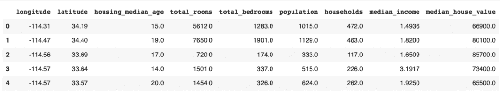
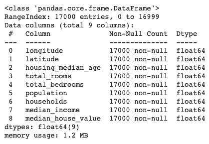
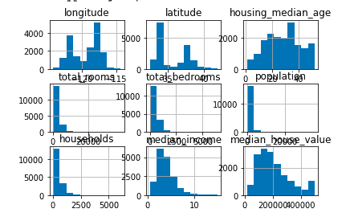

# Python 中的数据帧–快速查看和汇总

> 原文：<https://www.askpython.com/python-modules/pandas/dataframes-in-python>

熊猫数据框是一个美丽的东西。Python 中的 DataFrames 使得数据处理非常用户友好。

您可以使用 [Pandas](https://www.askpython.com/python-modules/pandas/python-pandas-module-tutorial) 导入大型数据集，然后有效地操作它们。你可以很容易地将 **CSV 数据**导入熊猫数据帧。

## 但是，Python 中的数据帧是什么，以及如何使用它们？

**Dataframes** 是一种二维标签数据结构，其列可以是不同的类型。

您可以使用数据框架进行各种分析。

数据集通常太大，不可能一次查看整个数据集。相反，我们希望看到数据帧的摘要。

在 summary 下，我们可以获得数据集的前五行，还可以获得数据的快速统计摘要。除此之外，我们还可以获得数据集中列的类型信息。

在本教程中，我们将学习如何在 Python 中显示数据帧的这种摘要。

在本教程中，我们将使用[加州住房](https://developers.google.com/machine-learning/crash-course/california-housing-data-description)数据集作为样本数据集。

### 1.在熊猫数据框架中导入数据集

让我们从将数据集导入熊猫数据框架开始。

要将数据集导入 Pandas 数据框架，请使用以下代码行:

```py
import pandas as pd
housing = pd.read_csv('path_to_dataset')

```

这将把数据集作为数据帧存储在变量*‘housing’*中。

现在，我们可以看看不同类型的数据汇总，这是我们在熊猫身上可以得到的。

### 2.获得前 5 行

首次导入数据集后，数据科学家通常会查看数据帧的前五行[。它给出了数据大概的样子。](https://www.askpython.com/python/examples/subset-a-dataframe)

要输出数据帧的前五行，请使用以下代码行:

```py
housing.head()

```

当您运行以下行时，您将看到如下输出:



Head

下面给出了显示数据帧前五行的完整代码。

```py
import pandas as pd
housing = pd.read_csv('path_to_dataset')
housing.head()

```

### 3.获取统计摘要

要获得数据帧的统计摘要，您可以使用**。描述()**熊猫提供的方法。

显示统计摘要的代码行如下:

```py
housing.describe()

```

运行这行代码将产生以下输出。


Describe

完整的代码如下:

```py
import pandas as pd
housing = pd.read_csv('path_to_dataset')
housing.describe()

```

输出显示数量，如平均值、标准偏差、最小值、最大值和百分位数。您可以对以下所有示例使用相同的代码，并且只替换每个示例中提到的函数名。

### 3.获得数据的快速描述

要获得表中数据类型的快速描述，可以使用**。熊猫提供的 info()** 方法。

您可以使用下面一行代码来获得描述:

```py
housing.info()

```

输出如下所示:



Info

对于数据集的每一列，输出都包含一行。对于每个列标签，您可以获得非空条目的计数和条目的数据类型。

了解数据集中列的数据类型可以让您在使用数据为模型定型时做出更好的判断。

### 4.获取每列的计数

您可以使用**直接获得每一列中的条目数。**计数()【熊猫法】。

您可以使用此方法，如下面的代码行所示:

```py
housing.count()

```

输出如下所示:


显示每列的计数可以告诉您数据中是否有丢失的条目。随后，您可以计划您的数据清理策略。

### 获取数据集中每一列的直方图

Pandas 允许您在一行代码中显示每一列的直方图。

要显示直方图，请使用以下代码行:

```py
housing.hist()

```

运行上面的代码后，我们得到如下输出:



Hist

数据科学家经常使用[直方图](https://www.askpython.com/python-modules/data-visualization-using-python-bokeh)来更好地理解数据。

## 结论

本教程是关于 Python 中数据帧的不同类型的快速总结。希望你和我们一起学习愉快！