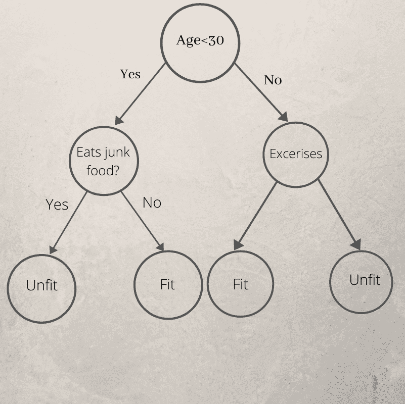
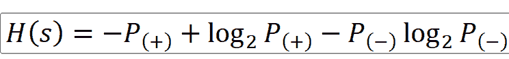
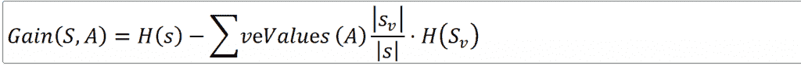
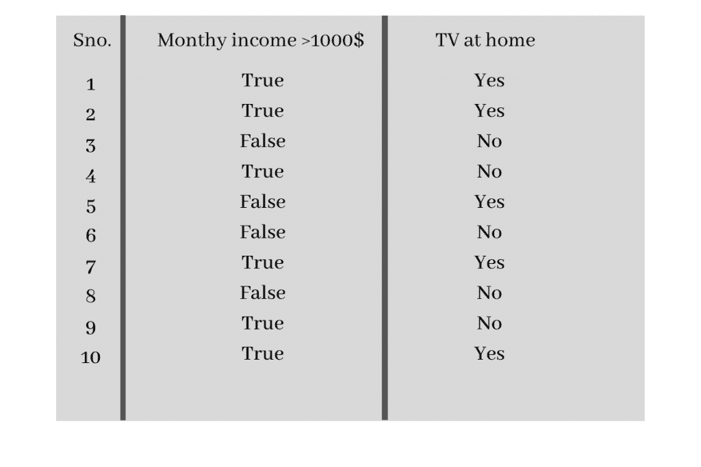
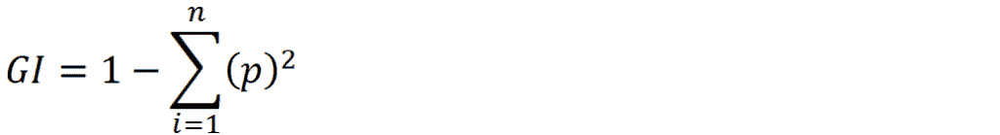
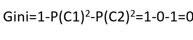
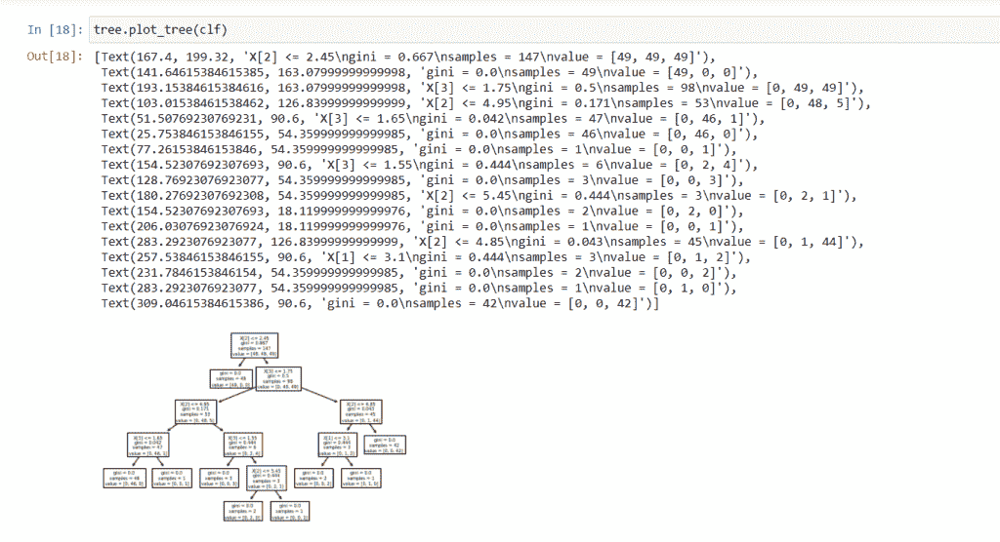
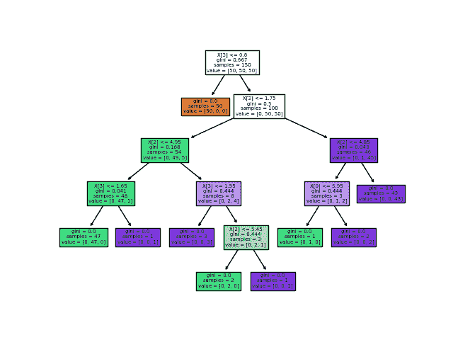

# Python 中的决策树–逐步实现

> 原文：<https://www.askpython.com/python/examples/decision-trees>

嘿！在本文中，我们将关注 Python 中决策树的关键概念。那么，我们开始吧。

决策树是用于进行预测的最简单和最常用的监督机器学习算法。

决策树算法用于[回归](https://www.askpython.com/python/examples/linear-regression-in-python)以及[分类问题](https://www.askpython.com/python/examples/naive-bayes-classifier)。它非常容易阅读和理解。

* * *

## 什么是决策树？

决策树是一种类似流程图的树状结构，包含了基于特定条件的所有可能的决策解决方案。它被称为决策树，因为它从一个根开始，然后像树一样分支到许多决策。

该树从放置最重要属性的根节点开始。分支代表整个决策的一部分，每个叶节点保存决策的结果。



Decision Tree for predicting if a person is fit or unfit.

* * *

## 属性选择度量

使用**属性选择测量(ASM)选择最佳属性或特征。**选择的属性是根节点特征。

属性选择度量是一种用于在元组中选择用于区分的最佳属性的技术。它对每个属性进行排序，选择最佳属性作为分裂准则。

最流行的选择方法是:

1.  熵
2.  信息增益
3.  增益比
4.  基尼指数

### 1.熵

为了理解信息增益，我们必须首先熟悉熵的概念。熵是被处理信息的随机性。

它测量分裂的纯度。当熵增加时，很难从信息中得出结论。它的范围在 0 到 1 之间。1 表示它是一个完全不纯的子集。



**这里，P(+)/P(-)= of+ve class/% of-ve class**

**举例:**

如果我们的类中总共有 100 个实例，其中 30 个是正的，70 个是负的，那么，

```py
 P(+) = 3/10 and P(-) = 7/10

```

```py
H(s)= -3/10 * log2 (3/10) - 7/10 * log2 ( 7/10)  ≈ 0.88

```

### 2.信息增益

信息增益是熵的减少。决策树利用信息增益和熵来确定将哪个特征分割成节点以更接近预测目标，并且还确定何时停止分割。



这里，S 是一组实例，A 是属性，S [v] 是 S 的子集。

**举例:**



Possession of TV at home against monthly income

对于整体数据，**是**值出现 **5 次**，而**否**值出现 **5 次**。所以，

```py
H(s) = -[ ( 5/10)  * log2 (5/10) +  (5/10) * log2 (5/10) ] = 1

```

现在来分析一下**真值**。**是**出现 **4 次**和**否**出现 **2 次。**

```py
H(s) = -[ ( 4/6) * log2 ( 4/6) + (2/6) * log2 (2/6) ] = 0.917

```

对于**假值**，

```py
H(s)= - [ ( 3/4) * log2 (3/4) + (1/4) * log2 (1/4) ] = 0.811

```

```py
Net Entropy = (6/10) * 0.917 + (4/10) * 0.811 = 0.874

```

```py
Total Reduction = 1- 0.874 = 0.126  

```

这个值(0.126)称为信息增益。

### 3.增益比

增益比是信息增益的修正。在选择属性时，它会考虑分支的数量和大小。它考虑了内在信息。

```py
GR(S,A) = Gain( S,A)/ IntI(S,A)

```

### 4.基尼指数

基尼指数也是一种帮助我们计算信息增益的标准。它测量节点的杂质，只计算二进制值。



**举例:**

C1 = 0，C2 = 6

```py
P(C1) = 0/6 = 0
P(C2) = 6/6 = 1

```



基尼系数在计算上比熵更有效。

* * *

## Python 中的决策树算法

让我们看看 Python 中的一些决策树。

#### 1.**迭代二分法 3 (ID3)**

该算法用于通过计算信息增益来选择分裂。递归地计算树的每一层的信息增益。

#### 2.C4.5

该算法是 ID3 算法的改进。它使用信息增益或增益比来选择最佳属性。它可以处理连续和缺失的属性值。

#### 3.分类和回归树

该算法可以生成分类树和回归树。在分类树中，目标变量是固定的。在回归树中，目标变量的值是要预测的。

* * *

## 使用 Scikit-learn 的决策树分类

我们将使用 scikit-learn 库来构建模型，并使用已经存在于 scikit-learn 库中的 iris 数据集，或者我们可以从[这里下载。](https://www.kaggle.com/uciml/iris)

该数据集包含三个类别-鸢尾、杂色鸢尾和海滨鸢尾，具有以下属性-

*   萼片长度
*   萼片宽度
*   花瓣长度
*   花瓣宽度

我们必须根据鸢尾植物的属性来预测它的种类。

### 1.首先，导入所需的库

```py
import pandas as pd 
import numpy as np
from sklearn.datasets import load_iris
from sklearn import tree

```

### 2.现在，加载虹膜数据集

```py
iris=load_iris()

```

要查看数据集中的所有特征，使用[打印功能](https://www.askpython.com/python/built-in-methods/python-print-function)

```py
print(iris.feature_names) 

```

输出:

```py
['sepal length (cm)', 'sepal width (cm)', 'petal length (cm)', 'petal width (cm)']

```

要查看数据集中的所有目标名称-

```py
print(iris.target_names) 

```

输出:

```py
['setosa' 'versicolor' 'virginica']

```

### 3.去掉标签

现在，我们将删除第 0、50 和 100 个位置的元素。第 0 个元素属于刚毛种，第 50 个元素属于杂色种，第 100 个元素属于海滨种。

这将删除标签，以便我们更好地训练决策树分类器，并检查它是否能够很好地分类数据。

```py
#Spilitting the dataset
removed =[0,50,100]
new_target = np.delete(iris.target,removed)
new_data = np.delete(iris.data,removed, axis=0) 

```

### 4.训练决策树分类器

最后一步是使用 scikit-learn 的决策树分类器进行分类。

```py
#train classifier
clf = tree.DecisionTreeClassifier() # defining decision tree classifier
clf=clf.fit(new_data,new_target) # train data on new data and new target
prediction = clf.predict(iris.data[removed]) #  assign removed data as input

```

现在，我们检查我们预测的标签是否与原始标签匹配

```py
print("Original Labels",iris.target[removed])
print("Labels Predicted",prediction)

```

输出:

```py
Original Labels [0 1 2]
Labels Predicted [0 1 2]

```

哇！我们模型的准确率是 100%。来绘制决策树-

```py
tree.plot_tree(clf) 

```



Image Source : [Scikit-learn docs](https://scikit-learn.org/stable/modules/tree.html)

* * *

## 结论

在本教程中，我们学习了一些重要的概念，如选择决策树的最佳属性、信息增益、熵、增益率和基尼指数。我们了解了不同类型的决策树算法和使用 scikit-learn 实现决策树分类器。希望，你们都喜欢！

## 参考

[官方决策树文档](https://scikit-learn.org/stable/modules/tree.html)

[决策树学习](https://en.wikipedia.org/wiki/Decision_tree_learning)