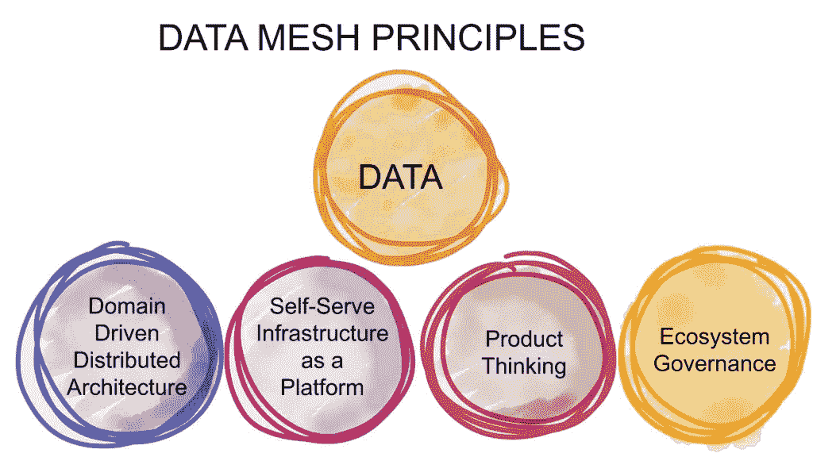
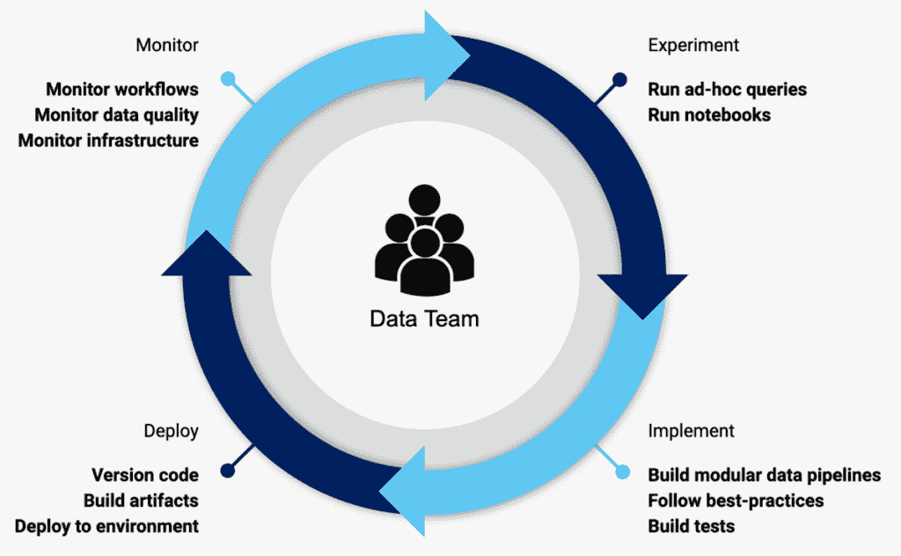

# 解码数据产品:为什么要使用数据网格？

> 原文：<https://www.askpython.com/resources/decoding-data-products-data-mesh>

数据网格是一种分析数据架构和操作范例，其中数据被视为一种产品，由知道如何最好地使用数据的团队拥有。

如今数据无处不在。我们所做的每一项数字活动都会产生数据作为副产品。数据是由一切事物产生的，包括系统、流程和传感器。技术让企业获取和保留数据变得更加简单，然后他们可以利用这些数据做出更好的决策，或者为消费者提供更个性化的体验。

另一方面，组织很难使他们的员工能够做出最好和最及时的判断。集中式数据平台设计无法以企业希望的速度和规模提供洞察力。这些问题通过使用数据网格来解决。

## 为什么要使用数据网格？

一个[数据网格](https://www.oracle.com/integration/what-is-data-mesh/)，当正确完成时，表明谁拥有数据，因此，谁可以帮助添加新功能，提供关于异常的进一步信息，并与业务和技术团队进行交互以弥补差距。

数据被分成不需要完全规范化的域。不再需要完全规范化的数据，因为除了存储成本更低之外，它还增加了 BI 和高级分析用例的连接复杂性。相反，团队通常采用一种" [Starflake](https://www.geeksforgeeks.org/difference-between-star-schema-and-snowflake-schema/) "模式，这是雪花和星星的结合。因此，他们能够支持更多的开发团队以及复杂的分析和报告用例。

## 数据网格原则

[Source](https://www.datanami.com/2022/01/21/data-meshes-set-to-spread-in-2022/)

### 域名所有权

数据生产者和数据消费者应该尽可能紧密地合作。从组织的角度来看，理想的情况是当同一个团队生产和消费相同的数据，在同一个团队中结合兴趣、责任和能力。事实上，这是很少可能的，因为一个数据生成团队在他们的领域已经有太多的义务来完全拥有一个数据消耗程序。

将这些职责分成两个团队，不需要中间人就可以直接互动，这是向前迈出的重要一步。数据生成团队的目的应该是以一种其他人可以从中受益的方式提供他们的数据。

### 数据作为一种产品

数据网格为数据提供了领域驱动的设计( [DDD](https://www.geeksforgeeks.org/domain-driven-design-ddd/) )。DDD 中的数据结构是由组织的域决定的。因此，组织和逻辑将由每个域驱动。

因为数据可以被理解为实体和特征，两者本质上都是领域驱动的，DDD 在这里的意义至少和它在软件工程中的意义一样大。数据网格将产品思维应用于数据，数据产品就是 API。为了“可被发现”，数据必须被很好地定义和记录。

传统的数据集市是数据仓库中的数据聚合，通常由一个小团队以更敏捷的方式驱动和管理，与数据网格概念有许多共同之处。他们被用来获得新的视角和解决特定的战略难题。

### 自助服务平台

如你所料，设计、安装、执行、监控和访问一个简单的六边形——一个[数据产品](https://lakefs.io/data-products/),需要很多基础设施。提供这种基础设施所需的技能是专门化的，不可能在每个领域都复制。

最重要的是，访问基础设施的高层抽象，消除提供和维护数据产品生命周期的复杂性和摩擦，是团队可以自主控制其数据产品的唯一方式。这需要建立一个新的原则:自助式数据基础设施作为域自治的平台。

### 数据治理

正如您所看到的，数据网格是使用分布式系统设计开发的，它由一组独立的数据产品组成，这些产品有自己的生命周期，由潜在的独立团队构建和发布。

然而，为了以更高阶数据集、洞察或机器智能的形式获得价值，这些不同的数据产品必须互操作。他们必须能够关联、联合、识别交叉点、绘制其他图表或在图表上按比例设置操作。

要使这些过程成为可能，需要一个数据网格实现，它包括去中心化和域自治、通过全球标准化实现的互操作性、动态拓扑，以及最重要的自动化平台决策执行。这就是我所说的联合计算治理。

## 作为产品的数据:数据网

获取、解释、信任和最终利用优秀数据的高摩擦和高费用是当前分析数据基础设施的问题之一。如果不处理，随着提供数据的站点和团队数量的增加，问题只会变得更糟。这将是我们第一个分权原则的结果。

“数据即产品”理念旨在解决数据质量和数据孤岛(即黑数据)这一古老问题。Gartner 将其定义为“企业在日常业务活动中获取、处理和存储的信息资产，但很少用于其他目的”。领域提供的分析数据必须作为产品来处理，数据消费者应该被视为顾客——快乐的顾客。

对于被称为产品的领域数据，数据网格实现应该提供可发现性、安全性、可探索性、可理解性、可信度等等。它还应该概述企业必须建立的角色(例如域数据产品所有者，他负责保证数据作为产品提供的客观指标)。

这些指标包括数据质量、减少的数据消耗滞后时间，以及通过净推广者分数衡量的总体数据用户满意度。领域数据产品的所有者必须完全了解谁是数据消费者，他们如何使用数据，以及他们更喜欢使用什么本地方法来消费数据。利用这些关于数据用户的详细知识，设计出符合用户需求的数据产品界面。

[Source](https://blog.dataminded.com/the-data-product-lifecycle-4903c9752527?gi=f917fc8b1d98)

老实说，对于网格上的大部分数据产品，只有少数传统的角色有他们自己的工具和期望:数据分析师和数据科学家。为了支持它们，所有的数据产品都可以构建标准化的接口。数据消费者和产品所有者之间的交流是开发数据产品接口的重要部分。

## 摘要

数据网格集成了孤立的数据，以帮助企业向规模化自动化分析发展。它使企业能够摆脱单一数据结构的消耗陷阱，节省运营和存储成本。通过将数据管理和所有权委托给特定领域的业务团队，这种新颖的分布式策略有望缓解由集中式数据所有权引起的数据访问瓶颈。