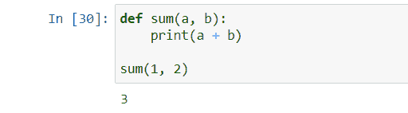
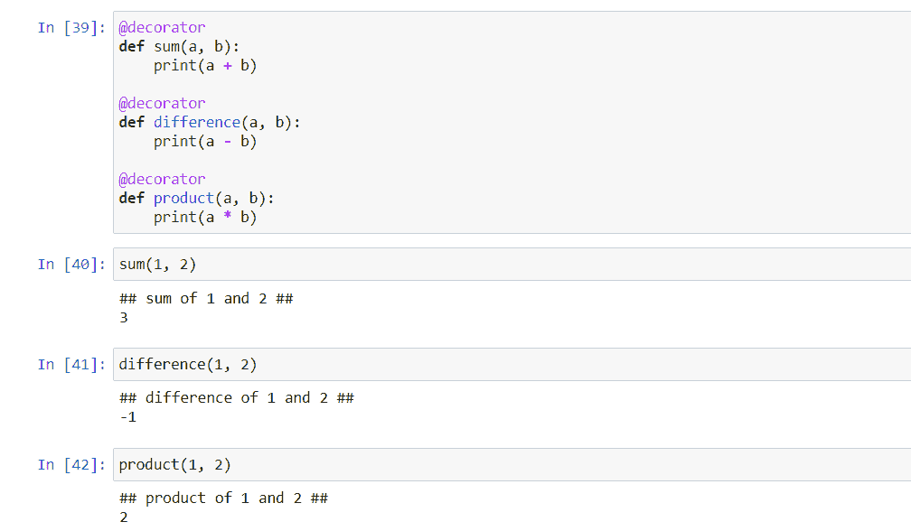

# Python 中的装饰者[解释]

> 原文：<https://www.askpython.com/python/examples/decorators-in-python>

今天来说一个小众话题——**Python 中的 Decorators】。这是一个简单但强大的工具，顾名思义，修饰[功能](https://www.askpython.com/python/python-functions)。**

## 先决知识

在继续学习 Python 中的装饰器之前，我们需要知道几个概念，即**高阶函数**和**嵌套函数**——一枚硬币的两面。

### 1.高阶函数

Python 有一种在其他函数之间传递和返回函数的简洁方式。许多编程语言都不支持这一点，它允许程序员进行各种各样的操作。

这就是高阶函数概念的来源——任何接受或返回另一个函数的函数都称为高阶函数。

例如:

```py
def hof(func, num):
    int res = func(num)
    return res

```

大家可以注意到，`hof()`的第一个参数是`func`，是后面调用的函数。类似地，高阶函数也返回其他函数。

***推荐阅读——[Python 递归函数](https://www.askpython.com/python/python-recursion-function)***

### 2.嵌套函数

Python 提供的另一个通用特性是，它允许您在函数内部声明函数，这些函数被方便地称为嵌套函数。考虑这个例子:

```py
def func(num):
    def nested_func():
        return num
    return nested_func

```

这里，`func()`是高阶函数，因为它返回另一个函数，`nested_func()`是嵌套函数(很明显)，因为它定义在另一个函数内部。

您可以看到，嵌套函数的定义完全取决于您发送给外部函数的内容。

这用于实现封装和创建闭包，这超出了当前教程的范围。

## Python 中的 Decorators 是什么？

正如我们之前讨论的，通俗地说，装饰者装饰功能。这意味着装饰者将代码或功能包装在函数周围，以增强函数的功能。

让我们看一个例子:

首先，我们来看一个简单的函数，它将两个数相加:

```py
def sum(a, b):
    print(a + b)

```



A simple summation function that prints the result

现在，假设你要做一大堆这样的数学函数，它们接受两个数字，对它们执行一些数学运算，并打印它们的结果(参见 [Python print](https://www.askpython.com/python/built-in-methods/python-print-function)

现在，假设您想在打印结果之前添加一行，告诉我们正在做什么以及正在操作什么数字。所以输出看起来像这样:

```py
## sum of 1 and 2 ##
3
```

你可以在定义每个函数的同时添加这一行，但是如果函数太多，并且*修饰*远远不止一行，那么最好使用一个装饰器。

## Python 装饰器的语法

```py
def decorator(function):
    def wrapper(num1, num2):
        print("##", function.__name__, "of", num1, "and", num2, "##")
        function(num1, num2)
    return wrapper

```

理解这段代码可能有点困难，所以我们将逐行检查:

*   这里有几件事需要注意。首先，装饰器被定义为一个函数，其行为类似于一个函数。最好把它想成一个函数。其次，也是更重要的，装饰者接受的参数是它所装饰的功能。注意装饰者的名字可以是任何东西。装饰器也可以接受多个参数，但是这是另一个讨论的主题。
*   这可能是代码中最令人困惑的部分。装饰器必须总是返回一个为原始函数增加了一些功能的函数。这通常被称为*包装器*功能。这个新函数将替换原始函数，这就是为什么它必须接受与原始函数完全相同数量的参数(在本例中是两个)。所以很明显，这个装饰器不会装饰一个没有两个参数的函数，尽管有办法使用`*args`来解决这个问题。
*   在我们的例子中，这将是装饰者添加到原始函数中的功能。注意，我们打印函数名和两个参数的方式与我们想要的完全一样。在此之后，我们需要执行函数，以便打印实际输出。
*   `function(num1, num2)`:很清楚`wrapper()`是如何做和`function()`一样的事情的，但是增加了我们需要的功能，所以下一步是显而易见的。
*   `return wrapper`:所以基本上，`decorator()`从我们这里拿了一个函数，用`wrapper()`在它周围包装了一些装饰，然后返回`wrapper()`，它将替换第一个函数。因为`wrapper()`正在调用第一个函数并做额外的事情，它基本上是第一个函数的增强版本。

当我们看到如何使用装饰器时，剩下的就清楚了。

## 在 Python 中使用装饰器

现在我们已经定义了一个名为 *decorator* 的 decorator，我们将使用它来增强三个函数——*sum*(我们前面已经看到过了)、 *difference* 和 *product* 。

```py
@decorator
def sum(a, b):
    print(a + b)

@decorator
def difference(a, b):
    print(a - b)

@decorator
def product(a, b):
    print(a * b)

```

这里，符号`@`用来告诉 Python 下一个函数正在使用装饰器。

因此，在定义函数之后，它将被传递给装饰器，装饰器将返回它的增强版本。装饰器返回的任何函数都将替换原来的函数。

让我们看看结果:



注意，调用`sum()`将执行它的增强版本。

**注意:使用装饰器会破坏函数的元数据。在我们的例子中，调用`sum.__name__`将返回`wrapper`而不是`sum`，因为这是我们实际使用的函数。docstring 也会根据包装器拥有的 docstring 而改变。**

为了避免这种情况，只需从`functools`导入`wraps`，然后在装饰器中装饰包装器，如下所示:

```py
from functools import wraps
def decorator(function):
    @wraps(function)
    def wrapper(num1, num2):
        print("##", function.__name__, "of", num1, "and", num2, "##")
        function(num1, num2)
    return wrapper

```

在这种情况下，包装器本身使用函数的元数据进行修饰，以便它保留函数元，如`__name__`和它的 docstring。

## 结论

这是对如何使用装饰器以及“ *@* ”符号的作用的深入解释。希望你学到了一些东西，下节课再见。

**参考文献——[https://www.python.org/dev/peps/pep-0318/](https://peps.python.org/pep-0318/)**