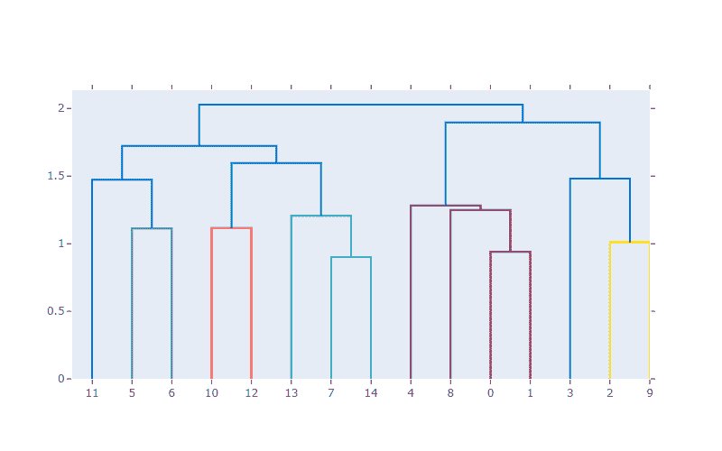
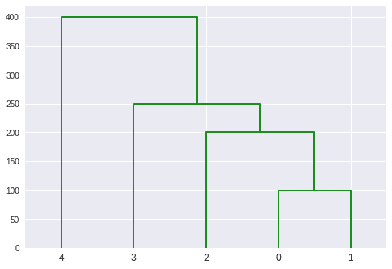

# Python 中的树状图指南

> 原文：<https://www.askpython.com/python/examples/dendrograms-in-python>

树状图是描述一棵树的图表。`create_dendrogram`图形工厂对数据进行层次聚类，并描绘出结果树。聚类之间的距离由树深度轴上的值表示。

树状图经常在计算生物学中用于描述基因或样本分组，偶尔在热图的边缘。

分层聚类产生树状图作为输出。许多人声称，这种类型的树状图可以用来确定集群的数量。然而，只有当超度量树不等式成立时，这才是正确的，这在实践中很少发生。

* * *

## 用 Python 绘制基本的树状图

```py
import plotly.figure_factory as ff
import numpy as np
np.random.seed(1)
X = np.random.rand(15, 12) 
fig = ff.create_dendrogram(X)
fig.update_layout(width=800, height=500)
fig.show()

```



Basic Dendrogram

* * *

## 应用层次聚类并绘制树状图

我们将利用以下方法实现层次聚类并绘制一个树状图:

1.  层次模块提供了用于层次和聚集聚类的例程。
2.  scipy . cluster . hierarchy . linkage 方法用于进行层次聚类。
3.  为了将分层聚类绘制为树状图，使用了 scipy . cluster . hierarchy . dendrogram 函数。

```py
import numpy as np
from scipy.cluster import hierarchy
import matplotlib.pyplot as plt
x = np.array([100., 200., 300., 400., 500., 250.,450., 280., 450., 750.])
temp = hierarchy.linkage(x, 'single')
plt.figure()
dn = hierarchy.dendrogram(temp, above_threshold_color="green", color_threshold=.7)

```



DendrogramsHeiCluster Plot

* * *

## 更改树状图的方向

```py
dn = hierarchy.dendrogram(temp, above_threshold_color="green", color_threshold=.7,orientation='right')

```


DendrogramsHeiCluster Plot Right Orientation

* * *

## 结论

恭喜你！您刚刚学习了如何用 Python 绘制树状图。希望你喜欢它！😇

喜欢这个教程吗？无论如何，我建议你看一下下面提到的教程:

1.  [Python 条形图——用 Python 可视化分类数据](https://www.askpython.com/python/python-bar-plot)
2.  [如何在 Python 中加载和绘制 MNIST 数据集？](https://www.askpython.com/python/examples/load-and-plot-mnist-dataset-in-python)
3.  [五大最佳 Python 绘图和图形库](https://www.askpython.com/python/python-plotting-and-graph-libraries)

感谢您抽出时间！希望你学到了新的东西！！😄

* * *