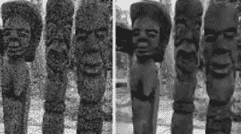
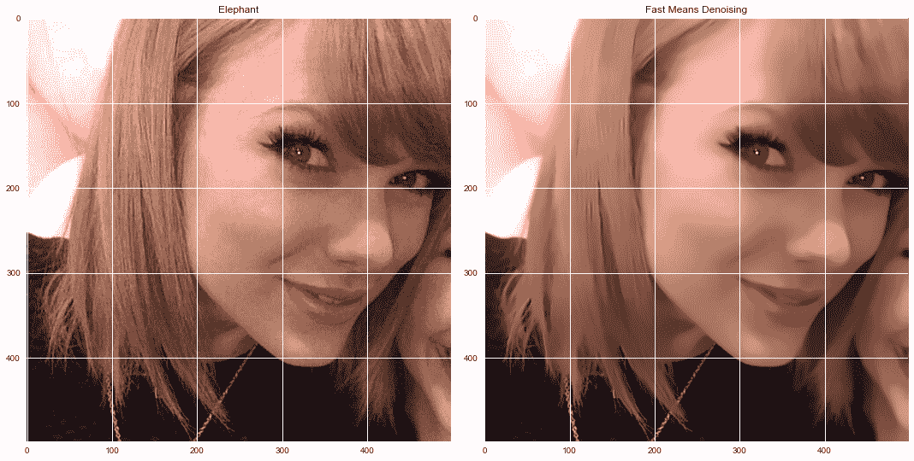
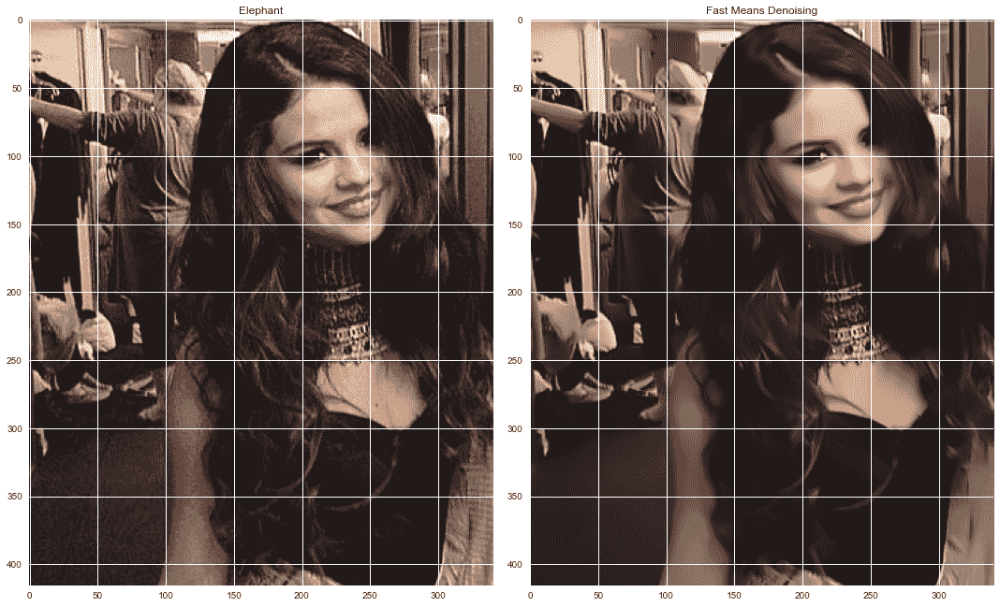
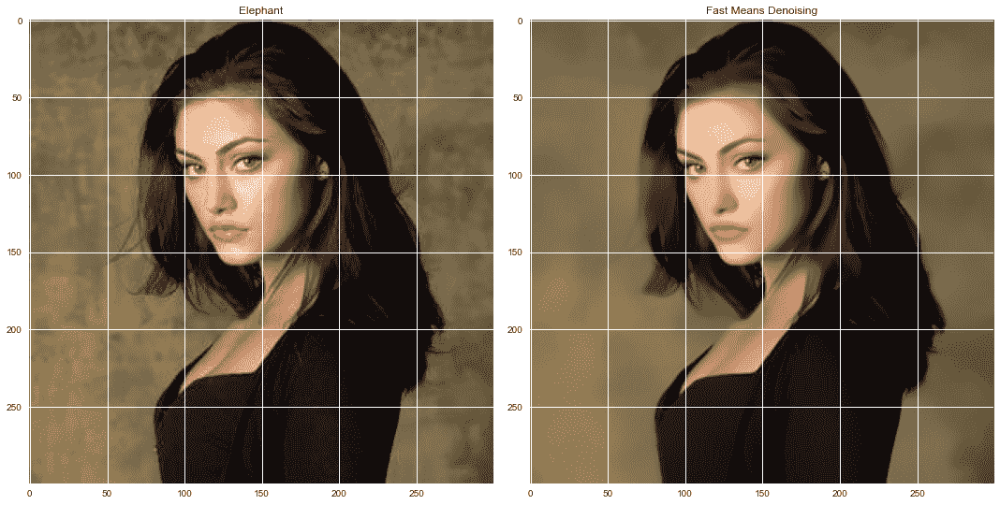

# Python 中的图像去噪——分步指南

> 原文：<https://www.askpython.com/python/examples/denoising-images-in-python>

在本教程中，我们通过使用 Python 作为编程语言，使用机器学习算法对有噪声的图像进行降噪。

让我们直接进入什么是图像去噪，以及如何在接下来的部分实现相同的功能。

***也读作:[使用直方图可视化图像中的颜色——Python OpenCV](https://www.askpython.com/python/visualizing-colors-in-images)***

* * *

## 图像去噪导论

随着数码摄影的迅猛发展，人们对更精确、更具美感的照片的需求正在上升。另一方面，现代相机产生的图像被噪声污染，导致视觉质量差。

因此，必须努力在不牺牲图像质量(边缘、拐角和其他尖锐结构)的情况下将噪声降至最低。



Image Denoise Sample

***图像去噪*** 是指从有噪声的图像中去除噪声以恢复原始图像的过程。

然而，由于一些成分，如噪声、边缘和纹理，很难在整个去噪过程中区分它们，去噪后的图像可能不可避免地丢失一些特征。

在降噪过程中从噪声图片中恢复有用信息以创建高质量的照片已经成为近年来的重要问题。

* * *

## Python 中的图像去噪——实现

现在我们已经有了图像去噪的介绍，让我们一步一步地实施。

### 1.导入模块

```py
import cv2
import numpy as np
from matplotlib import pyplot as plt
plt.style.use('seaborn')

```

* * *

### 2.加载图像

为了将图像加载到程序中，我们将使用`imread`函数。相同的代码如下所示。

```py
image = cv2.imread('sample_denoise_input.jpg')

```

* * *

### 3.应用 OpenCV 的去噪功能

OpenCV 库中有多个去噪函数，如下所示:

| **序列号** | **功能名称** | **描述** |
| **1** | cv2.fastNlMeansDenoising() | 适用于单灰度图像 |
| **2** | cv2 . fastnlmeansdenoisingcolored() | 为彩色图像工作 |
| **3** | cv2 . fastnlmeans no Singapore() | 适用于灰度图像序列 |
| **4** | cv2 . fastnlmeans no singularides() | 为一系列彩色图像工作 |

De-noising Techniques – OpenCV

在本教程中，我们将加载一个单一的彩色图像，所以我们将第二个功能。相同的代码如下所示。

```py
dst = cv2.fastNlMeansDenoisingColored(image, None, 11, 6, 7, 21)

```

* * *

### 4.绘制原始图像和去噪图像

现在图像已经去噪，是时候使用`subplots`绘制原始的去噪图像了，这可以通过下面提到的代码来实现。

```py
row, col = 1, 2
fig, axs = plt.subplots(row, col, figsize=(15, 10))
fig.tight_layout()
axs[0].imshow(cv2.cvtColor(image, cv2.COLOR_BGR2RGB))
axs[0].set_title('Elephant')
axs[1].imshow(cv2.cvtColor(dst, cv2.COLOR_BGR2RGB))
axs[1].set_title('Fast Means Denoising')
plt.show()

```

* * *

## 去噪图像的完整代码

```py
import cv2
import numpy as np
from matplotlib import pyplot as plt
plt.style.use('seaborn')

image = cv2.imread('sample_denoise_input.jpg')
dst = cv2.fastNlMeansDenoisingColored(image, None, 11, 6, 7, 21)

row, col = 1, 2
fig, axs = plt.subplots(row, col, figsize=(15, 10))
fig.tight_layout()
axs[0].imshow(cv2.cvtColor(image, cv2.COLOR_BGR2RGB))
axs[0].set_title('Elephant')
axs[1].imshow(cv2.cvtColor(dst, cv2.COLOR_BGR2RGB))
axs[1].set_title('Fast Means Denoising')
plt.show()

```

* * *

## 一些示例输出

现在，让我们看看上面提到的代码的一些示例输出。



Final Output Denoising Image



Final Output 2 Denoising Image



Final Output 3 Denoising Image

* * *

## 结论

我希望你理解这个概念，并喜欢输出。用更多的图像尝试同样的方法，看看屏幕上发生的奇迹吧！

编码快乐！😇

想了解更多？查看下面提到的教程:

1.  [Python 和 OpenCV:对图像应用滤镜](https://www.askpython.com/python/examples/filters-to-images)
2.  [Python 中的 ORB 特征检测](https://www.askpython.com/python/examples/orb-feature-detection)
3.  [使用 Python 进行颜色检测–初学者参考](https://www.askpython.com/python/examples/color-detection)

* * *