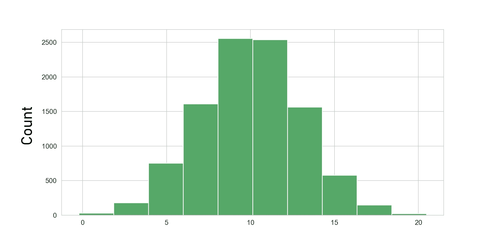
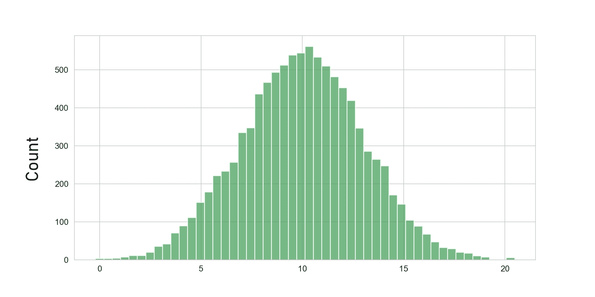
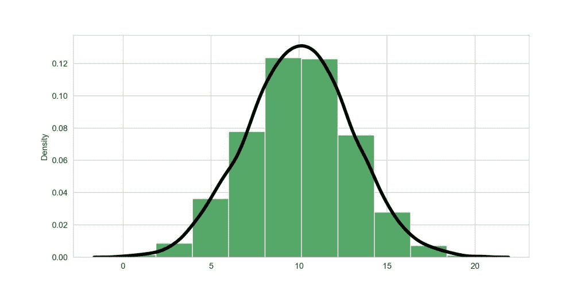
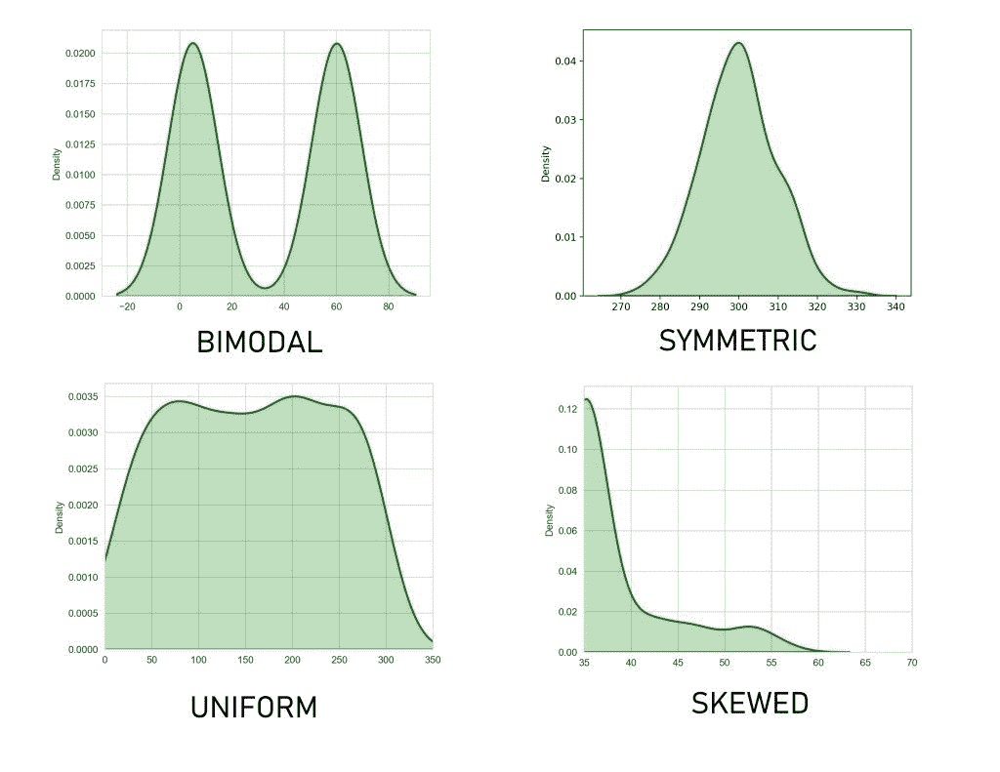
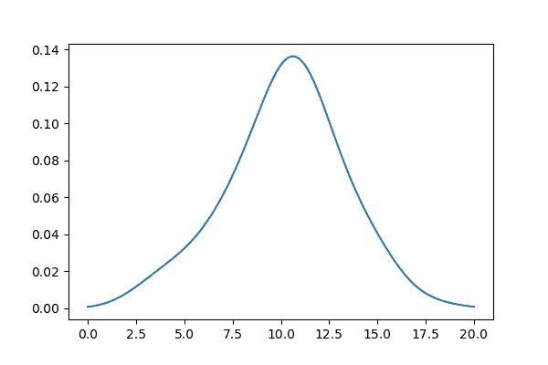
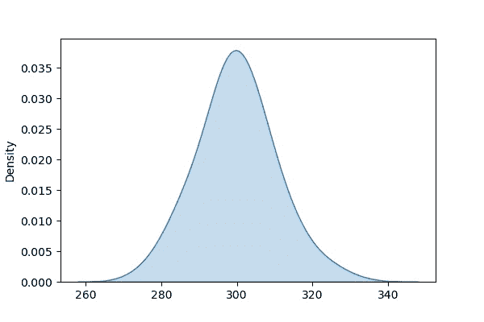
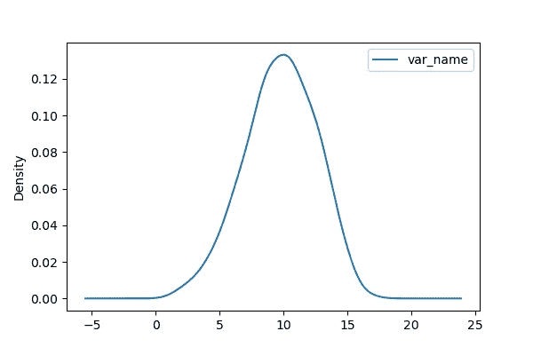
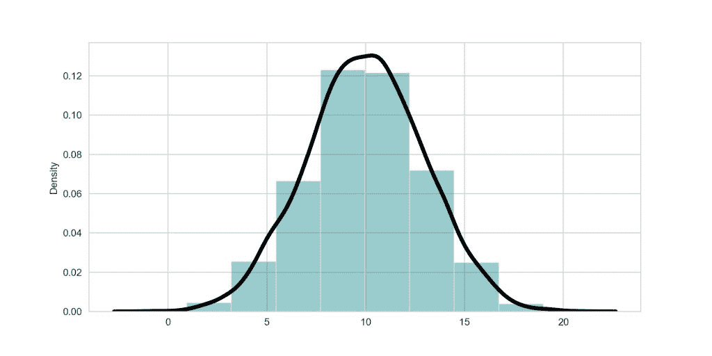

# Python 中的密度图–全面概述

> 原文：<https://www.askpython.com/python/examples/density-plots-in-python>

密度图用于显示数据集中连续数值变量的分布。它也被称为*核密度图。*

在开始应用任何机器学习技术之前，很好地了解你的数据是一个很好的做法。

作为一名优秀的 ML 从业者，我们应该问一些问题，如:

*   我们的数据是什么样的？
*   它是正态分布还是有一些不同的形状？
*   我们打算应用于数据的算法，是否有任何关于数据分布的潜在假设？

在我们获得数据后立即解决这些问题可以极大地改善后续阶段的结果，并为我们节省大量时间。

像[直方图](https://www.askpython.com/python-modules/pandas/plot-graph-for-a-dataframe)和密度图这样的图为我们提供了回答上述问题的方法。

## 为什么要在了解密度图之前了解直方图？

密度图非常类似于直方图。我们用直方图来显示分布的形状。直方图可以通过对数据进行宁滨处理并保存每个箱中的观察数量的计数来创建。在直方图中，y 轴通常表示容器计数，但也可以用每单位计数表示，也称为密度。



**A Histogram With Less Number Of Bins**

如果我们增加直方图中的箱数，分布的形状看起来会更平滑。



**Histogram Having More Number Of Bins**

现在，想象一条平滑连续的线穿过每个箱的顶部，创建我们的分布形状的轮廓。我们得到的结果就是我们所说的密度图。



**Density Plot With Histogram**

## **理解密度图**

我们可以把密度图想象成平滑的直方图，这很直观。密度图大多使用一个[*ernel 密度估计值*](https://en.wikipedia.org/wiki/Kernel_density_estimation) 。核密度估计通过平滑噪声允许更平滑的分布。

密度图不受仓数量的影响，仓数量是考虑直方图时的主要参数，因此允许我们更好地可视化数据的分布。

因此，总的来说，它就像一个直方图，但有一条平滑的曲线穿过每个箱的顶部。

在野外存在几种分布形式。我们很可能会遇到的一些最常见的形状是:



**Some Shapes Of Distributions**

## 使用 Python 绘制密度图

我们可以使用 python 以多种方式绘制密度图。我们来看几个常用的方法。

### 1.**使用 Python scipy.stats 模块**

`scipy.stats`模块为我们提供了`gaussian_kde`类来找出给定数据的密度。

```py
import numpy as np
import matplotlib.pyplot as plt
from scipy.stats import gaussian_kde

data = np.random.normal(10,3,100) # Generate Data
density = gaussian_kde(data)

x_vals = np.linspace(0,20,200) # Specifying the limits of our data
density.covariance_factor = lambda : .5 #Smoothing parameter

density._compute_covariance()
plt.plot(x_vals,density(x_vals))
plt.show()

```



**Density Plot Using Scipy**

我们改变`gaussian_kde`类的函数`covariance_factor`并传递不同的值以获得更平滑的图形。改变功能后记得打电话给`_compute_covariance`。

### 2.**使用 Seaborn `kdeplot`模块**

Seaborn module 为我们提供了一种更简单、更灵活的方式来执行上述任务。

```py
import numpy as np
import seaborn as sb
import matplotlib.pyplot as plt

data = np.random.normal(10,3,300) #Generating data.
plt.figure(figsize = (5,5))
sb.kdeplot(data , bw = 0.5 , fill = True)
plt.show()

```



**Density Plot Using Kdeplot**

Seaborn `kdeplot`需要一个单变量数据数组或一个 pandas 系列对象作为它的输入参数。`bw`参数相当于上面演示的`gaussian_kde`类的`covariance_factor`。我们可以让`fill` = `False`不用颜色填充曲线下的区域，而是简单地绘制一条曲线。

### 3.**使用熊猫绘图功能**

Pandas `plot`方法也可以通过提供`kind = 'density'`作为输入参数来绘制密度图。

```py
import numpy as np
import pandas as pd
import matplotlib.pyplot as plt

x_values = np.random.random(10,3,300) #Generating Data
df = pd.DataFrame(x_values, columns = ['var_name'] ) #Converting array to pandas DataFrame
df.plot(kind = 'density)

```



**Density Plot Using Pandas**

### **4。使用 Seaborn `distplot`**

我们还可以使用 seaborn `distplot`方法来可视化连续数值数据的分布。`seaborn.distplot( )`方法需要一个单变量数据变量作为输入参数，它可以是 pandas 系列、1d 数组或列表。

我们可以传递给`seaborn.distplot( )`的一些重要参数来根据我们的需要调整情节:

*   **`hist`**:(*Type–Bool*)是否绘制直方图。
*   **`kde`:**(*Type–Bool)**是否绘制高斯核密度估计。*
*   *`**bins**`:(*Type–Number*)指定直方图中面元的数量。*
*   ***`hist_kws`:***(Type–Dict)***关键字参数的 Dict 为[matplotlib . axes . axes . hist()](https://matplotlib.org/api/_as_gen/matplotlib.axes.Axes.hist.html#matplotlib.axes.Axes.hist)***
*   *****`kde_kws`:***(Type–Dict)*关键字参数为 [kdeplot()](https://seaborn.pydata.org/generated/seaborn.kdeplot.html#seaborn.kdeplot) 作为字典传递。***

```py
***import numpy as np
import matplotlib.pyplot as plt
import seaborn as sb

data = np.random.normal(10, 3, 1000) #Generating data randomly from a normal distribution.

sb.set_style("whitegrid")  # Setting style(Optional)
plt.figure(figsize = (10,5)) #Specify the size of figure we want(Optional)
sb.distplot(x = data  ,  bins = 10 , kde = True , color = 'teal'\
             , kde_kws=dict(linewidth = 4 , color = 'black'))
plt.show()*** 
```

***

**Density Plot Using Seaborn `distplot`***** 

***要了解更多关于 seaborn 的信息，你可以参考这篇关于 seaborn Distplots 的文章。***

## ***结论***

***这就把我们带到了文章的结尾！我们希望你今天已经学到了很多关于不同密度图的知识。您可以阅读这些文章来了解更多关于我们在本文中使用的 [Pandas](https://www.askpython.com/python-modules/pandas/python-pandas-module-tutorial) 和 [Matplotlib](https://www.askpython.com/python-modules/matplotlib/python-matplotlib) 库的信息。***