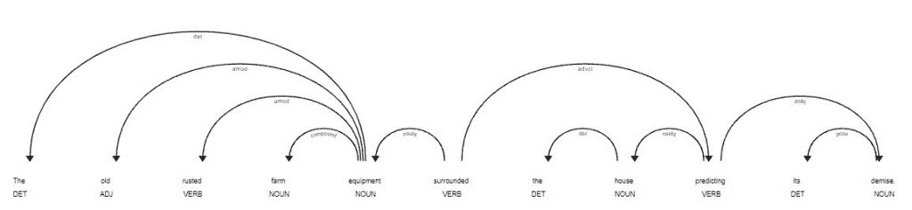
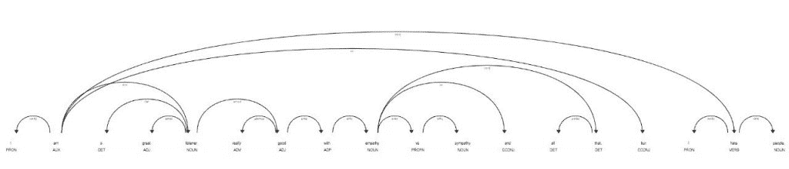
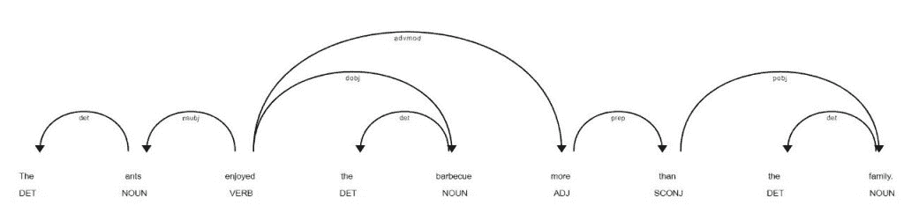

# Python 中的依赖解析简介

> 原文：<https://www.askpython.com/python/examples/dependency-parsing-in-python>

嘿伙计们！在今天的教程中，我们将了解什么是依赖解析，以及如何使用 Python 编程语言实现依赖解析。

* * *

## 什么是依存解析？

基于句子中单词之间的依赖性来评估句子的语法结构的技术被称为 ***依赖性分析。***

依存分析中的各种标签描述了句子中两个词之间的关系。这些是 ***依赖标签*** 。


Dependency Parsing Illustration

## 为什么需要依赖解析？

依存解析允许我们使用标记来构建解析树，以确定句子中单词之间的关系，而不是像句法解析那样使用任何语法规则，这提供了很大的灵活性，即使单词的顺序发生了变化。

* * *

## 在 Python 中实现依赖解析

为了实现依赖解析，我们将利用 Python 中的`spaCy`模块。所以，首先，我们把它导入到我们的程序中。

```py
import spacy
from spacy import displacy

```

现在让我们随机抽取一些我们想要进行依存分析的句子。

```py
text1 = 'It took me more than two hours to translate a few pages of English.'
text2 = 'The old rusted farm equipment surrounded the house predicting its demise.'
text3 = 'I am a great listener, really good with empathy vs sympathy and all that, but I hate people.'
text4 = 'The ants enjoyed the barbecue more than the family.'

```

接下来，我们使用`spacy.load`函数，它将帮助构建一个语言对象，加载模型数据和权重，并返回它。

```py
nlp=spacy.load('en_core_web_sm')

```

最后，我们将显示前面代码片段中提到的文本的依赖解析输出。

```py
displacy.render(nlp(text1),jupyter=True)

```


Dependency Parsing Output 1

* * *



Dependency Parsing Output 2



Dependency Parsing Output 3



Dependency Parsing Output 4

* * *

## 结论

恭喜你！您刚刚学习了如何使用 NLP 为句子构建依存解析图表。希望你喜欢它！😇

喜欢这个教程吗？无论如何，我建议你看一下下面提到的教程:

1.  [Python 中的词干化和词条化](https://www.askpython.com/python/examples/stemming-and-lemmatization)
2.  [用 python 从头开始创建单词包模型](https://www.askpython.com/python/examples/bag-of-words-model-from-scratch)
3.  [文字云使用 Python](https://www.askpython.com/python/examples/word-cloud-using-python)
4.  [使用 Python 进行情感分析](https://www.askpython.com/python/sentiment-analysis-using-python)

感谢您抽出时间！希望你学到了新的东西！！😄

* * *