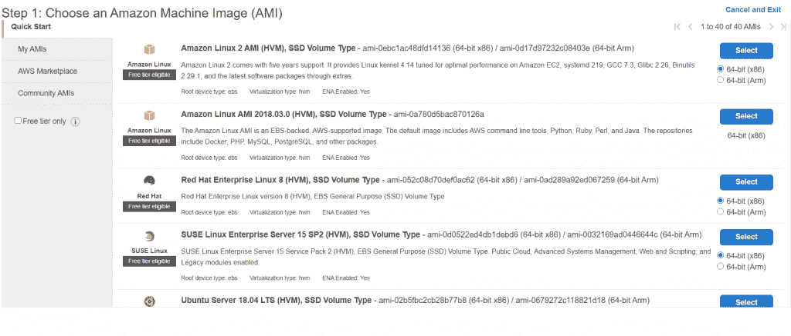

# 在 VPS 上部署 Flask 应用程序

> 原文：<https://www.askpython.com/python-modules/flask/deploy-flask-app-on-vps>

在本文中，我们将使用 **Apache Webserver 软件**和 **mod_wsgi** WSGI 将 [Flask 应用程序](https://www.askpython.com/python-modules/flask/create-hello-world-in-flask)部署到虚拟专用服务器(VPS)上。

## **什么是 VPS？**

VPS，代表虚拟专用服务器，是各种托管公司作为服务出售的虚拟机。你可以认为它类似于笔记本电脑的 CPU 硬件，但是是原始形式，即没有屏幕、键盘等。

像谷歌、亚马逊这样的公司提供云服务器服务(GCP、AWS 等。).作为服务的一部分，你可以借出位于世界不同地方的各种服务器。他们根据不同的标准向你收费，比如使用的时间、CPU 利用率等等。

使用云服务器有几个好处，比如:

*   **24 小时运行的服务器**–使用云服务器，您部署在其上的应用程序将 24 小时运行。在本地主机(您的笔记本电脑)的情况下，您需要让它运行 24 小时，这是不切实际的。
*   **可扩展性**–如果您的存储已满，您可以横向扩展您的服务(存储、RAM 等。)迅速在云端。
*   **更安全**–由于所有硬件都在云中心，因此更安全。
*   **可访问性**–您可以从任何笔记本电脑或计算机访问您的云服务器。

在本教程中，我们将使用 AWS–Amazon Web Services 进行部署。你可以选择任何一家 VPS 提供商。

* * *

## 在互联网上运行应用程序所需的软件

现在，部署在 VPS 上的 Flask 应用程序需要执行以下操作:

*   托管静态文件，如 HTML/ CSS/ JS
*   处理 Http 请求
*   从崩溃中恢复
*   需要时纵向扩展

为了执行所有这些任务，我们需要以下不同的软件:

1.  **一个 Web 服务器软件**——Apache、Nginx 等
2.  **Web 服务器网关接口(WSGI)应用服务器**–Mod _ WSGI、Gunicorn 等
3.  **您实际的网络应用**——使用 Flask、Django 等编写

这里**需要一个 web 服务器** **软件**如 Apache 来处理域逻辑并接受 HTTP 请求。然后，适当的请求通过 WSGI 应用服务器(如 mod_wsgi、Gunicorn 等)发送到主 web 应用程序(Flask)

WSGI 应用服务器提供了 Apache 软件和 Flask 应用程序之间的网关接口。 **WSGI** 是用 python 写的框架(Django/Flask)

WSGI 的主要用途是将请求转换成 python 可读的格式，并发送给**应用程序代码(用 Flask-python 编写)**，然后执行必要的功能并返回响应网页。

因此，WSGI 充当 Apache 和 Flask 应用程序之间的网关。

让我们分别来看一看

### **什么是 Web 服务器软件？**

网络服务器软件的主要作用是托管互联网上的网站。它充当**服务器**和**客户机**之间的中间人。

这些软件应用程序处理客户端请求，然后返回服务器上的物理文件(模板/数据),并将它们显示给客户端。

Web 服务器软件的例子有 **Apache、NGINX** 等。

在本文中，我们将使用好的旧的 **Apache** 服务器，它托管了互联网上几乎 **47%** 的 web 应用程序

### 什么是 mod_wsgi WSGI 应用服务器？

**Mod_wsgi** 是一个 Apache HTTP 服务器模块，它提供了一个符合 **WSGI** 的接口，用于在 Apache 下托管基于 Python 的 web 应用程序。它支持 Python 版本 **2** 和 **3。**

它充当 Apache 软件和位于云服务器上的 Flask 应用程序之间的接口。

## **在 VPS 上部署 Flask 项目**

第一步是从 VPS 提供商那里选择服务器。任何提供 VPS 的公司都会有几台运行在不同操作系统上的服务器，如图所示



AWS Servers

选择所需的服务器后，您需要完成一些步骤来设置和启动服务器。

务必**注意**您在云服务器上启用了 **HTTP 端口(80)** 。80 端口是 Web 服务器软件(Apache 等)的**端口**。)“监听”或接收来自 Web 客户端的请求。


Aws HTTP Post

一旦服务器设置完成，你将获得服务器的 **IP** 地址或**公共 DNS** ，稍后需要连接到云服务器。


Aws

### 1.从本地计算机连接到云服务器

我们使用 **ssh** 命令连接到服务器。要从本地计算机连接到云服务器，请运行以下命令:

*   使用 **Mac** 或 **Linux** :

在 shell 中，只需运行代码:

```py
ssh [email protected]<server_IP>

```

如果你使用的是 Ubuntu 服务器，用户名是 **ubuntu** 。

*   使用**窗口**

对于 windows 操作系统，我们使用一款名为 **PuTTY** 的软件，你可以[直接从互联网上下载](https://www.putty.org/)。下载完成后，进入**的云 IP** ，点击**打开**。


PuTTY

我将用来访问我的服务器的**云 IP/公共 DNS** 是:


Public DNS

对于 AWS，我们还需要使用一个额外的私有安全密钥。因此，根据 VPS 提供者，您可能还需要添加 security_key

完成后，您将登录到云服务器操作系统。


Ubuntu

### 2.安装必要的软件包

一旦连接了服务器，它将类似于新的 ubuntu 计算机。我们首先需要将所有重要的软件包安装到其中。

因此，运行以下命令:

**安装升级**

```py
sudo apt update
sudo apt upgrade

```

启动服务器后，务必更新系统。

**在服务器上安装 apache2 和 mod _ wsgi**

现在让我们首先在系统上安装 Apache2 和 mod_wsgi 包

```py
sudo apt install apache2
sudo apt install libapache2-mod-wsgi

```

要检查 Apache2 是否工作，请访问云服务器的公共 DNS/IP 地址。您将看到 Apache 默认页面。

**安装 python3-pip**

现在使用以下命令将 python3 和 pip 安装到系统上:

```py
sudo apt install python-pip

```

**安装砂箱** **及其延伸件**

现在安装**砂箱框架**和所有其他需要的**砂箱扩展**如**砂箱 _SQLAlchemy** 、**砂箱 _ 登录、** **砂箱 _wtf、**等

```py
sudo pip install flask
sudo pip install flask_sqlalchemy
....
....

```

只需安装您的 Flask 项目所需的 Flask 扩展。

### 3.将 Flask 项目从本地机器转移到云服务器

您可以创建一个新目录，并使用 **nano** 文本编辑器在其中编写整个 Flask 应用程序。

```py
mkdir flask_project
cd flask_project

```

更好的选择是在本地机器上编码项目，然后将 **flask_project** 文件夹转移到云服务器。

为了传输文件，我们使用代码

```py
scp -i <path/to/secret_key> -r <path/to/file> [email protected]<public_DNS>:<path/to/destination>

```


Transfer Files

在 AWS 中，我们还需要插入一个安全密钥。如果您的 VPS 提供商没有任何**安全密钥**，那么从命令中删除**密钥路径**

将主目录中的 Flask 应用程序项目目录 **flask_project** 与 Apache 的配置(位于 **/var/www/html** 目录中)链接起来。我们使用代码:

```py
sudo ln -sT ~/flask_project /var/www/html/flask_project

```

### 4.编写烧瓶应用程序

在 Flask_project 文件夹中，你应该有所有的 Flask 文件——**app . py**、 **models.py** 、**模板**等。

让我们编写一个简单的 Flask 应用程序，所以**在 flask_project 目录下，**创建一个文件 **app.py**

```py
sudo nano app.py

```

并添加代码:

```py
from flask import Flask

app = Flask(__name__)

@app.route('/blogs')
def blogs():
  return 'Welcome to The Blog App'

@app.route('/blog/<int:id>')
def blog(id):
  return "The Blog id is {}".format(id)

if __name__ == '__main__':
  app.run()

```

之后，我们现在必须创建一个 **WSGI** 文件。为此创造了一个**。与主 Flask 应用程序文件同名的 wsgi** 文件。我的情况是 **app.wsgi**

使用 **nano app.wsgi** ，添加代码:

```py
#flaskapp.wsgi
import sys
sys.path.insert(0, '/var/www/html/flask_project')

from app import app as application

```

太好了！！现在我们需要为 Apache 启用 **mod_wsgi** 来与 Flask 应用程序交互。

为此，请访问**/etc/Apache 2/sites-enabled/**:

```py
cd /etc/apache2/sites-enabled/

```

使用 nano 文本编辑器打开 conf 文件 **000-default.conf** ，在**document root/var/www/html**行下面添加代码:

```py
WSGIDaemonProcess flask_project threads=5
WSGIScriptAlias / /var/www/html/flask_project/app.wsgi

<Directory flask_project>
    WSGIProcessGroup flask_project
    WSGIApplicationGroup %{GLOBAL}
    Order deny,allow
    Allow from all
</Directory>

```


Conf File

## 运行烧瓶应用程序

好了，现在重新启动 apache 服务器:

```py
sudo service apache2 restart

```

并转到公共 DNS，网站将启动并运行！！


Blogss

与另一个 URL 类似


Blogs1

完美！

## 结论

您的 Flask 应用程序在云服务器上启动并运行。请尝试在云服务器上运行您自己的 Flask 应用程序，并让我们知道您的想法。下次再见了🙂