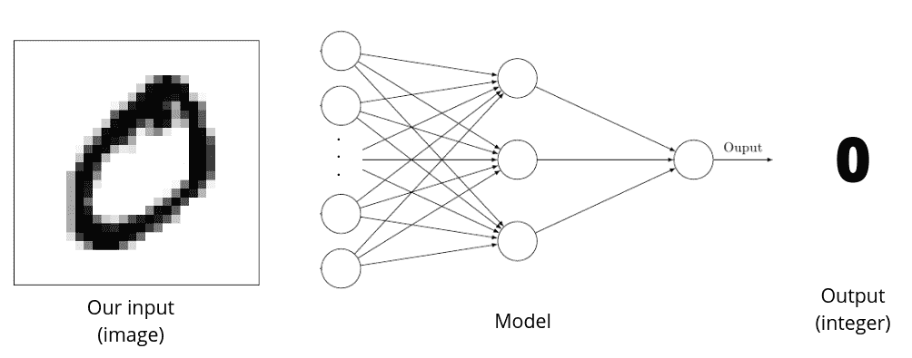
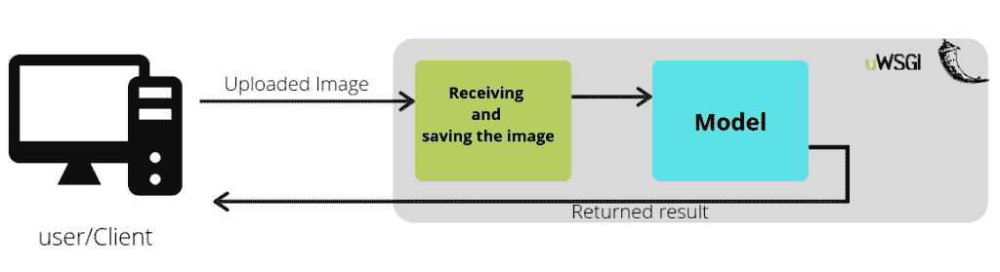
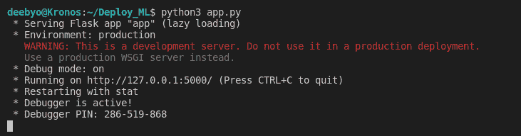
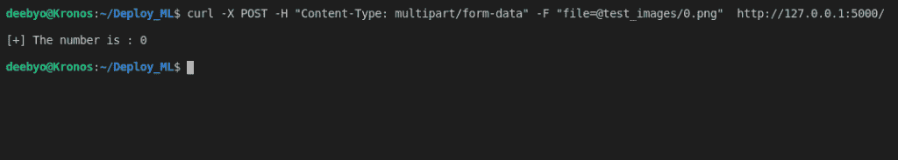

# 使用 Flask 部署 ML 模型

> 原文：<https://www.askpython.com/python-modules/flask/deploy-ml-models-using-flask>

在本文中，我们将讨论如何使用 Flask 部署 ML 模型。本文假设没有关于[烧瓶库](https://www.askpython.com/python-modules/flask/flask-mysql-database)的先验知识。

## 什么是部署？

用非常简单的术语来说，部署意味着让您的代码可供最终用户使用。让我们举一个例子。你设计了一个你认为对社会有巨大价值的应用程序。您已经测试了您的应用程序，并且您的应用程序可以在您的本地计算机上完美运行。

但是其他用户怎么用你的 app 呢？简单。你需要在用户可访问的计算机(服务器)上运行你的应用。在服务器上测试和运行代码的整个过程称为部署。

在我们的例子中，我们不会在本地机器上部署机器学习模型。

## 什么是烧瓶？

" *Flask 是一个轻量级的 [WSGI](https://wsgi.readthedocs.io/en/latest/) web 应用框架。它旨在快速轻松地开始使用，并能够扩展到复杂的应用程序。它最初是一个简单的包装器，围绕着 [Werkzeug](https://palletsprojects.com/p/werkzeug/) 和 [Jinja](https://palletsprojects.com/p/jinja/) ，现在已经成为最流行的 Python web 应用程序框架之一。*”

Flask 的一个更重要的特性是它不强制任何额外的依赖，让开发人员可以选择使用哪个库。要安装/更新 flask，您可以在终端中使用 [pip 命令](https://www.askpython.com/python-modules/python-pip):

```py
pip install -U Flask

```

注意: *Linux 用户可能希望将 pip3 用于 python 3 版本。*

## 使用 Flask 部署 ML 模型的步骤

让我们进入使用 Flask 库部署机器学习模型的步骤。

### 1。准备好你的模型

现在您已经安装了 Flask，接下来是我们需要部署的模型。如果你已经在[笔记本](https://www.askpython.com/python/jupyter-notebook-for-python) /IDE 中设计好了你的模型，现在是时候保存你训练好的模型了。需要注意的是，该模型在部署期间不会被训练。我们将使用多层感知，对 [MNIST 数据集](https://www.askpython.com/python/examples/load-and-plot-mnist-dataset-in-python)的图像进行分类。为了保存张量流模型，我们使用以下内容:

```py
model.save('<path to the model>/my_model.h5')

```

我们的模型接收图像作为输入，并返回图像的标签。



Fig 1: Working of our model : The model takes in an image as input and returns result which is an integer.

### 2。设计我们的工作流程

现在我们有了一个训练好的模型，我们可以设计我们的服务器应该如何处理用户请求。以下是建议的模型:

1.  用户使用 [HTTP POST 请求](https://www.askpython.com/python-modules/requests-in-python)将图像上传到服务器。
2.  图像被接收并保存在服务器上。我们还可以检查一些潜在的安全威胁的图像。
3.  保存的图像通过模型。
4.  模型的结果以文本的形式返回给用户。

下面是总结它的流程图:



Fig 2: A flowchart describing the working of our model

注意:*这是一个过于简化的模型。现实生活中的模型更难设计和实现，并且涉及创建复杂的数据管道，这超出了本文的范围。*

### 3。烧瓶 API 编码

我们创建一个 python 文件 app.py 来运行我们的应用程序。

#### 导入报表:

```py
# os to handle saving/deleting images
import os

# Import the required functions from flask
from flask import Flask, request, flash, redirect, send_file

# TensorFlow for loading the model
import tensorflow as tf

```

#### 创建我们的应用

```py
# Creates a flask app with a name same as the file name
# we can refer to this flask app as 'app' in our program
app = Flask(__name__)

```

#### 设置图像上传文件夹

```py
# uploaded images are stored in 'images' folder
UPLOAD_FOLDER = './images'

# Setting a environment variable
app.config['UPLOAD_FOLDER'] = UPLOAD_FOLDER

```

#### 加载模型

```py
# Assuming the model is saved in folder models as model_1.h5
model = tf.keras.models.load_model('models/model_1.h5')

```

#### 我们应用的 REST API

我们的应用程序接收并向用户发送数据。为此，我们需要指定一组特定的规则。app decorator 将函数 upload_file()绑定到我们的应用程序。该函数被路由到基本 URL(指定为“/”)，唯一允许的方法是 POST，即用户可以上传到基本 URL。upload_file()处理文件上传的许多情况——从没有文件到正确的文件。

```py
@app.route('/', methods=['POST'])
def upload_file():

    if 'file' not in request.files:
        flash('No file part')
        return redirect(request.url)
    file = request.files['file']
    if file.filename == '':
        flash('No selected file')
        return redirect(request.url)
    if file:
        filename = secure_filename(file.filename)
        filename = os.path.join(app.config['UPLOAD_FOLDER'], filename)
        file.save(filename)

        # Read from file and convert to tensor
        img_tensor = tf.io.decode_image(filename)
        results = model.predict(img_tensor)

        # Delete the file
        os.remove(filename)
        return "\n[+] The number is : "+str(results)+"\n\n"

```

注意:*与代码的其他部分不同，应用程序的这一部分会针对每个客户端请求反复运行。*

### 4。运行应用程序

```py
# If this file is run as standalone file
# The app will run in debug mode
if __name__ == '__main__':
    app.run(debug=True)

```

#### 启动并运行服务器

```py
# If your file server name is app.py
python3 app.py

```



Fig 3: Staring the server

请注意，服务器运行在 http://127.0.0.1:5000/上，这是我们的应用程序端点。现在我们的应用程序已经在本地机器上运行了，我们只需使用 URL 就可以访问该应用程序。

#### 上传图片

我们没有使用前端来让最终用户的生活更轻松。另一方面，这种将后端与前端分离的方法使得与其他独立的前端应用程序的交互更加容易。即使没有前端也可以使用我们的 curl 命令上传图像

```py
curl -X POST -H "Content-Type: multipart/form-data" -F "[email protected]<file location>"  http://127.0.0.1:5000/

```

用图像的位置替换`<file location>`。



Fig 4: Accessing the app using curl command from a terminal

### 结论

我们看到，我们可以轻松地在本地机器上部署我们的机器学习模型，因此连接到您网络的用户可以使用您的应用服务。为了让应用程序服务全天候工作，应用程序需要在您的计算机上全天候运行。在这种情况下，你可以考虑在 Heroku、DigitalOcean、Azure 等服务器上运行你的代码。我们将在后面的文章中讨论将代码部署到服务器。敬请关注。